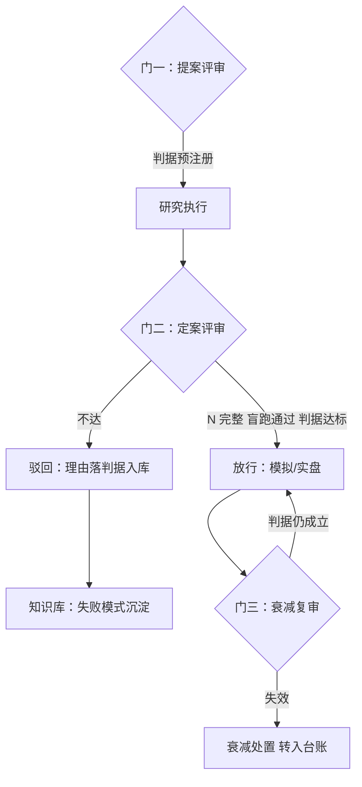

# 委员会与评审流程

委员会裁决的不是科学品味，是证据的完整性；它的产出是挂在判据上的决定记录，不是会议纪要。

<footer>—— 据 Arnott, Harvey and Markowitz, A Backtesting Protocol in the Era of Machine Learning, Journal of Financial Data Science, 2019 与站内 ML 投研工作流的门口径整理</footer>

[上一课](/quant/rc2-knowledge-base)让组织记得住。记得住不等于裁得动：把策略押上模拟与实盘的决策，要动真金和限额，不能靠两个人在走廊里点头。本课写委员会与评审流程——组织层最硬的一环：三个门、一条边界、一套程序要件。它是[ML 投研工作流](/quant/fml-research-workflow)「门有交付物」一条的机制化，也是[版本与审批](/quant/sl-versioning-approval)在研究侧的上游。

## 问题

没有委员会的团队，放行决策有三个默认值，全是坏的。**判据让位于人情**：判据没达标，但提案人资历深、时机急，「再等等看」成了默认——放弃线在提案时写过，没人在有权停止的时刻翻出来。**试验在最后一刻才被审视**：上实盘前没人问过 $N$ 是多少，[实验管理](/quant/rc2-experiment-management)记的台账从头到尾没人读。**驳回不留痕**：不同意的人私下嘀咕，会议纪要写「一致通过」，组织学不到判据的边界在哪里。缺口不是「开个会」，是一套把**停止的权力从提案人手里独立出来**的程序：什么时候必须停，由预注册的判据和一群没有利益冲突的人说了算。

## 方法

### 三个门

**提案评审**：研究开始前，判据预注册——主指标与放弃线先于任何结果存在，写进[一页假设文档](/quant/rc2-research-docs)；评的是问题与判据，不评结果。**定案评审**：上模拟或实盘前，只查证据完整性——$N$ 完整、复现包盲跑通过、台账指纹与声称的实验一致、判据达标；[ML 投研工作流](/quant/fml-research-workflow)的交付物清单（契约、台账、审计包）在此逐项点收。**衰减复审**：上线后按信号半衰期定期重开，问的是「判据今天还成立吗」，衰减证据从[策略台账](/quant/sl-knowledge-management)来。

## 机制

程序要件有三，缺一则会议退化成仪式。**回避**：提案人不参加对自己提案的表决——放行与否直接关系他的考核，利益冲突不可自裁。**前置送达**：材料提前到达，会上只裁不介绍；临时抛材料换来的不是深思是同情分。**决定落判据**：通过、驳回、有条件通过，每条理由必须指向预注册判据的具体条款——「效果不好」不是数据，是[研究复盘](/quant/research-postmortem)钉死的口径；驳回理由是知识库的正式进料（上一课的入库三标准在这里接上）。边界一条：委员会裁决证据完整性，不裁决科学品味——「这个想法不够聪明」不进议程，品味之争回到提案文档与文献。

节奏口径：低频高质，双周或月度，法定人数固定；被驳回不丢人、不计考核减分——否则提案人会学会把坏消息留在门外，委员会就只剩听好消息的功能，比没有委员会更糟。

### 为什么门能拦住

门的本质是把「停止」从一个非对称博弈里解放出来：提案人喊停，成本全在自己（白干几个月）；别人喊停，成本在关系。委员会把喊停的成本摊给制度，判据预先注册又把「什么时候该停」从临场判断变成查表。回测协议要求试验可数、决策按时间记录——门的会议记录正是决策的时间戳：谁、凭哪条判据、放行或拦下哪个指纹的实验。三个月后复盘实盘事故，这条记录能回答「当时的决定基于什么」，而不是「当时大家都觉得行」。

## 边界

委员会不产生科学：它拦不住一个想法平庸但判据诚实的研究被做出来，也不应该拦——很多好信号第一眼平庸。它不替代数据核查：证据完整性检查的是「材料齐不齐、指纹对不对」，材料里的每个数字仍然由台账与复现包保证真。它的速度是真实成本：门槛过高，研究会绕开委员会走影子流程（[研究、模拟、实盘隔离](/quant/research-sim-prod)警告过的分叉）；所以门只设在押上资源的时刻，探索期完全不设，频率随组织规模调节。

## 小结

- 没有委员会的三个坏默认：判据让人情、台账没人读、驳回不留痕。
- 三个门：提案评审（判据预注册）、定案评审（证据完整性点收）、衰减复审（判据是否仍成立）。
- 程序三要件：提案人回避、材料前置送达、决定逐条落判据；驳回理由是知识库的进料。
- 委员会裁决证据完整性，不裁决品味；门的成本用「只设在押资源的时刻」控制。
- 出处：Arnott, Harvey and Markowitz, *JFDS*, 2019；站内[ML 投研工作流](/quant/fml-research-workflow)、[版本与审批](/quant/sl-versioning-approval)、[研究、模拟、实盘隔离](/quant/research-sim-prod)各课。
