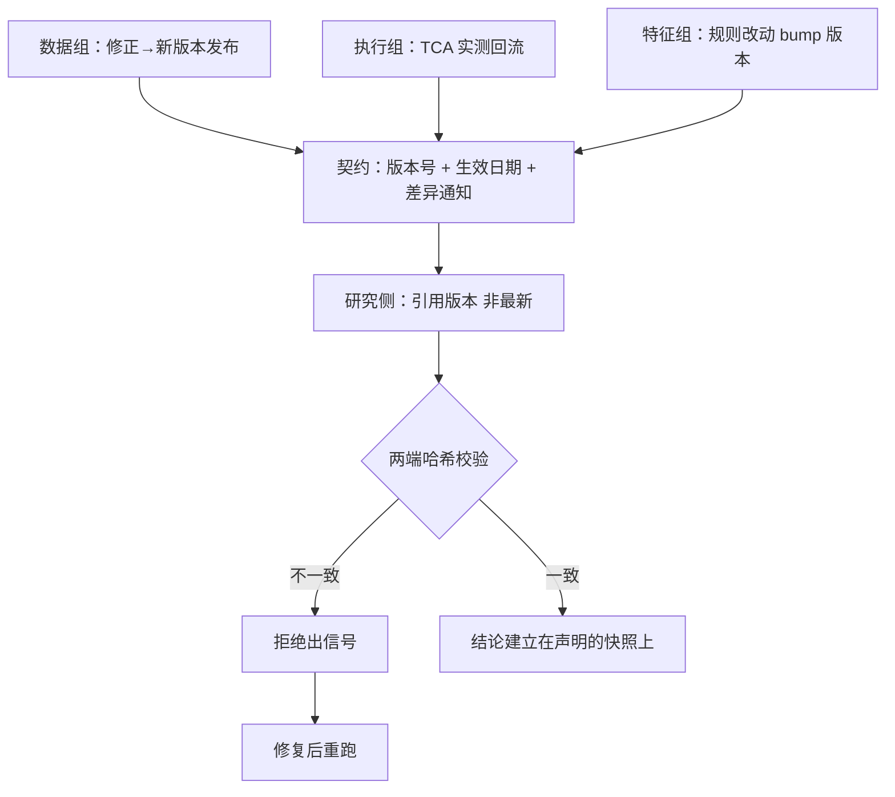
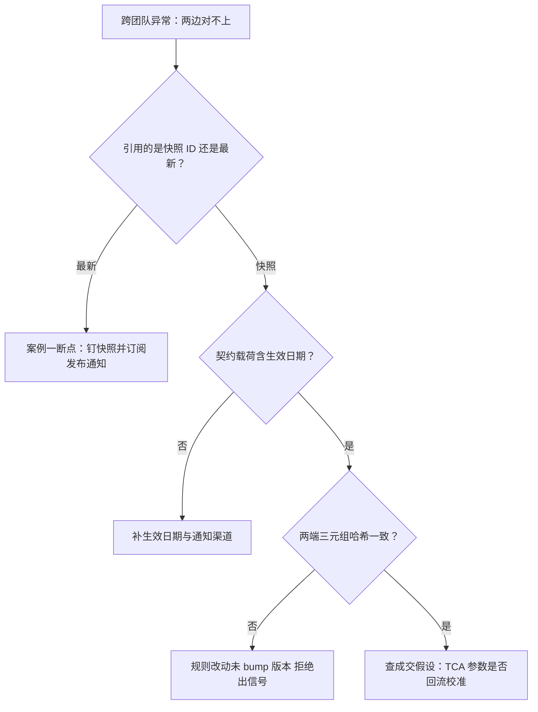

# 跨团队协作与案例

跨团队事故的共同死因很少是技术，是「我知道，但你不知道」；接口的工作就是把知道变成契约。

<footer>—— 据站内数据版本化、研究模拟实盘隔离与特征存储三元组口径的案例整理</footer>

[上一课](/quant/rc2-committee-process)把决策关进了流程，但流程到团队边界为止。研究的产出每天要穿过三只别人的手：数据组管清洗修正，执行组管成交成本，特征组管训练与服务共用的一切；每只手都按自己的节奏改东西，而研究结论建立在改动之前的快照上。本课用三个案例读接口怎么断、怎么接——死因落在接口条款上，不落在沟通态度上，这是[研究复盘](/quant/research-postmortem)死因口径在协作层的用法。

## 问题

团队内协作有评审、文档与委员会兜底，团队之间没有：各有各的优先级、发布节奏和对「改个小地方」的判断。研究侧的防御本能是「把一切搬进自己团队」，那是坏解法：自建全链等于把别人的正职做成自己的副业（回测框架一课的自建分账同样适用）。真正的缺口是**接口契约**：研究消费别人的产物时，引用什么、依赖什么、何时通知谁。三个案例各断一处。

## 方法

### 案例一：修正发布的连锁

数据组按发布流程重传公司行动修正，复权因子变化，分位数全漂。断点：一半在研实验的配置里写的是「数据库当前状态」而非快照 ID——[数据版本化](/quant/de-data-versioning)「修正走发布不覆盖、旧版本永不可变」保住了钉版本的实验，没钉的全部静默作废，两个已进定案材料。接法：一律引用快照 ID；发布通知带版本号与差异摘要，自动推送给引用旧版本的负责人。

数字实例看复权因子：某股票 10 送 10，复权因子一变，历史价格整体砍半——昨天分位数排在 80% 的量价特征，今天同样的原始数据算出来落在 40%。没钉快照的实验不是「数据更新了」，是「研究对象被无声换掉了」，而你只在三周后发现曲线不对劲时才知情。

### 案例二：执行假设的分叉

回测按历史滑点模型算的容量，与执行组 TCA 实测差出一截——判据还成立，按回测容量排的上线计划却全错。断点：成交假设是写死的默认值，执行侧的真实成本从不回流。接法：把[研究、模拟、实盘隔离](/quant/research-sim-prod)的口径反向用——分叉用来校准回测假设，TCA 周报按品种回流给撮合器更新参数，更新走版本（[成交模拟的深化](/quant/bf-fill-simulation-deep)的乐观偏差入口须声明参数版本）。

### 案例三：特征契约的错位

特征组改清洗规则没 bump 版本，线上用新规则算特征、模型用旧规则训练，实盘与回测系统性偏移，查了两周。断点：特征存储的三元组（定义、数据版本、清洗规则）服务侧没有强制校验。接法：[特征存储的深入](/quant/fml-feature-store-deep)的三元组哈希两端比对，不一致即拒绝出信号——错位从两周后发现的静默偏移，变成当天的硬错误。

## 机制

三个案例压成一条原则：**消费方引用版本，生产方发布变更，两端校验一致**。引用版本免受静默变更（案例一）；实测回流持续校准假设（案例二）；两端校验把「应该一致」变成「不一致即报错」（案例三）。契约载荷里最易省略的一栏是**生效日期**：「下个版本改」在三个团队里是三个日期；缺生效日期的通知等于没有通知，对齐责任又回到口头同步。事故复盘照判据口径写：死因是「引用了最新而非版本」「缺生效日期」，不是「沟通不畅」——前者有条款可改，后者只有态度可叹。

这张图回答的问题与上图不同：上图是「接口该怎么建」，这张是「异常已经发生，按哪条条款归因」。直觉类比：生效日期就是把「下周大扫除」改成「10 月 1 日大扫除」——三个室友嘴里的「下周」是三个日子，日历上的日期只有一个。

实用断点检测：盘点上游依赖里写「最新」「当前」「线上库」的引用，每个都是案例一的候选断点——盘点不过一小时，漏掉一个就是一次静默作废的金额。

## 边界

契约不是合同：接口靠共同利益与复盘维系，条款要少而硬——版本、生效日期、通知渠道，三条之外别贪。版本引用有代价：永远钉旧快照的研究会与现役系统脱节，重估与迁移是显式动作。三个案例是接缝的类型学（数据、执行、特征），不是全集；新断点按同样口径归档，类型学自己生长。

常见误区：初学者容易以为接口问题靠「多沟通、多对齐会」解决。口头约定是存在人脑里的一次性内存——三个月后没人记得当时说的是哪个版本；契约把承诺写进系统，「不一致即报错」不依赖任何人的记性。沟通仍需要，但用来谈条款，不用来当条款。

## 小结

- 团队间没有评审与委员会兜底，接口只能靠契约：消费方引用版本，生产方发布变更，两端校验。
- 案例一断在「引用最新」，快照与通知保住实验；案例二断在假设不回流，TCA 校准成交参数。
- 案例三断在三元组错位，两端哈希校验，不一致即拒绝出信号。
- 契约最易省略的栏是生效日期；死因落条款不落态度，复盘才能改东西。
- 出处：站内[数据版本化](/quant/de-data-versioning)、[研究、模拟、实盘隔离](/quant/research-sim-prod)、[特征存储的深入](/quant/fml-feature-store-deep)、[成交模拟的深化](/quant/bf-fill-simulation-deep)各课口径的案例整理。
