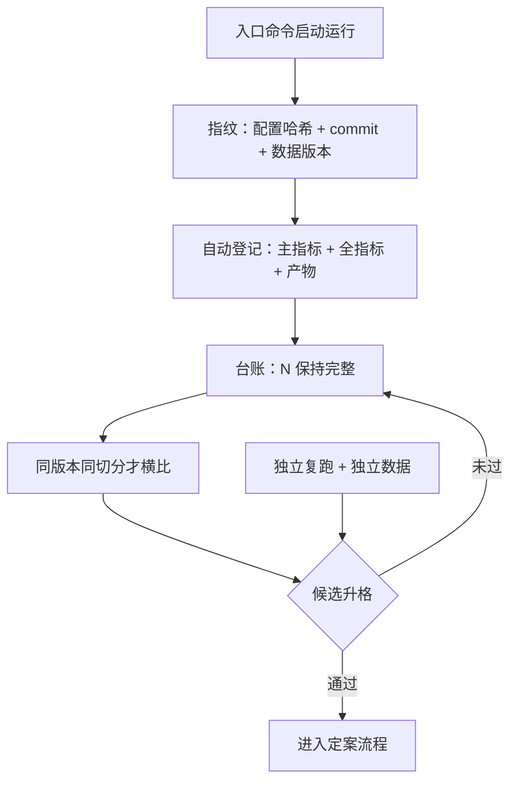

# 实验管理

没有台账的四十次尝试里，最好的那一次不是发现，是抽样误差的冠军。

<footer>—— 据 Harvey, Liu and Zhu, …and the Cross-Section of Expected Returns, Review of Financial Studies, 2016；Bailey, Borwein, López de Prado and Zhu, Notices of the AMS, 2014 整理</footer>

[上一课](/quant/rc2-notebook-engineering)让一次实验经得起重启重跑。缺口随即升级：一项研究不是一次实验，是一串——今天换窗口，明天换特征，后天换 universe。一串实验若没有台账，串里最好的成绩无法解释，因为你连串里一共有多少次尝试都数不出。本课写实验管理的最小机制：每次运行登记指纹与指标，试验计数保持完整，横比口径统一。它是[研究日志纪律](/quant/research-log-discipline)在工程上的落点。

## 问题

实验管理的核心困难不在记录，在**完整**。手记台账漏掉的几乎全是失败的尝试：人只在成功时想留下记录。残缺台账比没有台账更会撒谎——分母 $N$ 被静默缩小，分子全是赢家，于是最普通的一次运气在台账里看起来像信号。计量的后果是硬的：检验统计量要除以尝试次数打折，$N$ 记不全，折价就算不出。[回测过拟合](/quant/backtest-overfitting)的 CSCV 框架与[缩水夏普](/quant/bailey-dsr)都假设你知道 $N$；假设落空，整条防线失效。第二个困难是**可比**：三周前的成绩与今天的成绩要能放在同一张表里比，前提是数据版本、切分与指标口径都没动过——而这三样恰恰是最常被顺手改掉的。

## 方法

### 最小登记字段

每次运行自动登记五项：**配置指纹**（配置文件哈希，改参即换指纹）、**代码版本**（commit 哈希）、**数据版本引用**（[数据版本化](/quant/de-data-versioning)的快照 ID，不是「数据库当前状态」）、**指标**（预先锁定的主指标在前，完整指标在后）、**产物路径**。登记必须自动挂在入口命令上，不给「这次先不记」留操作空间；探索轨道自由登记，候选升格要走独立复跑——分轨规则照[研究日志纪律](/quant/research-log-discipline)执行。

## 机制

台账真正的产出不是「找回某次实验」，是**让 $N$ 成为可审计的量**。[研究复盘](/quant/research-postmortem)的假设台账、[回测协议](/quant/fml-research-workflow)的试验可数，落点都在这张表上：评审问「这组参数试过几次」，答案从台账查询来，不从记忆来。横比的机制同样由此保证：两次登记的指纹若只在配置一栏不同，差异可以归因到参数；三栏都不同，根本不许放进同一张比较表——口径漂移下的排名是在比噪声。扫描框架的落库规则（[参数扫描的架构](/quant/bf-param-sweep-arch)）是本课在批量场景的特例：扫描的每一格都是一次运行，都要入账。

不这么做错在哪：没有自动登记的团队，半年后的典型对话是「我记得我们试过动量，好像是二十天窗口，效果还行」——没有指纹、没有 $N$、没有切分口径，这句话既不能证实也不能证伪，只能重试一遍，而重试又是一次不入账的尝试。

Harvey–Liu–Zhu 给出的口径：考虑到跨试验的多重比较，新因子的 t 统计量门槛应从 2 抬到 3。门槛抬得再高，也救不了记不全的分母——漏记的试验几乎全是失败的，这使台账的偏差方向恒定为高估。

## 边界

实验管理不判断好坏：台账记录的是「做过什么」，判据与放弃线属于研究文档与提案评审，升格决策属于委员会。它也不替代版本控制——台账引用 commit 与快照，本身不存代码与数据；引用断了（快照被删、仓库被清），台账退化为购物小票，所以引用的靶标必须落在不可变存储上；打包与盲跑的验收标准，是下一课的主题。最后，别把台账当成品排行：主指标之外的完整指标登记在案，就是为了防止「按单一指标排名」把台账用成新的过拟合装置。

## 小结

- 实验管理的核心是完整性：$N$ 记不全，多重检验折价失效，台账反而放大高估。
- 最小五字段：配置指纹、代码 commit、数据版本引用、指标（主指标预锁）、产物路径。
- 登记自动挂入口，不给「先不记」留操作空间；探索与候选分轨，升格走独立复跑。
- 横比只在同数据版本、同切分、同指标口径下进行，指纹差异决定可比性。
- 出处：Harvey, Liu and Zhu, *RFS*, 2016；Bailey, Borwein, López de Prado and Zhu, *Notices of the AMS*, 2014；站内[研究日志纪律](/quant/research-log-discipline)、[数据版本化](/quant/de-data-versioning)、[回测过拟合](/quant/backtest-overfitting)各课。
