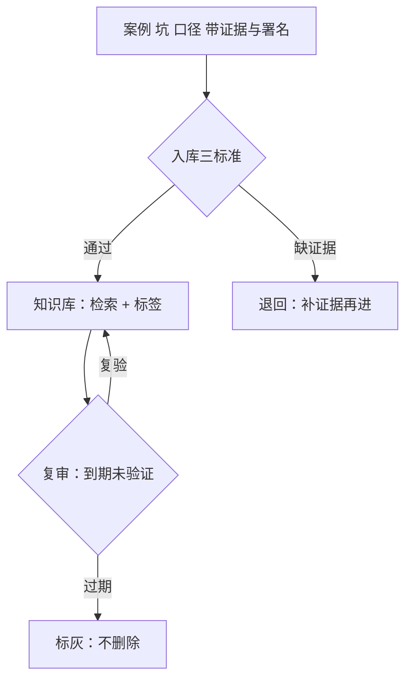

# 团队知识库

知识库不是案例的备份，是组织的二手记忆；它的第一条纪律不是「写」，是「标记失效」。

<footer>—— 据站内研究复盘的负结果可检索口径与策略台账的知识管理分工整理</footer>

[上一课](/quant/rc2-research-docs)把每项研究写成可冻结的一页案例。缺口在案例之上：案例各自成立，组织仍然失忆——同一个供应商字段怪癖、同一处时区陷阱、同一类失败模式，散在几百页案例里，检索不到就等于没写。本课写团队知识库：跨研究的第二层记忆装什么、怎么进、怎么防腐。它与[策略台账](/quant/sl-knowledge-management)分工：那边管策略资产的生命周期记录，这边管研究过程的知识沉淀。

## 问题

组织失忆的成本不是重复劳动，是重复**风险**。同一个数据坑，A 组三个月前绕过去了，B 组今天原样踩上——因为 A 组的知识活在他脑子里，离职或调组即清零。新人头三个月能提问的对象只有一个：老员工，而老员工的时间是团队最贵的资源。放任自流的解法通常是「建个 wiki」，然后得到一个只进不出的坟场：几百页没人敢删的页面，检索靠记忆文件名，内容真假与时效全凭运气。**过期的知识比没有知识更危险**：一条「该字段有误」若早已修复而仍躺在清单里，新人会绕开一个其实可用的字段，并且没人知道为什么绕。缺口因此是三样东西的合取：装什么、怎么进、怎么防腐。

## 方法

### 三类内容与入库标准

知识库装三类跨研究的知识。**数据坑清单**：供应商字段怪癖、公司行动修正行为、时区与对齐陷阱——[数据版本化](/quant/de-data-versioning)与数据质量监控的副产品，按供应商与数据集归档。**口径表**：每个指标、每条清洗规则的唯一定义处，口径之争在此裁决，别处引用不定义。**失败模式与家族分类**：按[因子本体](/quant/alphaschema-ontology)的骨架归档案例，让「又一个动量族衰减」能被检索。入库三条标准：有证据引用（实验 ID 或快照）、有日期、有署名——没有证据的段子不收；这与[研究复盘](/quant/research-postmortem)「负结果可检索」是同一条款的组织级版本。

## 机制

防腐的机制是**失效标记加复审责任**，不是删除。每条知识带「最后验证日期」，复审到期未验证自动标灰：标灰的内容仍可检索，但带显著警告——历史也是证据，「当时错在哪」本身有检索价值，删掉就把教训一起删了。复审责任落在使用者身上：谁引用、谁顺手复验并刷新日期，比设专职管理员可持续。检索优先于目录：全文检索加标签是主路径，目录只留三层——目录编得再细，也细不过组织分裂的速度。

为什么这套机制成立：它把知识从「人的记忆」搬到「带时间戳的记录」，并且让记录自己报告自己的年龄。新人的问题从「问问老王」变成「查坑清单」；查不到的东西才升级为提问，而每次升级提问再沉淀入库，知识库就完成一次生长。反过来，没有日期与复审的库，每次检索都要先猜真假——猜的成本高过问人，库就被弃用，回到人治。

一个可操作的启动口径：知识库不从「整理历史」起步，从「拦下一次事故」起步——每次跨团队事故与返工，先落一条带判据的坑记录，历史知识在头三个月里自然长出骨架，比一次性大迁徙快得多。

## 边界

知识库不承载结论级研究记录——那是[研究文档](/quant/rc2-research-docs)与案例库的事；库里的条目指向案例，不复述案例。它也不裁决口径：口径表记录裁决结果，裁决流程属于委员会（下一课）。别把知识库当协作沟通工具：讨论与争论留在评审与会议里，库只收沉淀物；把待办、草稿、情绪倾倒进库，检索信噪比立刻崩坏。最后，库存有组织偏差：署名与判据让幸存者偏差比散装八卦好一点，但不消除——流传下来的永远是有人记得写下的，这层偏差只能靠复盘归档的强制条款兜底。

## 小结

- 组织失忆的代价是重复风险；过期的知识比没有知识更危险，防腐优先于收集。
- 三类内容：数据坑清单、口径表（唯一定义处）、失败模式与家族分类（挂本体骨架）。
- 入库三标准：证据引用、日期、署名；没有证据的段子不收。
- 防腐机制：最后验证日期加到期标灰，标灰不删除；谁引用谁复验。
- 出处：站内[研究复盘](/quant/research-postmortem)的归档口径、[策略台账](/quant/sl-knowledge-management)的知识管理分工、[因子本体](/quant/alphaschema-ontology)与[数据版本化](/quant/de-data-versioning)各课。
