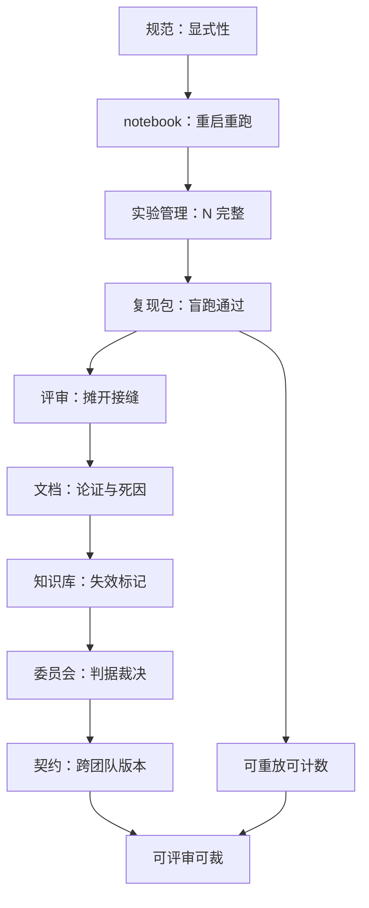
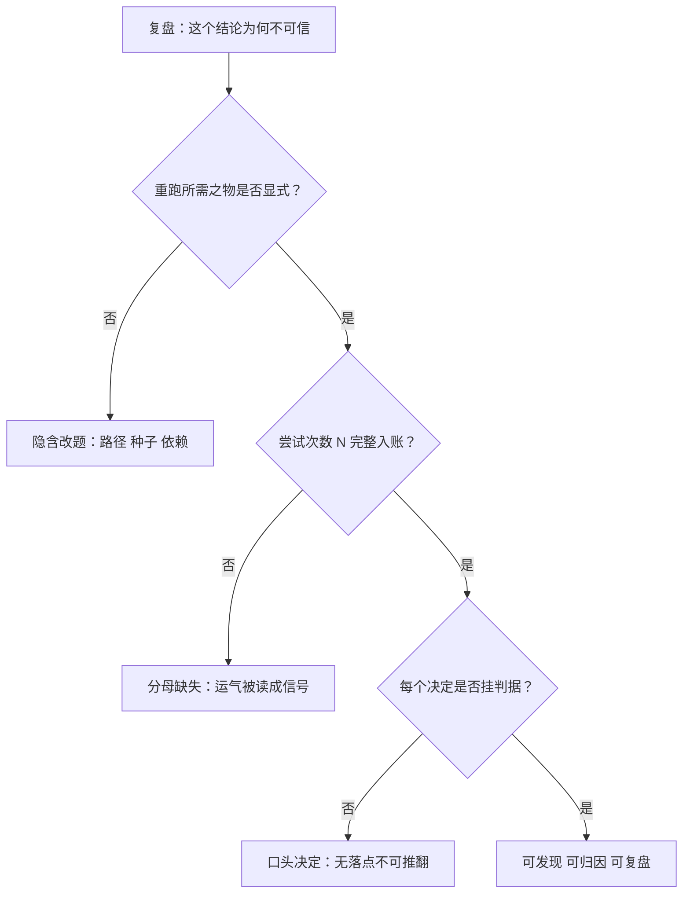

# 协作与复现收束

复现是协作的最小单元：不能重跑的实验无法被评审，无法被评审的研究无法协作。

<footer>—— 据 Arnott, Harvey and Markowitz, A Backtesting Protocol in the Era of Machine Learning, Journal of Financial Data Science, 2019 与 Wilson et al., Best Practices for Scientific Computing, 2014 全课程口径整理</footer>

[上一课](/quant/rc2-cross-team-cases)用三个案例把接口写成契约。十课走完，本课收束：先收回个人层四课，再收回组织层五课，最后把这条线放回它与回测框架设计课程的接缝上。本课程到此收束。

## 问题

收束课要回答的问题只有一个：这十课合起来，把研究这件事改成了什么。## 方法

答案写在两个层的分工里。个人层改的是**一次研究**：规范钉显式性，notebook 钉重启重跑，实验管理钉 $N$ 的完整性，复现包钉陌生人盲跑——四课合起来，把一次实验从「做过的动作」变成可复述的函数 $f(\text{配置}, \text{快照}) \to \text{结果}$。组织层改的是**一群人的研究**：评审摊开接缝盲区，文档接住论证与死因，知识库抵抗失忆并标记失效，委员会把停止的权力独立于人，跨团队契约把「我知道」变成「引用版本」。两层不是并列的清单，是依赖关系：组织层审的全部材料——diff、指纹、台账、一页文档、复现包——都是个人层的产物；个人层不达标，组织层就在空转。

## 机制

全课程反复出现的机制只有三个。**显式**：凡是重跑与裁决所需的东西——参数、种子、依赖、判据、放弃线——先于结果存在并落进文件；隐含是所有事故的共同入口。**可数**：试验入账、$N$ 完整、决策按时间记录，多重检验折价才有分母——[研究日志纪律](/quant/research-log-discipline)的 t 值门槛与[缩水夏普](/quant/bailey-dsr)都建立在这个分母上。**挂判据**：放弃落死因、驳回落条款、复盘落接口，所有「不做了」「不许过」都有可检索、可推翻的落点——这是[研究复盘](/quant/research-postmortem)「『效果不好』不是数据」在全课程的重现。

与回测框架设计课程的接缝值得明写：那门课把回测语义做成可维护、可审计、可重放的**软件**——引擎重放事件流；本课程把研究过程做成可重放的**组织记忆**——台账重放决策、快照重放输入、文档重放论证。两门课合起来，研究才同时拥有两种可重放：计算的与决定的。缺前者，结论无从核查；缺后者，核查过的结论也无从问责。

这张图与上图分工不同：上图画十课的依赖顺序，这张画三个机制各自缺了会死在哪——事故复盘时按图索骥。直觉类比：「显式」就是「写进文件」：脑子里的默认值等于没有默认值，会议室里的口头共识等于没有共识，只有落在文件里、带时间戳的东西才能在三个月后出来作证。

数字实例看「可数」：某因子在 40 次尝试中最好的一个 $t=2.5$，按经典门槛 2 算「显著」；按 Harvey–Liu–Zhu 抬到 3 的跨试验门槛，$2.5 \lt 3$ 只能归入「待定」。同一组数、两个结论——差别只在分母 $N=40$ 有没有躺在台账里。

全课程只要求背走一个数：Harvey–Liu–Zhu 之后，跨试验比较的 t 统计量门槛从 2 抬到 3。而它成立的前提只有一个——分母 $N$ 完整地躺在台账里；这一前提就是本课程十课的全部工程。

## 边界

收束课划边界：工具会过期，机制不会。实验跟踪产品、notebook 形态、wiki 与工作流引擎，三年一代；显式、可数、挂判据这三条机制与工具无关，换什么栈都要重实现一遍。课程也不承诺复现能消除错误：它只保证错误**可发现、可归因、可复盘**——泄漏的因子复现得越完美，越依赖评审清单与判据去拦。最后，这套协作有真实成本：评审的延迟、委员会的节奏、契约的维护，都是研究速度的对价；课程各课已给过控制成本的口径——门设在押资源的时刻、契约只留三条硬条款、知识库标灰不删除——照用即可，不必加码。

常见误区：初学者容易以为「上一个实验跟踪平台」就等于完成了实验管理。工具是机制的载体，不是机制本身——平台不会替你阻止「这次先不记」，台账分母照样缺；换栈时显式、可数、挂判据要在新栈里逐条重落地，验收标准是流程行为，不是软件采购合同。

## 小结

- 个人层四课把一次研究变成可复述的函数：显式、可重跑、可计数、可盲跑。
- 组织层五课把一群人的研究变成可裁的证据链：评审、文档、知识库、委员会、契约。
- 三个贯穿机制：显式（先于结果存在）、可数（$N$ 完整入账）、挂判据（决定可检索可推翻）。
- 与回测框架课程合看：引擎重放计算，台账重放决策，研究才同时可核查、可问责。
- 工具三年一代，机制不过期；协作的成本照各课给的口径控制，不必加码。
- 出处：Arnott, Harvey and Markowitz, *JFDS*, 2019；Wilson et al., 2014；Harvey, Liu and Zhu, *RFS*, 2016；站内[研究日志纪律](/quant/research-log-discipline)、[缩水夏普](/quant/bailey-dsr)、[研究复盘](/quant/research-postmortem)与上一课[跨团队协作与案例](/quant/rc2-cross-team-cases)。
