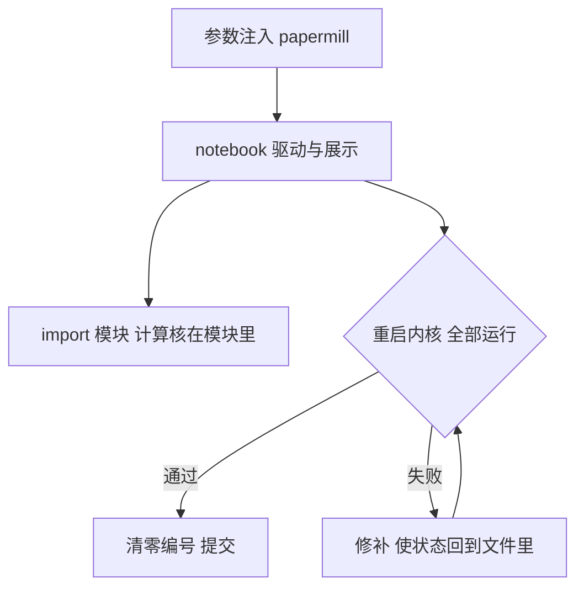

# notebook 工程

notebook 的承诺是叙事与计算同页；它的代价是状态与叙述一样容易失序。重启重跑，是唯一诚实的校对。

<footer>—— 据 Pimentel et al., Understanding and Improving the State of the Art in Notebook Reproducibility, 2019 与 Jupyter 社区的 restart-and-run-all 约定整理</footer>

[上一课](/quant/rc2-code-standards)把研究代码钉在配置分离与纯函数计算核上，但研究的第一现场往往不是模块，是 notebook：数据在眼前、图在下一格、叙述顺手就写进 Markdown 单元。这份自由正是它的生产力和它的复现黑洞。本课写 notebook 的工程纪律：它只是驱动层，计算核仍在模块里；验收门只有一个——重启内核后从头跑通。守不住这一格，上一课的五条规范在 notebook 里全部作废。

## 问题

notebook 有两大病灶，都来自同一个根源：**内核状态与文件内容是两个东西**。其一，隐藏状态：你看到的代码是文件，变量却住在内核里——删掉一格重跑，旧变量还在；编号乱序地跑过一遍，图是旧代码画出来的。文件记录的实验和内核里跑过的实验，早就不是同一次。其二，巨型单体：加载、清洗、建模、画图长在一页里，跑通了，但没人敢动其中任何一格——一动就全页重跑，一动就断。于是 notebook 变成只进不出的圣物：能看，不能改，更不能重跑。Pimentel 等对公开 notebook 的研究用「重启后全部执行」检验，绝大多数经不起——「我这里能跑」与「任何人都能跑」之间隔着这一格。

## 方法

### 驱动层纪律

解法是把上一课的分层搬进 notebook：**notebook 只做驱动与展示**——读配置、调模块、画图、写叙述；加载与清洗、计算核都住在可导入的模块里，notebook 用 `import` 调用，不复制粘贴。参数注入用执行器（如 papermill）从外部配置生成 notebook，一份模板跑一批参数，而不是复制十个文件改十处路径。大表与模型产物落盘成文件，notebook 里只留引用与图，不把百兆数据帧留在输出里随文件一起提交。**提交前清零编号**：编号连续只说明你这次没乱跑，说明不了别人能跑通。

## 机制

为什么唯一的门是重启重跑：它把「实验等于文件」这个假设强制兑现一次。内核态的任何依赖——残留在内存里的修正列、上次手动执行的那格改参——都会在重启后暴露为 NameError、旧图或静默不同的数字。失败是好事：它逼你把隐含依赖搬回文件，搬回模块，搬回配置。这正是上一课「显式性」约束在执行环境上的延续，只是检查从人眼换成了机器。

不这么做错在哪，量化场景有一类专属事故：notebook 里的探索结论（某因子窗口最优）被抄进正式代码，而 notebook 当时用了一个只在内核里存在的前处理步骤；三个月后复现包对不上基准，追查半天，死因是那格没保存的 cell。结论先行、代码后补，是 notebook 最贵的失败模式。台账接在后面：重启重跑通过的那次运行，才值得登记指纹与指标。

易错点：把「编号连续」当成「顺序正确」。乱序执行的文件可以恰好编号连续，只要那是在乱跑之后一次性提交的；唯一可信的证词是提交前那一次「重启并全部运行」，编号从 1 开始且一路通过。

## 边界

notebook 不必消灭：探索期的乱序快跑是它的正当用途，本课约束的是**被引用的时刻**——结论进文档、进汇报、进台账之前，那一页必须过重启重跑的门，与上一课「被引用的草稿没有豁免权」同一条款。也不是所有计算都该塞进模块：一次性的一行统计、一格画图诊断，留在 notebook 里比新建模块更诚实。真正的边界在于：凡是别人需要重跑的东西（计算核、参数、数据路径），不许只活在内核里。可视化诊断的更多手法，回测框架一侧另有专课，本课不展开。

## 小结

- notebook 的根源病灶：内核状态与文件内容是两个东西；文件记录的不一定是内核跑过的实验。
- 驱动层纪律：notebook 只做驱动与展示，计算核在模块里，参数用执行器注入。
- 唯一验收门是重启内核后全部运行；通过才允许提交，提交前清零编号。
- 大产物落盘留引用，别把数据帧存进输出；结论抄进正式代码前，先确认依据可重跑。
- 出处：Pimentel et al., 2019 对 notebook 复现率的实证；Jupyter 社区 restart-and-run-all 约定；站内[研究代码的规范](/quant/rc2-code-standards)一课。
