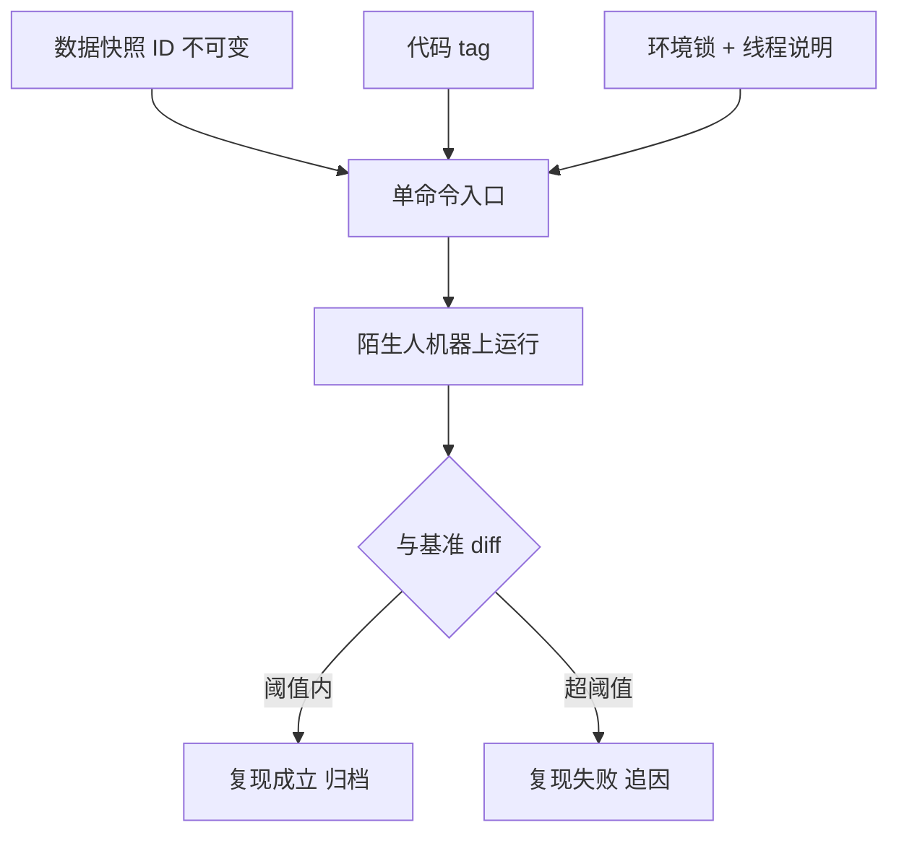

# 复现包的标准

复现包的验收不是「在我机器上能跑」，是「在陌生人的机器上跑出同一张表」；前一句是安装问题，后一句才是复现。

<footer>—— 据 Sandve et al., Ten Simple Rules for Reproducible Computational Research, PLoS Computational Biology, 2013；站内研究复盘的快照双冻结口径整理</footer>

[上一课](/quant/rc2-experiment-management)把一串实验收进台账，引用的靶标落在不可变存储上。缺口是交付：研究定案后要交到陌生环境里的陌生人手里——评审要看，审计要查，接手的人要跑。本课定复现包的标准：数据快照、代码、环境、入口、基准五件齐，盲跑通过才算数。它是[研究复盘](/quant/research-postmortem)「可复现快照」一件的工程化。

## 问题

「能跑」与「跑得同」是两件事。环境锁与容器解决依赖可安装，但装好了不等于输入同一：指向「数据库当前状态」的连接，在数据修正发布后跑出的就是另一份数据——[数据版本化](/quant/de-data-versioning)的三种不可复现（就地更新、选择性重拉、规则漂移）全部静默。输入同一了，还有输出同一：浮点归约顺序、BLAS 线程数、并行度，都会让「同一实验」的年化收益在小数点后几位开始分叉。三关全过，复现才成立；缺任何一关，复现退化为「能运行」，而能运行的假复现比明确标注「不可复现」更危险——它让人以为核查过了。

## 方法

### 五件套

**数据快照引用**：钉快照 ID，不钉地址；快照不可变是[数据版本化](/quant/de-data-versioning)的旧版本永不变原则。**代码 tag**：定案时刻打 tag，此后任何改动都是新版本。**环境锁**：依赖清单钉版本，附硬件与线程数说明。**单命令入口**：从快照到结果表一条命令，无手动步骤——Sandve 第二条「避免手动数据操作」：每一步手工操作都是包里的隐形依赖。**预期输出基准**：结果表与关键图随包提交，重跑后 diff；允许的浮点差异要预先声明阈值与来源，超阈值即复现失败，而不是「大概一致」。

## 机制

标准的判定机制是**陌生人盲跑**：把入口命令、数据引用与文档交给从没碰过这个项目的人，在他不问作者的条件下跑通并对上基准。为什么必须是陌生人：作者自己再跑一遍，会无意识地补上文档没写的隐含步骤——换个目录、先手动下载、跳过某个报错；这些隐含步骤正是包的破绽，只有盲跑能把它们暴露出来。盲跑通过率是复现包唯一的验收指标：一份包要么一次盲跑通过，要么不合格，没有「基本能复现」。

定案时刻的**双冻结**把包与复盘衔接：代码 tag 与数据快照同刻冻结，案例、结果、包互相引用（[研究复盘](/quant/research-postmortem)的同模板归档）。此后数据修正发布，包不受影响——它引用的是旧快照，而旧快照永不可变；要在新数据上重估，那是新版本的事，不是改旧包。[框架的测试](/quant/bf-framework-testing)的黄金重放在这里换了个对象：黄金案例从「引擎重放出同一笔成交」变成「包重放出同一张结果表」，验收逻辑同构。

文档质量有一个粗略的先行指标：出现的「先手动跑一下」「先改一下路径」越多，盲跑通过率越低。每句这种话都是一次把依赖转嫁给读者的记录，写包时看到它们就该变成配置项。

## 边界

复现包是**定案的产物，不是探索的日常**：每跑一次就打包会把研究拖死，打包频率跟里程碑走——提案定稿、定案评审、复盘归档各一次。它也不解决正确性：包忠实地复现一个带泄漏的因子，复现得越完美，错误走得越远；正确性由评审清单与预注册判据把关，包只保证「可核查」。最后，包有半衰期：数据供应商改接口、依赖库停维护，几年后旧包可能装不起来；这不是标准失效，是归档的现实——快照与结果表仍能证明当时算出过什么，重跑是另一回事。

## 小结

- 「能跑」与「跑得同」是两关：环境锁管可安装，快照 ID 管输入同一，基准 diff 管输出同一。
- 五件套：快照引用、代码 tag、环境锁、单命令入口、预期输出基准；手动步骤是隐形依赖。
- 唯一验收指标是陌生人盲跑通过；作者自跑不算数，他会无意识补上文档缺的步骤。
- 定案时刻双冻结：代码与数据同刻冻结，之后的一切改动都是新版本。
- 出处：Sandve et al., *PLoS Comput Biol*, 2013；站内[研究复盘](/quant/research-postmortem)、[数据版本化](/quant/de-data-versioning)、[框架的测试](/quant/bf-framework-testing)各课。
