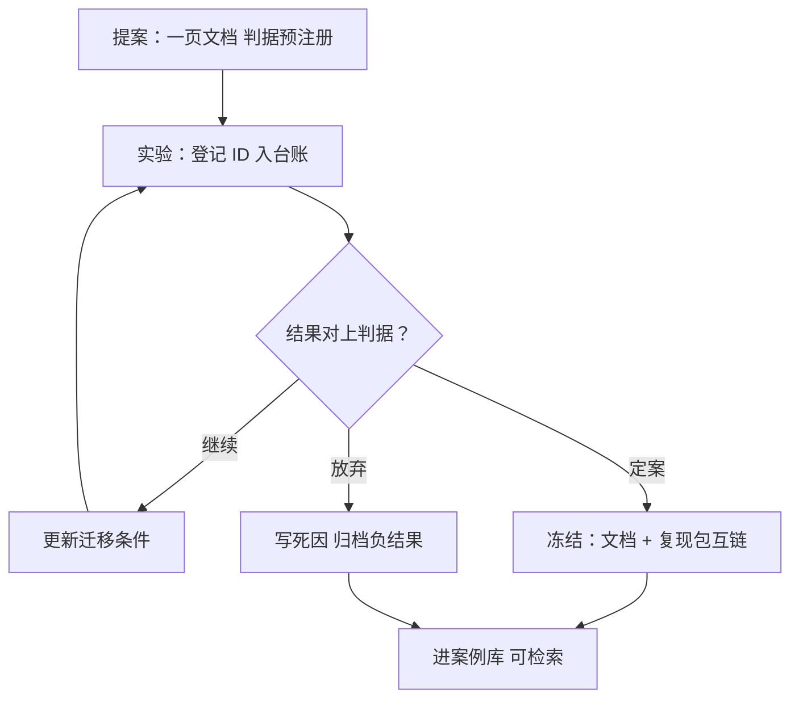
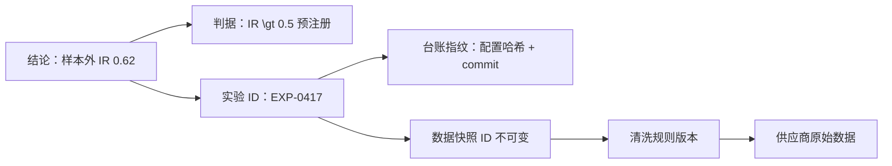

# 研究文档

研究文档里最贵的一段，是「我们为什么放弃」；没有它，组织会用同样的学费再交一次。

<footer>—— 据 Arnott, Harvey and Markowitz, A Backtesting Protocol in the Era of Machine Learning, Journal of Financial Data Science, 2019 与站内研究复盘的归档口径整理</footer>

[上一课](/quant/rc2-code-review)的清单守住了代码与配置，但研究最有价值的部分不在 diff 里：假设为什么立、判据定在哪、为什么半途放弃——这些只住在作者脑子里，脑子会离职、会失忆、会把运气记成判断。本课写研究文档：一页假设文档的最小结构，以及它从活文档到冻结案例的两段生命。它是[研究复盘](/quant/research-postmortem)四件沉淀物在写作端的展开。

## 问题

研究论证有三个去处，全都不可靠：notebook 的叙述格（跟着输出漂移）、会议上的口头汇报（当天就失真）、作者的记性（把 $N$ 次尝试压缩成一个「我们试过」）。缺口是一份**独立于代码与人脑的论证载体**，它要同时满足三个属性：可追溯（每句结论挂得上证据）、可冻结（定案时刻定版）、可检索（半年后能被搜到）。缺了它，评审、审计与接手全都退化成考古——[复现包](/quant/rc2-repro-package-standard)让人能重跑你的计算，文档让人能重走你的推理；后者不比前者便宜。

直觉类比：复现包是料理包，加热就能得到同一道菜；研究文档是厨师的创作笔记——为什么选这个火候、试过哪种配料不行、放弃的那版差在哪。半年后想改进这道菜的人，加热料理包只能吃到原味，创作笔记才告诉他下一步往哪改。

## 方法

### 一页假设文档

六栏，一页写完。**问题**：这项研究要回答什么，为什么值得回答（源头见[研究问题的来源](/quant/research-question-origination)）。**数据**：快照 ID 与清洗规则引用，不写「数据库里的日频数据」。**方法**：计算核位置与配置指纹。**判据**：主指标与放弃线，提案时预注册，先于任何结果存在——这是[研究日志纪律](/quant/research-log-discipline)主指标预锁的文档落点。**结果**：只写登记过的实验 ID，不手抄数字。**死因或迁移条件**：放弃要写死因，继续要写条件。

## 机制

文档的两段生命对应两种不同的写作纪律。**活文档期**：提案与探索阶段随便改，版本由代码仓库管，与代码同一个 diff 流（上一课的评审顺带覆盖文档改动）；这一阶段的关键纪律只有一条——判据栏在见到结果之前就填好，之后不许回填。**冻结期**：定案或放弃时，文档与复现包互链、同刻冻结，成为案例：结果挂台账指纹，结论挂判据，审计从任何一句结论可以一键回溯到实验与快照。这正是回测协议要求的「决策按时间记录」在写作上的兑现：文档的时间戳与内容绑定，回填无处遁形。

为什么「死因」一栏最值钱：研究的产出里，负结果占大多数，而组织天然只流传成功案例。死因写成「效果不好」等于没写——它不落在判据上，不告诉后来者**哪条路在什么条件下不通**。写成「在 2015 前样本内有效、样本外衰减到零，判据是样本外 IR 大于 0.5，未达」——同样一句放弃，变成了可检索、可引用、可推翻的证据。半年后有人想重试同一片沼泽，搜到的是一条带判据的死因，而不是一片空白。

这张图回答的问题与上图不同：上图是文档的一生怎么走，这张是审计员怎么从一句话走回原始数据——「可追溯」不是形容词，是这样一条每环都落在不可变存储上的链。术语翻译：「冻结」不是从此不许改，是定版存档：此后修改的唯一合法方式是开新版本并注明理由，旧版仍在——像会计只做红字冲销，不改旧账。

统计各团队文档的空栏率，「死因或迁移条件」几乎总排第一。它空着的原因不是懒，是没有预注册的判据——没有判据，「放弃」就找不到落点，只能含糊其辞。

## 边界

文档不替代数据：它引用实验与快照，本身不承载结果表的全量——引用断了，文档退化为散文，所以引用靶标必须落在不可变存储。它也不写成论文：一页是硬约束，超过一页说明判据不清，而不是研究深刻。更不要求文采：六栏填实比写得漂亮有用得多。最后，活文档期不等于无纪律——探索期的改判可以，改判要留痕；冻结之后再改内容的唯一合法方式是开新版本并注明理由，直接改历史是[数据版本化](/quant/de-data-versioning)禁的那条路在文档上的翻版。

常见误区：初学者容易把「一页」的硬约束当成不重视，越写越长以显得严谨。实际上超过一页几乎总说明判据没定清楚——论证发散是因为不知道什么算完成；六栏各一句话的文档，比三十页的综述更能通过评审，因为评审查的是证据链，不是字数。

## 小结

- 文档是独立于代码与人脑的论证载体：可追溯、可冻结、可检索，三者缺一即考古。
- 一页六栏：问题、数据引用、方法与指纹、预注册判据、结果挂实验 ID、死因或迁移条件。
- 两段生命：活文档期与代码同 diff，冻结期与复现包互链成案例。
- 死因必须落在判据上；负结果可检索，组织才不会用同样的学费再交一次。
- 出处：Arnott, Harvey and Markowitz, *JFDS*, 2019；站内[研究复盘](/quant/research-postmortem)、[研究日志纪律](/quant/research-log-discipline)、[研究问题的来源](/quant/research-question-origination)各课。
