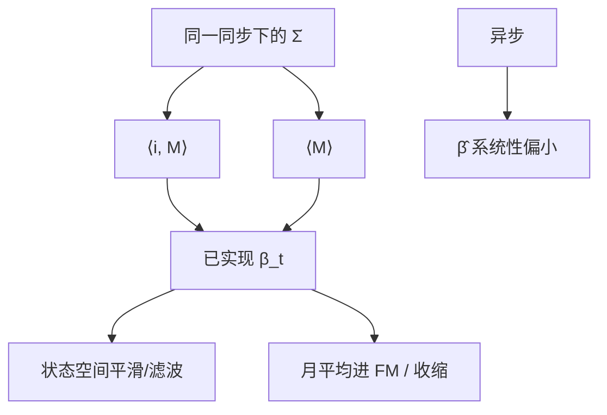

# 已实现 beta

把一天之内的协变差除以市场的已实现方差，得到当日的 $\beta$；它测的是这一天共同波动里的暴露，不是三年日收益回归的平均斜率。

<footer>—— Andersen, Bollerslev, Diebold and Wu 对已实现 beta 的经验与建模；二次协变差表述见 Barndorff-Nielsen and Shephard</footer>

[已实现协方差](/quant/realized-covariance) 给出矩阵 $\hat\Sigma_t$。已实现 beta

$$
\hat\beta_{iM,t}=\frac{\widehat{\langle X^i,X^M\rangle}_t}{\widehat{\langle X^M\rangle}_t}
$$

是当日对市场（或因子）的二次协变差比。Andersen、Bollerslev、Diebold 与 Wu 把它写成时变 $\beta$ 的测量，再对 $\{\hat\beta_t\}$ 建模（持续、均值回复）。缺口是：**分子分母的噪声与异步处理必须匹配**，否则高频 $\beta$ 系统性偏小（Epps 在分子）。下一课刷新时间专门解决分母与分子的共同时钟。本课先钉对象：日度测量 vs 日频 OLS $\beta$。

## 问题

日频 $\beta$ 来自 $R_{it}=\alpha+\beta R_{Mt}+\varepsilon_{it}$ 的月或年窗口，平均掉日内变异。已实现 $\beta$ 每个交易日一个读数，看见 $\beta$ 在公告日、危机日跳。问题是测量误差：$\hat\beta_t$ 的误差来自 $\hat\Sigma$ 的误差，薄股票、短会话噪声大，时序上看 $\beta_t$ 会抖。应用 Kalman 或 HAR 式平滑当状态，交易只用滤波后的 $\beta$，接 [状态空间](/quant/state-space-kalman-smoother) 纪律。

Fama–MacBeth 用时间序列 $\beta$ 进截面。用已实现 $\beta$ 的月平均进 FM，是用更好的测量减生成回归量噪声，但仍要 Shanken/HAC。对象仍是风险价格，不是宣称高频 $\beta$ 可交易。

### 偏差清单

- 异步：个股慢于指数期货，分子偏小，$\hat\beta<1$ 的幻觉。
- 噪声：分母 TSRV、分子朴素，量纲乱。
- 隔夜：分子含隔夜、分母不含，或反过来。
- 跳跃：共跳让 $\beta$ 在新闻日飙升，连续 $\beta$ 应用跳稳健协方差。

股指期货往往领先现货。用期货当 $M$、现货当 $i$，已实现 $\beta$ 含领先滞后。若对象是对冲现货，应允许滞后窗口或用 HY 滞后版，而不是强迫同期格。

## 方法

**构造。** 同一同步规则下估 $\langle i,M\rangle$ 与 $\langle M\rangle$。推荐：刷新时间 + 核，或五分钟 previous-tick 两边同一格。TSRV 只用于分母、分子用 HY，须在报告里当「混合估计」而不是标准已实现 $\beta$。

**时序模型。** $\beta_{t+1}=c+\rho\beta_t+u_{t+1}$ 或 HAR 式多尺度。测量方程 $\hat\beta_t=\beta_t+v_t$，$v_t$ 异方差（随 $IV$ 与 $n$）。状态空间自然。样本外：用 $\beta_{t|t-1}$ 对冲次日，评估跟踪误差，不要用平滑 $\beta_t$。

**截面。** 月内日已实现 $\beta$ 平均，再当 FM 第一步。噪声仍在，Vasicek 收缩可向 1 拉，接 [收缩](/quant/shrinkage-empirical-bayes)。薄股权重更大。

### 与条件 CAPM

已实现 $\beta$ 是测量，不是检验。条件 CAPM 还要 $\lambda_t$。高 $\hat\beta_t$ 日的平均收益是否更高，是另一回归，HAC 与重叠照旧。不要把「$\beta_t$ 能预报」与「$\beta_t$ 测得准」混为一谈。

## 机制

二次协变差比是连续时间回归系数在一天上的积分版：若瞬时 $\beta_u$ 变化，已实现 $\beta$ 是以市场瞬时方差为权的平均。危机日 $\sigma_M$ 大，当天 $\hat\beta$ 更反映危机暴露。机制解释为何已实现 $\beta$ 的时间变异大于日频滚动 $\beta$（滚动还平均了许多天）。

Epps 机制：分子漏记共同波动，分母一元 RV 漏得少（只噪声），比值向下。同步修好分子后，$\hat\beta$ 回升。这是执行对冲比时必须用已实现量而非日 $\beta$ 的理由之一——也是必须修 Epps 的理由。

对冲误差方差 $\approx \langle i\rangle-\langle i,M\rangle^2/\langle M\rangle$，即已实现残差方差。报 $\hat\beta$ 应同时报已实现 $R^2$。很低说明当天特异主导，对冲价值有限。

### 到刷新时间的交接

刷新时间让所有腿在同一事件时钟上更新后再取收益，是多元核与已实现 $\beta$ 的标准前置。下一课写它丢掉什么信息、何时 HY 更省。本课只要求：$\beta$ 的两端同一时钟。

## 边界与工程取舍

半天市、熔断，$n$ 小，$\hat\beta$ 无对象。行业 ETF 对行业指数的 $\beta$ 近 1 噪声仍可观。用中点 $\beta$ 去对冲成交路径，执行滑点不在测量里。

工程：日频风控用五分钟已实现 $\beta$ 的 Kalman；研究用核。与日 OLS $\beta$ 并列。不要用未同步 tick $\beta$ 做盘中对冲。不要把已实现 $\beta$ 的 $t$（把日当独立）去检验 $\beta=1$——须 HAC。下一课：刷新时间。

## 小结

- 已实现 $\beta$ 是当日二次协变差比，测一天的暴露，不是长窗口 OLS $\beta$。
- 分子分母须同一噪声与同步处理；异步使 $\beta$ 偏小。
- $\{\hat\beta_t\}$ 测量误差大，应用滤波再对冲；平滑不可交易。
- 共跳、隔夜、期货领先都改变对象，须声明。
- 出处：Andersen, Bollerslev, Diebold and Wu 关于已实现 beta；协变差理论见 Barndorff-Nielsen and Shephard, *Econometrica*, 2004。
