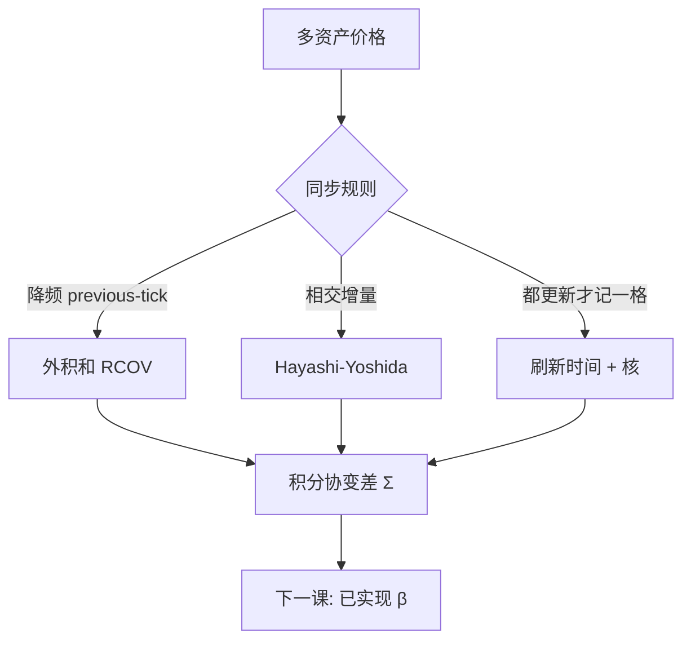

# 多元已实现协方差

无噪声、同步观测时，日内收益外积之和收敛到积分协变差；异步与噪声会把同一加总拉向零或拉向噪声交叉项，必须先声明对时与降噪。

<footer>—— Barndorff-Nielsen and Shephard, Econometric Analysis of Realized Covariation, Econometrica, 2004</footer>

[TSRV](/quant/tsrv) 修好了一元 $IV$。组合、$[X,Y]$、对冲比需要矩阵。Barndorff-Nielsen 与 Shephard 给出无噪声同步下已实现协方差 $\sum r_i r_i^\top\to_p \int\sigma_u\sigma_u^\top du$ 的渐近理论，并与已实现方差同一套幂变差语言。实务立刻碰到两件事：股票不同步成交（[Epps](/quant/epps-effect)），以及噪声交叉。本课缺口：把 **BN–S 的对象**写清，并把偏差来源分类；[Hayashi–Yoshida](/quant/hayashi-yoshida) 已给不同步的一种估计量。下一课把矩阵收成已实现 $\beta$；刷新时间课专门对付同步规则。

## 问题

$d$ 维对数价格 $X$，积分协变差矩阵 $\Sigma=\int_0^1 \sigma_u\sigma_u^\top du$。同步网格、无噪声、无跳（或跳计入）时

$$
\mathrm{RCOV}=\sum_{i=1}^{n}\Delta X_i\Delta X_i^\top \ \xrightarrow{p}\ \Sigma+[{\mathrm{跳的外积}}].
$$

观测是不同步的 $Y=X+\varepsilon$。Previous-tick 到公共格子再做 RCOV，密格子上大量零乘积，表观相关下降——Epps。噪声使对角像一元那样爆，非对角若噪声独立则主要加方差，若共同微观结构则偏。问题是：对象是 $\Sigma$ 的哪一部分（含不含跳），以及同步规则是 HY、刷新时间还是降频到五分钟。

Andersen、Bollerslev、Diebold、Labys 的经验已实现协方差是后续资产定价与宏观–金融的数据输入；计量上必须带着偏差清单用。

### 正定性

逐元 HY 或逐元核，拼起来的矩阵可以不正定。多元已实现核（Barndorff-Nielsen, Hansen, Lunde, Shephard）在刷新时间网格上对向量收益做核，保持半正定构造。工程上：要么整向量一套核，要么对不正定结果做投影（特征值截断），并声明。组合优化对最小特征值敏感，假的负相关会变成假对冲。

五分钟 previous-tick 矩阵是最常见的正定（外积和半正定）折中。它牺牲高频分辨率，换可复现与正定。要更高频，就要付同步与核的复杂度。

## 方法

**同步降频。** 公共五分钟，previous-tick，外积和。隔夜外积单独。适合横截面、HAR 式预测。

**HY。** 二元相交增量，无公共格。噪声脆弱；多元 $d>2$ 要两两算再拼，正定性不保证。适合配对、期现。

**刷新时间 + 核。** 所有资产都更新后记一格，再多元核。丢快资产在等待期间的成交。适合要半正定、要噪声修正的中等 $d$。

**跳跃。** 门限或双幂次协变差估连续 $\Sigma$；共跳外积是另一对象（新闻课）。先写要连续相关还是总协变差。

### 预测与损失

日频 $H_t$ 的预测可用已实现协方差的 HAR（Chiriac–Voev 一类）或 Wishart。评估用多元 QLIKE，代理必须与训练同一同步规则，否则在比较同步偏差。接 [QLIKE](/quant/qlike-vol-forecast-eval) 纪律。

## 机制

同步无噪声时，外积和是二次协变差的黎曼和，BN–S 给出稳定收敛与渐近混合正态。异步的机制是零填充或陈旧价格，共同 $d\langle X^i,X^j\rangle$ 被漏记。噪声的机制与一元相同，交叉项 $E[\Delta\varepsilon^i\Delta\varepsilon^j]$ 在独立时近零。HY 用重叠指示把漏记补回，但不减独立噪声的方差膨胀。

Epps 随采样变密而加剧，是同步规则的函数，不是经济相关消失。把分钟相关当「高频相关真的低」去做日频对冲，会在日频上暴露共同风险。

维数 $d$ 大时，即使五分钟，$n\approx 78$，$d=50$ 的矩阵噪声极大，须因子或收缩——波动因子课在已实现矩阵上同样适用。

### 到已实现 beta 的交接

$\beta^{ij}=\Sigma^{ij}/\Sigma^{jj}$。分子分母须同一同步与噪声处理，否则 $\beta$ 系统偏差。下一课专门写这个比。不要用日 $\beta$ 与高频 $\beta$ 不加声明地混用。

## 边界与工程取舍

$d$ 大、流动性差异大，刷新时间被最慢的腿决定，矩阵变成「慢时钟」。应分组（流动性桶）或 HY 配对。缺测、停牌让刷新卡死，须剔除或插值政策。

工程：研究默认五分钟 RCOV；配对 HY；要噪声修正的向量用刷新+核。报告同步规则与是否投影正定。不要对 tick 未对齐外积和当 $\Sigma$。不要用 RCOV 最小特征值去做无约束最小方差组合而不收缩。下一课：实现 beta。

## 小结

- 同步无噪声时，已实现协方差外积和一致于积分协变差（BN–S）。
- 异步造成 Epps 向下偏；噪声炸对角、污染交叉；须选 HY、降频或刷新+核。
- 逐元估计会失正定；向量核或特征值投影要声明。
- 预测评估与代理必须同一同步规则。
- 出处：Barndorff-Nielsen and Shephard, *Econometrica*, 2004；经验已实现协方差见 Andersen, Bollerslev, Diebold and Labys；多元核见 Barndorff-Nielsen, Hansen, Lunde and Shephard。
