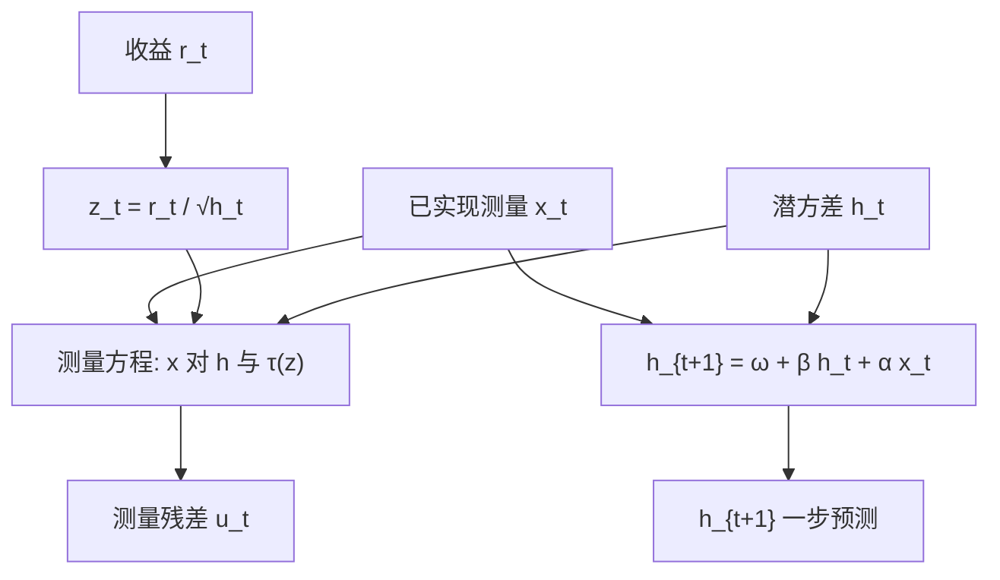

# 已实现 GARCH

把已实现波动当成潜在条件方差的带噪声测量，与收益方程联立，日收益平方就不再是方差过程的唯一观察值。

<footer>—— Hansen, Huang and Shek, Realized GARCH: A Joint Model for Returns and Realized Measures of Volatility, Journal of Applied Econometrics 2012</footer>

[上一课](/quant/stochastic-volatility)让对数方差走带新息的自回归；有 RV 时潜波动被钉住，SV 与已实现测量模型合流。缺口是把合流写成可估的联合动态：GARCH 只用 $\varepsilon_{t-1}^2$ 更新；HAR 只用 RV 预测 RV，不保证与收益的条件方差是同一个过程。Hansen–Huang–Shek 的已实现 GARCH 让潜方差 $h_t$ 由已实现测量驱动，再写测量方程把当日 RV 连到 $h_t$ 与当日收益新息。本课写这条联合模型。不重推 Heston 特征函数。

## 问题

经典 GARCH 的信息集在 $t-1$ 日收盘：今日开盘到现在的波动要等到今晚的 $\varepsilon_t^2$ 才进入明天的 $\sigma$。但今日的 RV 在收盘时已知，且比 $\varepsilon_t^2$ 干净得多。直接把 RV 塞进 GARCH 替换 $\varepsilon^2$，会忽略 RV 与 $h_t$ 的尺度差、偏差，以及 RV 与当日 $z_t$ 的相关（杠杆）。问题是写一个联合模型：

$$
r_t=\sqrt{h_t}\,z_t,\qquad
h_t=\omega+\beta h_{t-1}+\alpha x_{t-1},\qquad
x_t=\xi+\varphi h_t+\tau(z_t)+u_t,
$$

其中 $x_t$ 是已实现测量（RV、核、RK），$u_t$ 是测量噪声，$\tau(z)$ 是杠杆函数。要估的是潜方差动态、测量的校准（$\xi,\varphi$）以及 $\tau$。没有测量方程，RV 与 $h$ 的单位可以对不齐；没有 $\tau$，下跌日 RV 偏高会被当成 $h$ 的水平跳。

### 测量方程是模型的核心，不是附属诊断

$\varphi$ 接近 1、$\xi$ 接近 0 时，$x_t$ 近似无偏观察 $h_t$（再加 $\tau$ 与 $u$）。实践中五分钟 RV 往往高估（噪声）或因隔夜缺失而与收盘到收盘 $h_t$ 不对齐，$\xi,\varphi$ 就是来吸收这些。换用 [已实现核](/quant/realized-kernel) 或预平均，$u_t$ 的方差应变小，$\varphi$ 更接近 1。把任意一个「波动代理」丢进右边而不估计测量，等于假设代理已经是 $h_t$，这正是朴素「GARCH-X」常有的误设。

GARCH-X 通常指在方差方程里外生放入 RV，但不写 $x_t$ 如何由 $h_t$ 生成，因而不能完整似然、也不能把今日 $x_t$ 正确反馈进今日对 $h$ 的理解。Realized GARCH 的测量方程使 $x$ 内生，滤波与预测是联合的。

## 方法

**设定。** Hansen–Huang–Shek 常用对数线性：$\log h_t$ 对 $\log x_{t-1}$ 回归，保证正性，类似 EGARCH 的方便。杠杆 $\tau(z)$ 取 Hermite 型多项式，例如 $\tau(z)=\tau_1 z+\tau_2(z^2-1)$，以同时吸收符号与大小。$z_t$ 与 $u_t$ 可设为联合高斯或更肥的尾。一步预测 $h_{t+1}$ 在收盘后立刻用今日 $x_t$ 更新，这是相对经典 GARCH 的信息优势。

**估计。** 联合准极大似然。残差有两个：标准化收益 $z_t$ 与测量残差 $u_t$。诊断应两者都看：若 $u_t$ 仍有强持续，测量没吸干 RV 的动态，可能要给 $u$ 自己加 AR，或换更干净的 $x$。若 $z_t$ 仍有非对称，加重 $\tau$ 或把 EGARCH 式符号放进 $h$ 方程。

**与 HAR、HEAVY 的关系。** HAR 预测 RV，不联立收益。Shephard 与 Sheppard 的 HEAVY 用已实现测度驱动收益的条件方差，结构不同但共享「RV 进信息集」。Realized GARCH 的特点是显式测量方程与杠杆 $\tau(z)$，从而 $x_t$ 与 $r_t$ 同期相容。样本外比较应固定损失：对收益密度用对数分，对波动用 QLIKE，不要只用 RV 的 $R^2$ 宣布胜利——那会让纯 HAR 占便宜，因为它不承担收益方程。

### $x_t$ 的构造先于似然

输入是五分钟 RV、核还是双幂次，决定 $u_t$ 里有多少噪声与跳跃。含跳的 RV 会让 $\tau$ 与 $u$ 在崩盘日极端；连续变差更接近 $h_t$ 的连续部分，但与总二次变差（对冲对象）不一致。隔夜：若 $r_t$ 是收盘到收盘，而 $x_t$ 只是开盘到收盘，测量方程必须允许 $\varphi\neq 1$ 或把隔夜平方加进 $x$，否则系统性地把隔夜方差推进 $u_t$。管道与 [HAR](/quant/har-rv) 相同：先对象，后方程。

## 机制

机制是状态空间： $h_t$ 为状态，$r_t$ 与 $x_t$ 为观测。GARCH 只有一个噪声极大的观测 $\varepsilon_t^2$；现在每日多了一个高质量观测 $x_t$，状态被钉得更紧，类似于 SV 滤波在看见 RV 之后的收缩。杠杆 $\tau(z)$ 让当日负 $z$ 提高当日 $x$ 的条件期望，而不必把这笔同期相关误写入 $h$ 的持久成分——否则每一次下跌都会被当成方差水平的永久上移，持续性被高估。

预测机制：收盘后，$x_t$ 进入 $h_{t+1}$ 的方差方程，信息集比 GARCH 多了完整一日的日内变差。开盘前对「今日」的 $h_t$ 仍只能用昨日信息；盘中若要更新，需要日内 Realized GARCH 或直接用截至当前的核，那是另一套高频模型。日频 Realized GARCH 的本分是**隔夜到下一开盘之间的条件方差**，不是 tick 级。

测量噪声 $u_t$ 不是微观结构噪声的同义词，但会被后者撑大。换核估计后若似然大增、$u$ 的方差下降，说明你之前在让模型吸收估计量误差。改进 $x$ 往往比把 $h$ 的阶数从 (1,1) 升到 (2,2) 更有效。

### 潜波动：GARCH、SV 与已实现测量的合流点

GARCH：无额外波动冲击，状态可测。SV：有 $\eta_t$，无直接测量。Realized GARCH：状态仍可写成可测递推（给定过去 $x$），但测量方程承认 $x\neq h$，并允许当日 $z$ 进入 $x$。它比 SV 轻（不必粒子滤波），比 GARCH 富（用了 RV）。若还要给 $h_t$ 额外冲击，就滑向 Realized SV，估计又变重。工程上先 Realized GARCH，诊断 $u_t$ 是否白；若 $u$ 里仍有一块像波动自身的新息，再考虑 SV。

## 边界与工程取舍

联合模型对 $x_t$ 缺失敏感：半日停牌、指数成分调整、数据源切换会让测量断裂。缺失日不要用 $\varepsilon_t^2$ 偷偷替换 $x_t$ 而不改测量方差，否则滤波会把噪声当 IV。多元 Realized GARCH 需要已实现协方差，异步与维数立刻变难，实务常对指数与因子组合估一元，个股用 beta。

不要用 Realized GARCH 的 $h_t$ 直接当隐含波动：仍缺风险溢价。不要在样本内用未来全日 RV 去驱动「开盘时」的 $h_t$。计算比 HAR 重、比 SV 轻，适合作为有高频数据时的日频默认联合模型。若只有指数有可靠 RV、个股没有，对个股保留 GJR，对指数用 Realized GARCH，比强行给每只股票一个劣质五分钟 RV 更诚实。

对数线性设定下，对 $h$ 的预测变回方差要小心 Jensen。报告波动预测时应写是 $E[h_{t+1}]$ 还是 $\exp(E[\log h_{t+1}])$。比较 HAR 与 Realized GARCH 时两边用同一变换、同一损失。

## 小结

- Hansen–Huang–Shek（2012）把 RV 类测量与收益联立：方差方程由已实现测量驱动，测量方程把 $x_t$ 校准到潜方差 $h_t$ 并吸收杠杆。
- 相对经典 GARCH，收盘后的信息集包含当日 IV 代理，一步预测通常明显改进；相对纯 HAR，它同时承担收益密度。
- 测量方程不可省：$\xi,\varphi,\tau,u$ 处理偏差、尺度、同期杠杆与估计噪声。
- $x_t$ 的构造（核、隔夜、跳跃）先于似然；改进测量往往比升阶更有效。
- 仍是物理测度的条件方差，不是隐含波动；多元与缺失日是主要工程边界。
- 出处：Hansen, Huang and Shek, *Realized GARCH: A Joint Model for Returns and Realized Measures of Volatility*, Journal of Applied Econometrics, 2012。
