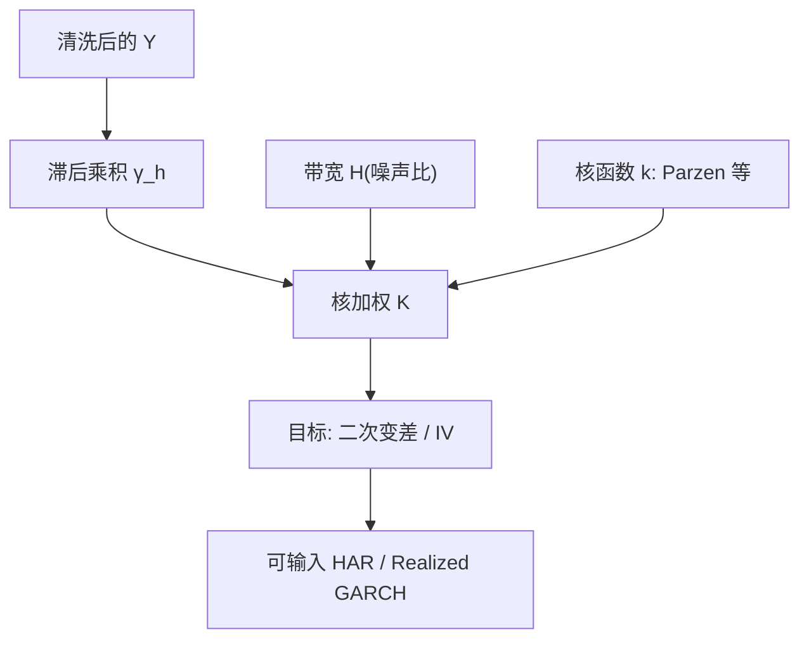

# 已实现核估计

把已实现方差换成收益自协方差的核加权和，就可以在微观结构噪声下仍一致地估计二次变差；核的形状与带宽，决定你扣掉多少噪声、留下多少信号。

<footer>—— Barndorff-Nielsen, Hansen, Lunde and Shephard, Designing Realized Kernels to Measure the ex post Variation of Equity Prices in the Presence of Noise, Econometrica 2008</footer>

[上一课](/quant/har-rv)用日、周、月 RV 近似长记忆，对象是已实现方差的条件均值，不包含方差风险溢价，也不能替代噪声修正后的 RV 构造。缺口正是构造：朴素已实现方差把噪声的二次变差按采样次数加进积分波动。已实现核把同一问题写成 HAC：噪声表现为短滞后的收益自相关，用核函数把这些滞后加回去。Barndorff-Nielsen、Hansen、Lunde 与 Shephard 给出内生噪声下的设计条件。本课专写核、带宽，以及它与 [RV 噪声修正](/quant/rv-noise) 里其他估计量的分工。不重推 HAR 的三期限回归。

## 问题

有效对数价格 $X$ 为半鞅，观测 $Y=X+\varepsilon$。网格间隔 $\Delta=1/n$ 上的收益 $r_i$。无噪声时 $\gamma_0=\sum r_i^2\to_p\,IV$。有噪声时 $\gamma_0$ 爆炸，且 $\gamma_1=\sum r_i r_{i-1}$ 倾向为负。已实现核定义为

$$
K=\gamma_0+\sum_{h=1}^{H}k\left(\frac{h}{H}\right)(\gamma_h+\gamma_{-h}).
$$

问题是选 $k$ 与 $H$，使 $K$ 对 $IV$ 一致、渐近方差可控，并在噪声与 $X$ 相关（内生）时仍然成立。内生来自买卖方向携带信息、或价格与买卖价差同时被订单推动。普通 Bartlett 核对某些内生情形不够，需要平坦顶或满足 $k'(0)=0$ 的核，2008 年论文把「什么样的 $k$ 合法」写成设计约束。

### 签名图上核是一条向右压平的曲线

横轴采样频率、纵轴 RV：噪声让高频端上翘。核估计相当于在最密的网格上采样，再用滞后项把上翘削掉，目标是一条不随 $n$ 爆炸的水平。带宽太窄，削不够，估计仍偏高；太宽，把 $X$ 自己的短时相关也扣掉，估计偏低，开盘附近的日内季节性尤其受害。核不是「更平滑的五分钟 RV」，它改变的是估计量，不是把数据降频。

$\gamma_h$ 的求和应在固定交易时段内做，不要跨隔夜。隔夜一个大跳会污染所有滞后，核会把隔夜波动误当噪声结构。隔夜方差应单独一项，再与日内核相加，见日历效应一文。

## 方法

**核函数。** 实践里 Parzen 核常用：它保证 $K\ge 0$（在常见实现下），且满足 BHLS 的光滑条件。Bartlett 核对应 Newey–West，实现简单，正定性较好，但效率与内生稳健性不如更平坦的设计。Tukey–Hanning 等也出现在论文中。不要把核当成可以任意画的窗：不满足设计条件时，偏差项不会以正确速率消失。

**带宽。** $H$ 随 $n$ 与噪声–信号比增长。BHLS 给出均方误差最优的阶，实践论文用初步的噪声方差估计（例如极高频 RV 的上翘）去适配 $H$。全市场用同一 $H$ 会让薄股票欠平滑、厚股票过平滑。带宽应随股票、随日适应，但适应规则必须预指定，否则每日挑使 $K$ 最好看的 $H$ 是数据挖掘。

**数据。** 先 [清洗](/quant/tick-cleaning)：错价、撤单回放、非正常交易状态。核在脏 tick 上会把错价平方和滞后进 $K$。成交价噪声大、中点噪声小；中点核估的是中点二次变差，不是可交易路径的波动。多元时不同股票不同步，需 refresh time 或多元核，不能在未对齐的成交上对元素套一元公式，见 [不等间隔采样](/quant/irregular-sampling)。

### 与 TSRV、预平均的位置

两尺度 RV 用两个 $n$ 解 $IV$ 与 $\sigma_\varepsilon^2$，直觉干净，对 i.i.d. 噪声好，相关噪声下要加更多尺度。预平均先局部滤波再平方。核是频域/HAC 视角，对序列相关噪声自然。三者渐近可以排效率，有限样本取决于噪声相关长度与日内季节性。工程选择往往是：要复现学术 RV、流动性好，五分钟朴素；要更高频 IV 且能估带宽，用核或预平均。HAR 的输入可以是任何一种；换输入比换 HAR 系数更重要。

## 机制

噪声使相邻 $\Delta Y$ 出现负相关：这一跳上了买价，下一跳回到有效价格附近，乘积为负。$\gamma_0$ 多了大约 $2n\sigma_\varepsilon^2$，$\gamma_1$ 少了大约同一量级。把 $\gamma_1$ 加回 $\gamma_0$，一阶上抵消 i.i.d. 噪声。相关噪声把指纹拖到更长滞后，所以需要 $H>1$ 与逐渐衰减的 $k(h/H)$，以免把 $X$ 的滞后也等权加回。平坦顶（$k$ 在零附近一阶导数为零）用来对付内生：噪声与有效收益的同期相关会在 $h=0$ 附近留下额外偏差项，需要核在原点足够平才能消掉。

正定性不是美学。方差估计若为负，后续 GARCH、HAR、期权比较全部中断。Parzen 等核把估计量约束在正锥附近，代价是一点效率。jittering、结束效应修正等实践细节，是为了让有限样本的 $K$ 不要因为边界收益少算滞后而偏。

核的渐近分布在噪声修正之后，才能当「IV 的标准误」用。把未修正的一分钟 RV 配上无噪声 RV 的极限方差，区间会假窄。BHLS 提供可行的渐近方差估计；要用置信区间，就用与 $K$ 匹配的那一套，而不是 RV 教科书上的无噪声公式。

### 成交与报价不是同一条 $Y$

2009 年实践论文强调：报价中点与成交的噪声结构不同，最优 $H$ 不同。成交带买卖弹跳，中点带报价更新的离散与滞后。把成交核与中点核对着比，差异可以来自对象而不是实现。用于对冲与保证金，应接近你实际交易的价格；用于描述有效价格波动，中点更干净。不要混用两条 $Y$ 去「互相验证」而不写对象。

## 边界与工程取舍

核假定噪声的相关长度短于 $H$、且在交易时段内结构稳定。开盘、收盘的季节性使噪声方差时变，单一 $H$ 是折中。圆整噪声离散，小价格股票上高斯型展开差。跳跃会进入二次变差；若目标是连续 IV，核之后仍要与双幂次或跳跃稳健核组合。不要跨日做核。不要在未同步的国际板块上直接估已实现协方差核。

计算上，$\gamma_h$ 对 $h\le H$、$n$ 为数万 tick 时，逐日全市场可接受；$H$ 随 $n$ 涨，极端高频要截断或先预抽样。五分钟 RV 仍是截面资产定价的默认，因为它简单、可复现、对许多问题噪声已可忍受。核是当你真正需要盘中分辨率或薄股票的 IV 时才上的估计量，不是把所有研究里的「RV」字样替换掉。

带宽适应若用未来全日的噪声估计，会有轻微前视。严格做法是用过去数日的噪声比设定今日 $H$，或用开盘后一段预样本。对事后描述 IV，全日适应可接受；对交易信号，前视必须去掉。

## 小结

- Barndorff-Nielsen、Hansen、Lunde 与 Shephard（2008）把噪声下的 IV 估计写成收益自协方差的核加权和，并对内生噪声给出核的设计条件。
- 带宽随噪声–信号比变化：过窄剩噪声，过宽平滑掉 $X$ 的短时波动。
- Parzen 等核兼顾正定性与渐近条件；跨隔夜、未清洗 tick、未同步多元都会破坏对象。
- 核、TSRV、预平均是同一问题上的不同估计量；五分钟 RV 仍是许多低频问题的工作马。
- 中点核与成交核对象不同；置信区间须用匹配的渐近方差，不能套无噪声 RV 公式。
- 出处：Barndorff-Nielsen, Hansen, Lunde and Shephard, *Designing Realized Kernels…*, Econometrica, 2008；同作者 *Realized Kernels in Practice: Trades and Quotes*, Econometrics Journal, 2009。
