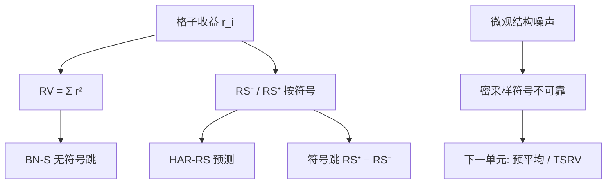

# 已实现半方差与符号跳跃

把已实现方差拆成正收益平方和与负收益平方和，下行部分往往更持续、对未来方差更有预报力；符号跳跃是两边之差，不是再做一次无符号的跳跃检验。

<footer>—— Barndorff-Nielsen, Kinnebrock and Shephard, Measuring Downside Risk: Realised Semivariance, 2010 前后工作；预报力见 Patton and Sheppard, Journal of Financial Econometrics, 2015</footer>

[日内季节性](/quant/intraday-seasonality) 之后，格子收益可当作更齐次的输入。[已实现方差](/quant/rv-noise) 把所有 $r_i^2$ 加总；[跳跃检验](/quant/jump-tests) 用双幂次分离连续与跳，仍无符号。Barndorff-Nielsen、Kinnebrock 与 Shephard 的已实现半方差

$$
RS^-=\sum_i r_i^2 1_{r_i\lt 0},\qquad RS^+=\sum_i r_i^2 1_{r_i\gt 0},
$$

在无跳时各趋于 $IV/2$，有跳时把跳的平方记入对应符号。Patton–Sheppard 表明 $RS^-$ 对未来 RV 的预测强于 $RS^+$。本课是「多元与长记忆」的收束：对象从对称长记忆转到**非对称二阶**。下一单元噪声下的估计从预平均开始，半方差同样会被噪声污染，须把测量问题单独开课。

## 问题

杠杆效应：跌时波动升。EGARCH/GJR 在日频用符号乘平方；高频用 $RS^\pm$ 直接测量当天下行二次变差。问题是构造一致估计、处理噪声与隔夜，以及在 HAR 里用 $RS^-$ 替换或并列 $RV$（HAR-RS）。符号跳跃 $SJ=RS^+-RS^-$ 接近「当天跳的方向性贡献」，与 BN–S 的无符号跳份额不同。

对象：下行风险、预测、以及是否把负跳当状态变量。不是再推导双幂次。

### 无跳极限与有跳

连续对称半鞅，$RS^\pm\to_p IV/2$。有限活动跳把 $(\Delta X)^2$ 放入对应半方差。因此 $RS^-$ 既含连续一半也含负跳。若只要连续下行，需半幂次或先去跳再拆符号，理论更重。实务 HAR-RS 常用朴素 $RS^-$，接受混合对象，因为它预报好。

隔夜负收益很大时，若不算进 $RS^-$，当天「下行」被低估。是否并入隔夜应与 RV 定义一致，并在季节课的隔夜项上对齐。

## 方法

**构造。** 同一网格上对 $r_i$ 按符号分流平方和。噪声使 $r_i$ 弹跳变号，密采样 $RS^\pm$ 被噪声主导且符号不可靠——应先降频、预平均或核，再拆符号。下一单元会把预平均、TSRV 讲透；本课只要求：半方差继承 RV 的带宽纪律。

**预测。** Patton–Sheppard：$RV_{t+1}$ 对 $RS^-_t$、$RS^+_t$ 回归，$RS^-$ 系数显著更大。QLIKE 评估，接上一课。可加杠杆项与 HAR 的周月 $RS^-$。

**检验。** $RS^+$ 与 $RS^-$ 是否同分布、符号跳是否与新闻同向，描述性即可；正式跳仍用 BN–S/Lee–Mykland，再给跳标符号。不要用 $SJ$ 替代 $Z_J$。

### 与 EGARCH 的分工

日频 GJR 用一个平方和一个符号，信息少。$RS^-$ 用日内格子，信息多。有高频时 HAR-RS 通常打赢 GJR 的一日前预测。无高频时 GJR 仍是默认非对称。不要对日收益硬造「半方差」。

## 机制

连续部分对称时，正负格的二次贡献各半；杠杆来自 $\sigma$ 对负冲击的反馈，出现在**下一期**的 IV，而不是要求当天 $RS^-\gt RS^+$。当天 $RS^-$ 更大，往往是因为当天已经有负跳或单边跌。预报力机制：下行已实现把「坏的波动状态」测得更准，状态持续，故预测未来 RV。上行平方更多是噪声或短暂挤空，持续弱。

与负半方差风险（资产定价）：截面上对 $RS^-$ 载荷要溢价，是另一组 FM 检验，本课不展开。计量对象先测准 $RS^-$。

开盘未除季节时，$RS^-$ 会被开盘下跳主导。先季节后半方差，与上一课交接一致。

### 到高频单元的交接

半方差、RV、协方差，在噪声下都不一致。下一单元第一课 [预平均](/quant/pre-averaging) 从测量端修 $Y=X+\varepsilon$，半方差同样可预平均后再拆符号。本单元不再把噪声当主对象。

## 边界与工程取舍

买卖弹跳让中点收益的符号比成交价干净，但中点不是可交易路径。极薄股票大量零收益格，$RS^\pm$ 稀疏。多元下行协方差（负半协变差）对异步更脆弱，留给已实现协方差课。

工程：日 RV 预测默认加 $RS^-$；网格与噪声处理与 RV 相同；QLIKE 评估。不要用 $RS^-$ 当 VaR——分位是另一泛函。不要把符号跳当可交易预测器而不做样本外。高频单元开始后，所有已实现量默认要过噪声这一关。

## 小结

- 已实现半方差按格收益符号拆开二次变差；无跳时各趋 $IV/2$，有跳则带符号。
- $RS^-$ 对未来 RV 往往更有预报力，HAR-RS 是自然扩展；用 QLIKE 评估。
- 符号跳不是 BN–S 的替代；噪声与季节须先处理再拆符号。
- 与 GJR 分工：有高频用半方差，无高频用日频杠杆项。
- 出处：Barndorff-Nielsen, Kinnebrock and Shephard 论已实现半方差；Patton and Sheppard, *Journal of Financial Econometrics*, 2015；Andersen 等已实现波动传统。
