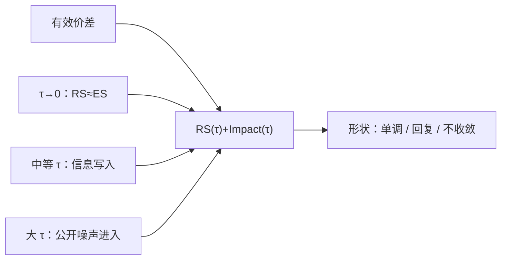

# 实现价差期限

实现价差是做市商把存货再转手之后还剩多少；「之后」是五分钟、三十笔还是次日开盘，剩下来的就不是同一个对象。

<footer>—— 据 Huang and Stoll 对实现价差的定义；期限结构的经验处理见后续以多窗口报告冲击的市场质量文献</footer>

[Kyle lambda 校准](/quant/kyle-lambda)把冲击收成流量对价格的一个斜率，窗口写在回归里。[有效价差与实现价差](/quant/effective-realized-spread)已经写出 $\mathrm{RS}_t(\tau)=2D_t(P_t-M_{t+\tau})$，但当时把 $\tau$ 当成设定。本课的缺口是把 $\tau$ 本身当成对象：实现价差作为期限的函数 $\mathrm{RS}(\tau)$，以及它如何与永久冲击、存货回复、公开信息到达纠缠。价格形成这一课序到此结束；[持有期](/quant/holding-horizon)会把微观窗口接到策略时钟上。本课不重写 Huang–Stoll 的三路方程，也不重写 Kyle 的均衡 $\lambda$。

## 问题

恒等式 $\mathrm{ES}=\mathrm{RS}(\tau)+\mathrm{Impact}(\tau)$ 对每个 $\tau$ 都成立。$\tau\to 0$ 时冲击未写出，$\mathrm{RS}$ 接近有效价差；$\tau$ 变大，中点沿成交方向漂移，$\mathrm{RS}$ 下降，冲击上升；$\tau$ 再大，无关的宏观跳价进入 $M_{t+\tau}$，冲击方差爆炸，均值变成「含公开信息的永久成分」。五分钟是美股文献的惯例，不是最优。开盘后、公告窗、收盘拍卖前，信息写入的时钟不同，固定五分钟会在一段样本里偏短、另一段里偏长。

缺口是报告一条曲线，而不是一个讨喜的数。曲线的形状才区分机制：若 $\mathrm{RS}(\tau)$ 在几笔之内迅速下降后持平，像逆向选择被很快写入；若先降后升（实现价差回升），像存货诱导的中点回复压过了信息；若随 $\tau$ 单调变差且不收敛，像窗口被日历噪声主宰。把单一 $\tau$ 的实现价差拿去和 Huang–Stoll 的 $\theta$ 比大小，地平线没对齐。

### 事件时间还是时钟时间

$\tau$ 可以是墙钟（秒、分钟）、也可以是笔数、成交量时钟。同一只不活跃股票，五分钟可能只有一两笔，曲线的第一点就已经混进公开信息；活跃股票五分钟含数百笔，信息早已写入。事件时间上的「随后 $k$ 笔」更贴近做市商转手。先修[事件时间](/quant/event-time)已经论证过时钟的选择；本课要求实现价差曲线至少报一套事件时间、一套墙钟，并在开收盘拍卖上断开——拍卖没有连续中点路径。

$\tau$ 跨越隔夜时，$M_{t+\tau}$ 含隔夜跳价。应在每个交易日截断曲线，隔夜单独报。否则实现价差变成隔夜收益的带符号版本。

## 方法

对每笔（或每笔主动）成交，计算一组 $\tau\in\{1\text{笔},5\text{笔},30\text{秒},5\text{分钟},30\text{分钟}\}$ 上的 $\mathrm{RS}(\tau)$ 与 $\mathrm{Impact}(\tau)$。等权与成交量加权都报。按：是否公告窗、是否 $n=1$ 的 tick 约束、本所还是场外打印、方向是否来自官方标志，做分层曲线。收敛判据：相邻两个 $\tau$ 的均值差相对于截面标准误不再显著，则称「永久成分在该尺度上稳定」，仍可能被更长窗口的宏观信息改写。

与 lambda 对照：短窗 lambda 对应曲线左端的瞬时斜率；日度 ILLIQ 对应右端附近用全日收益去除以量。两者不是曲线上的两点的简单函数，但应同向。若短窗 lambda 很大而 $\mathrm{RS}(\tau)$ 在 30 秒内已回到有效价差，冲击是机械深度而非信息——曲线比单点 lambda 更诚实。

### 做市商的「转手」不是对称的反向成交

实现价差的故事是：你在卖价被打，之后中点若不动，你赚半价差；若中点跟着涨，你亏了。实际转手可能是：另一次主动卖打在你的新买价上、你主动减仓、或隔夜把存货扔给别人。$\tau$ 只是用中点盯市代替真实转手。库存周期长的名字，五分钟实现价差仍含未平的存货风险，把它叫「订单处理收入」会高估处理、低估存货。曲线右端若仍显著为正，更像处理加风险溢价；若穿过零变负，流动性提供者在该地平线上平均亏钱。

## 机制

信息机制：知情成交把价值写进价格，中点沿 $D$ 移动并停留，$\mathrm{RS}(\tau)$ 下降后持平。存货机制：做市商移动中点以诱导反向流，随后中点部分回吐，$\mathrm{RS}(\tau)$ 可能出现非单调。公开信息：与本笔无关的新闻在 $\tau$ 内到达，给曲线加噪声，均值在大样本仍可解释为协方差，但单个名字的曲线不可读。内部化与中点成交：有效价差本身已接近零，曲线几乎全是冲击项，谈「价差租金随 $\tau$ 消失」没有对象。

期限结构对执行的含义：以五分钟实现价差当 taker 成本的「可回收部分」，只对持有期接近五分钟的策略有意义。日频策略关心的是日终冲击，应读曲线右端或隔夜截断。这是下一课持有期的接口。

不要为了让逆向选择「看起来占 30%」去挑 $\tau$。预注册一组窗口。Huang–Stoll 的 $\theta$ 对应模型里的下一笔报价更新，与五分钟冲击份额没有恒等关系。

### 实现价差不是做市商的会计利润

曲线右端仍为正，只说明盯市收入在该 $\tau$ 上平均非负，未扣费用、隔夜存货与对冲。把它写成「订单处理利润占比」，会高估处理、低估风险补偿。

## 边界

集合竞价、停牌、涨跌停使 $M_{t+\tau}$ 不存在或被截断，这些成交应从连续曲线里删除，或单独用拍卖出清价定义一个 $\tau=\text{再开盘}$ 的点。多场所时 $M$ 必须与方向所用报价同源。加密永续若用最后成交当 $M$，针价会毁掉曲线，应改标记价格，见[标记价格](/quant/crypto-mark-price)。

预注册窗口之后仍应用同一组 $\tau$ 报告失败的曲线，而不是改到「好看」的期限再发表。形状本身是结果，包括不收敛。

价格形成主干在本课收束。后面的持有期课把 $\tau$ 从「做市商转手」换成「策略打算拿多久」。

## 小结

- 实现价差是 $\tau$ 的函数；单一五分钟是惯例，要报曲线。
- 事件时间与墙钟会给出不同形状，拍卖处必须断开。
- 形状区分快速写入、存货回复与日历噪声。
- 短窗 lambda 对左端，日度非流动性对右端，不能互相替代。
- 持有期与 $\tau$ 不对齐时，实现价差不能当策略成本。
- 出处：Huang and Stoll, *JFE*, 1996/1997 对有效与实现价差的会计；多窗口冲击报告见市场质量经验文献；事件时钟见 Easley, López de Prado and O'Hara 对成交量时钟的讨论。
