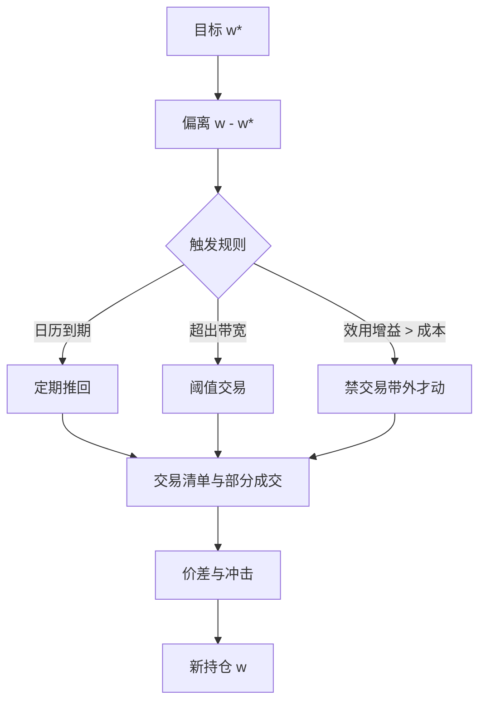

# 再平衡规则

恒定混合是一种卖出赢家、买入输家的动态策略；买了持有则让赢家变大。两者的终值差来自再平衡本身，而不是来自对收益的预测。

<footer>—— Perold and Sharpe, Dynamic Strategies for Asset Allocation, Financial Analysts Journal, 1988</footer>

给定一个目标权重——战略配置、风险预算或主动优化的输出——下一笔交易何时发生，是另一套规则。日历再平衡按月或按季把组合推回去；阈值再平衡等偏离带宽才动手；成本感知的禁交易带则要求效用增益超过往返摩擦。Perold 与 Sharpe（1988）把买了持有、恒定混合与组合保险对照：再平衡不是中性的「维护」，它本身是一种动态策略，在趋势市里亏凸性、在震荡市里赚凸性。本篇写规则的对象、机制与成本，补上 [因子衰减与换手](/quant/factor-decay-turnover) 里只点到的那一小节：那里的问题是信号半衰期该配多长持有期；这里的问题是**已经有目标之后，用什么触发去逼近它**。

## 问题

记 $t$ 时刻目标为 $w_t^{\star}$，现仓为 $w_t$。若每期强制 $w_{t}=w_t^{\star}$，跟踪误差最小，换手最大。若从不交易，换手为零，配置漂移：升的资产权重变大，这就是买了持有。问题是在跟踪误差、交易成本与动态策略的路径依赖之间选一条可重复的触发。

规则必须先声明「目标是什么」。战略配置的目标低频、由政策给定；因子组合的目标随信号每天动。对每天都在变的 $w^{\star}$ 做月频再平衡，等于另选了一个更慢的策略，见衰减曲线。对几乎不动的战略权重做日频再平衡，多半是在噪声上付[价差](/quant/spread-cost)。把两种目标混在同一条「每月最后一个交易日调仓」里，归因时无法分开政策偏离与实施偏离。

### 再平衡是动态策略，不是手续

Perold–Sharpe 的对照表说得很硬：恒定混合在资产涨时减仓、跌时加仓，相对买了持有是凹的支付——震荡中反复「低买高卖」，趋势中反复「卖出趋势」。CPPI 一类组合保险则是凸的：跌时减风险资产。日历再平衡逼近恒定混合；只在跌破止损时交易则更接近保险。你不能一面声称自己是战略 60/40，一面用趋势过滤暂停再平衡，还把结果当作 60/40 的样本。规则改了，策略就改了。

Masters（2003）讨论的 5/25 一类带宽——绝对偏离 5% 或相对偏离 25% 才调——是阈值规则的工程近似，不是最优控制定理。带宽相对价差与波动校准；把别人论文里的 5/25 直接搬到 A 股行业配置上，只是借用了一个整数。

## 方法

三类触发可以写进同一套伪代码，但经济含义不同。

**日历。** 固定日期（每月、每季、每年）把权重推到 $w^{\star}$，或推到带宽内最近点。优点是可审计、与报告期对齐、便于叠加指数审核与财报时点。缺点是交易挤在同一天：指数与 ETF 的再平衡日冲击、月末流动性与窗口粉饰会抬高实现成本。Donohue 与 Yip（2003）在交易成本下讨论最优频率：频率是参数，应用换手与波动预先校准，而不是用全样本搜「夏普最高的那个月」。

**阈值 / 带宽。** 当 $\|w-w^{\star}\|$ 超过盒约束或某个资产 $|w_i-w_i^{\star}|\gt b_i$ 时交易。可以只修越界的资产，也可以一次性全推回。后者换手更整，前者更省。阈值把日历的「时间触发」换成「状态触发」：波动大的月份交易更勤，平静期更懒，这与[风险预算](/quant/risk-budgeting)的已实现贡献偏离是同一类监控。

**禁交易带。** 把线性或非线性成本放进目标，只有 $w^{\star}$ 与 $w$ 的效用差超过成本才交易，见 [组合约束](/quant/portfolio-constraints)。Leland 以及带固定成本的最优控制（Constantinides、Davis–Norman 一类）给出不再是一个点、而是一个区域的目标：区域内最优是不作为。这是与日历、阈值不同的一等对象——最优集有面积。

重叠持有是再平衡的另一种会计：动量 J/K 每月开一个 vintage、持有 K 个月，组合是 K 个组合的等权。它降低单期换手，改变的是策略的持有期分布，不是「同一目标的更平滑实施」。报告换手时必须声明是父策略还是 vintage 加总。

### 推回多少：全额、部分、交易清单

触发之后仍要决定交易量。全额再平衡跟踪最好、冲击最大。部分再平衡（只走差距的一半，或只走当日 ADV 的某一占比）把冲击摊开，留下故意的跟踪误差，接近 [Almgren–Chriss](/quant/almgren-chriss) 在执行层的轨迹，只是这里的「风险」是相对 $w^{\star}$ 的偏离。交易清单还要处理最小手数、涨跌停、停牌：不可执行的腿应记入实施缺口，而不是假装权重已经到位。A 股 T+1 使当日买入的头寸不能当日再卖，日历日末再平衡若依赖当天新买的筹码去调另一条腿，规则在制度上不可行。

Perold 的实施缺口把决策价与最终成交的差记下来，包括延误与放弃。再平衡规则应配套一条「放弃」政策：带宽外但流动性不足时，是扩大带宽、拆成多日，还是用期货先对冲净暴露。没有放弃政策的阈值规则，在压力里会变成市价砸盘。

## 机制

资产价格变动使权重漂移。对两项资产，涨的那一项权重上升，恒定混合必须卖出它。若收益有动量，这种交易逆着信号；若收益有反转或只是噪声波动，这种交易供给流动性。机制不保证哪一边赚钱——它保证的是：**规则把你放在凹或凸的哪一侧。** 波动上升时，同样的日历规则产生更大的偏离、更大的交易量，成本集中在高波动期，而高波动期价差与冲击也更差，见 [净边缘](/quant/net-edge)。这是再平衡成本的状态依赖，不是平均换手乘以平均价差能概括的。

因子组合里，$w^{\star}$ 本身在动。若信号衰减慢，日历滞后主要是跟踪误差；若信号衰减快，日历滞后是在持有已经消失的 alpha。阈值规则对 $w^{\star}$ 的高频抖动更不敏感，这是优点也是缺点：它自动过滤噪声交易，也可能过滤掉你本来想追的短半衰期信号。滤波器与再平衡是同一枚硬币，见衰减文对「过度平滑会改变因子含义」的警告。

### 与杠杆、风险平价的耦合

波动目标与风险平价在 $\Sigma$ 上升时减名义，这是强制性再平衡，往往与战略带宽冲突：你刚因为偏离不够而不交易，波动目标却要求大幅降杠杆。2018 与 2020 年风险平价的同步去杠杆，是再平衡规则在相关升、波动升时的挤兑形态。[组合约束](/quant/portfolio-constraints) 里的总杠杆上限一旦绑定，再平衡从「回到 $w^{\star}$」变成「先满足 $G$」。规则优先级必须写死：先杠杆与流动性，再行业盒，再风格目标，否则优化器在压力里的字典序是未定义的。

## 边界与工程取舍

不要用全样本挑再平衡日、带宽和部分成交比例。Harvey–Liu–Zhu 式的多重检验在这里同样成立：试了十二种规则再展示最好的一种，t 值不是策略的性质。预指定并冻结，样本外只允许因制度变更（涨跌停规则、指数编制）而改。

日历规则在全球多市场会撞上时区与假日：同一「月末」在不同交易所不是同一流动性事件。阈值规则对度量敏感：用名义权重偏离还是用风险贡献偏离，触发次数可以差一倍；后者与风险预算一致，但 $\Sigma$ 的噪声会制造假触发。禁交易带依赖成本模型：低估价差会让区域缩成一个点，回到每天交易；高估价差会让组合睡着。

不要声称某条再平衡规则「提高了收益」。Perold–Sharpe 已经说明，相对买了持有的超额来自动态策略的凹凸性，路径依赖极强。可报告的是：相对冻结规则，跟踪误差、换手、成本后主动收益与在趋势/震荡分段上的行为是否符合该规则应有的形状。

重叠持有、部分再平衡与禁交易带会同时改变换手数字。比较两条规则时，应冻结目标 $w^{\star}$ 的生成过程，只改触发；否则你比较的是两个策略，不是两种实施。

## 小结

- 再平衡规则决定何时、以多大力度逼近目标权重；它本身是动态策略，恒定混合偏凹，组合保险偏凸（Perold–Sharpe, 1988）。
- 日历、阈值与成本禁交易带是三类触发，经济对象分别是报告期、状态偏离与最优控制的区域解。
- 触发之后仍要规定推回比例、放弃政策与不可执行腿的会计；A 股 T+1 与涨跌停使「日末全额再平衡」经常不可行。
- 成本集中在高波动期，平均换手乘平均价差会低估再平衡的真实摩擦。
- 规则必须预指定；对频率与带宽做全样本搜索，改变的是策略定义，不是实施质量。
- 出处：Perold and Sharpe, *Dynamic Strategies for Asset Allocation*, Financial Analysts Journal, 1988；Donohue and Yip, *Optimal Portfolio Rebalancing with Transaction Costs*, Journal of Portfolio Management, 2003；Masters, *Rebalancing*, Journal of Portfolio Management, 2003。
