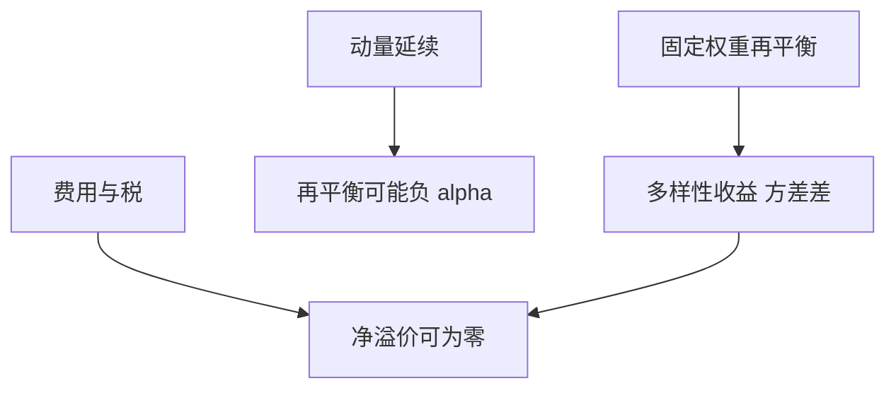

# 再平衡溢价

固定权重组合相对买入持有的超额，来自波动与相关，而不是来自有边的择时；它与多样性收益是同一枚硬币。

<footer>—— 对照 Booth and Fama 对 diversification return 的讨论；Erb–Harvey 与再平衡的商品文献</footer>

[上一课](/quant/leverage-volatility-drag)写每日重置的拖累。再平衡溢价（diversification return）的缺口是**固定权重 vs 漂移权重**：定期把权重拉回 $w$，等价于卖出相对强的、买入相对弱的。无预测时，这块超额的期望来自方差项，不是 alpha。本课收口多期单元，后面策略族不再把再平衡当「免费 alpha」。

## 问题

两资产、目标 50/50，波动高且相关低时，再平衡组合的几何收益可以高于各资产几何的加权，也常高于从不调仓的市值漂移组合。Booth–Fama 称之为 diversification return：$\tfrac12\sum w_i\sigma_i^2-\tfrac12\sigma_p^2$。问题是把它写成**会计恒等式+再平衡规则**，而不是写成一个可卖的因子。费用、税、跳会把这块吃掉；相关升到 1 时溢价消失。

与杠杆 ETF：杠杆 ETF 对**单资产**每日重置，震荡市拖累；多资产固定权重再平衡在资产间做均值回复式交易。符号取决于你是否在「卖出赢家」的那一侧，以及赢家是否继续赢（动量）。动量强时再平衡是负 alpha，溢价公式的期望仍可正但实现为负。

### 不是对波动的风险溢价

波动风险溢价是卖出方差互换的补偿。再平衡溢价不要求有人付风险补偿，它是权重过程与二次变差的乘积。可以在风险中性世界里存在（作为不同财富过程的差）。不要用 [方差互换](/quant/variance-swap-vix) 的价格去「解释」50/50 的超额。

商品趋势 vs 展期课已经把曲线收益与趋势分开。商品风险平价的再平衡溢价常被宣传夸大，要用 Erb–Harvey 的分解核对。

## 方法

分解：组合几何 $\approx$ 加权几何 $+$ 再平衡项 $+$ 交叉项。用实际再平衡频率与费用模拟。对照买入持有（权重漂移）。若「溢价」只在无费用日频再平衡里出现，生产频率下可能为零。税务账户里再平衡溢价尤其贵，见税务课。

## 机制

固定 $w$ 强迫你在相对价格偏离时交易，捕获相对价格的负自相关（若存在）以及纯粹的方差差。数学上源自 $\log\sum w_i e^{x_i}$ 的 Jensen。杠杆拖累源自 $\log(1+\lambda r)$ 的 Jensen。都是凹/凸，比较对象不同。

## 边界

权重若是风险平价，再平衡还对 vol 变化交易，多一层。估计 $\Sigma$ 时再平衡与估计噪声耦合。不要把再平衡溢价写进向客户承诺的 alpha；它应留在预期几何的工程分解里。

## 小结

- 再平衡溢价主要是多样性收益，不是择时 alpha。
- 与杠杆 ETF 拖累同属 Jensen，比较对象不同。
- 费用、税、动量可使其净值为负；不能当产品卖点。
- 出处：Booth and Fama, *Financial Analysts Journal*, 1992；Erb and Harvey 对商品再平衡的讨论。
