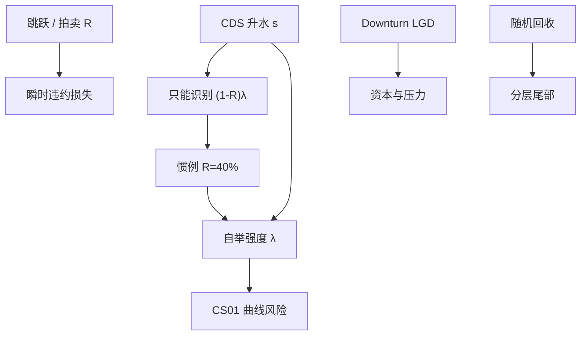

# 回收率假设

    
标准 CDS 用一个固定回收把升水拆成强度；这个数通常不是对清算回收的预测，而是让曲线能在市场之间对账的计量约定。违约损失率（LGD）既随机，又与违约强度纠缠。

    <footer>—— 对照 Duffie and Singleton, Credit Risk, 2003；以及 ISDA CDS 标准模型的常数回收惯例</footer>

信用产品的或有支付几乎总是 $(1-R)$ 乘暴露。$R$ 叫回收率，LGD 是 $1-R$。债券的历史回收来自清算、拍卖与重组后的市价；CDS 的标准模型却把 $R$ 钉在 40%（优先）或 20%（次级）一类常数上，好让升水与强度一一对应。Duffie–Singleton 的框架允许回收与强度相关，也可以把回收定义为面值的一部分或市值的一部分。本篇写这些定义为什么不能混用、市场如何（以及为何难以）从价格里读出 $R$，以及回收假设怎样污染 [CDS 定价](/quant/cds-pricing)、[基差](/quant/cds-bond-basis) 与分层。

## 问题

单条 CDS 升水大致满足 $s\approx(1-R)\lambda$。观测到 $s$，只能识别乘积 $(1-R)\lambda$，不能单独识别 $R$ 与 $\lambda$。把 $R$ 固定，全部升水变动都推进 $\lambda$；把 $R$ 改成 20%，同一升水会推出更低的强度，保护腿在接近违约时却更贵。风险系统若在希腊值里用 40%、在跳跃违约里用「预期拍卖 25%」，两套数字会对不上。

历史回收的离散度很大：同一优先级在不同行业、不同周期、不同国家的均值可以差十几到几十个百分点；分布还是双峰的（重组存活对清算清零）。用无条件均值当每一笔债的 $R$，会低估困境名字的不确定性。回收还与违约强度正相关于「坏时候回收更差」（downturn LGD），巴塞尔与内部评级法为此单独给压力 LGD。高斯 Copula 分层对 $R$ 与相关的误设会互相补偿，更容易把回收错误藏进基相关，见 [高斯 Copula](/quant/gaussian-copula-cdo)。

### 回收的三种会计对象

回收对面值（recovery of face）：违约时支付 $R$ 乘面值，CDS 现金结算与许多结构模型用这个。回收对市值（recovery of market）：违约时损失是当时无违约市值的一个分数，Duffie–Singleton 便于把可违约债写成调整后的贴现。回收对国债（recovery of treasury）：支付相当于无风险债券的一个分数。三种 $R$ 不是同一个百分数，不能把 Moody's 的拍卖回收直接塞进 Duffie–Singleton 的市值回收参数。合约上，CDS 拍卖定的是可交割债的最终价格，再映射成现金结算的 $1-R$；可交割篮子与最便宜交割会让这个 $R$ 低于「参考债自己的预期回收」。

ISDA 标准模型的 40% 是为了让不同经销商的升水–预付转换一致，不是对下一笔违约的点预测。困境名字应改用市场可观测的预期回收（回收锁定、回收互换或拍卖预期），否则前端升水会被错误的 $R$ 扭曲成荒谬的强度。

## 方法

**惯例回收。** 曲线自举固定 $R$，输出 $\lambda$ 与 CS01。资本与 CVA 若用同一套曲线，应声明 LGD 与此相同，或显式做一套转换。改 $R$ 必须重自举，不能只在保护腿上改 $(1-R)$ 而留下旧的 $\lambda$。

**锁定回收与回收互换。** 数字 CDS（违约时付 1 而不是 $1-R$）与普通 CDS 的组合可以识别隐含回收。回收互换直接交换固定 $R$ 与实现回收。这些工具流动性差，隐含 $R$ 噪声大，但在困境名字上比 40% 更诚实。拍卖预期出现后，交易台会把 $R$ 当市场价格，把 CDS 当对违约时点的期权。

**随机回收。** 让 $R$ 依赖系统性因子，使坏状态里 LGD 更高，能产生更厚的分层尾部，部分替代把 $\rho$ 调到不合理的高水平。标定仍然脆弱：分层市价要同时喂给相关与回收。更稳妥的工程是：标准名字用惯例 $R$，压力与资本用 downturn LGD 情景，困境用市场 $R$，并禁止用「调 $R$ 让模型拟合」当日常自由度。

### 对 CS01 与跳跃违约的分工

CS01 回答「升水动一个基点」。在固定 $R$ 的线性附近，它主要由风险年金决定。跳跃违约回答「今晚违约」：损失是 $(1-R_{\text{jump}})$ 减当前盯市。两套 $R$ 可以不同——惯例 $R$ 服务曲线，跳跃 $R$ 服务濒死情景——但必须在报告里分成两列。把 CS01 乘一个巨大的升水跳动去模拟违约，会漏掉回收不确定性，也会在预付已经很大时重复计算。

## 机制

回收进入价格的机制是缩放违约损失。强度解释升水时，更高的 $R$ 要求更高的 $\lambda$ 才能匹配同一 $s$，于是生存概率更低、费用腿更轻，短端与长端的分配会变。对远离违约的投资级，这个再分配较小，40% 够用。对高收益与主权重组，回收是一等风险因子：希腊 2012、阿根廷诉讼，争议的是「什么算信用事件」以及「能回收多少」，而不只是强度，见 [主权 CDS](/quant/sovereign-cds)。

与违约的相关（wrong-way LGD）让期望损失大于 $\mathbb{E}[1-R]\mathbb{E}[\mathbf{1}_{\{\tau\le T\}}]$。对手方暴露上这是错向风险；债券池与 CDO 上这是系统性回收。忽略它，高等级分层会显得过厚。历史回收在繁荣期被高估，是因为样本里重组偏多、清算偏少；用扩张期的均值去给衰退期的池子定价，是回收假设最常见的样本偏差。

评级机构的历史回收按工具优先级与有无抵押分组，仍然是无条件均值。行业、周期、管辖与契约（担保、次级、COCO）会移动分组。用「优先无担保 40%」覆盖所有司法辖区，对新兴市场主权与中国境内债尤其粗。

### 基差与 CTD 如何改写实现回收

CDS 买方交付最便宜可交割债，实现的有效 $R$ 是 CTD 的拍卖价，可能低于你账上那只债券的回收。负基差交易在违约后的残渣，有一块就来自这个缺口。结构模型里股权在违约时为零、债务回收由资产价值决定，与 CDS 拍卖不是同一清算程序。不要用 Merton 的内生 $R$ 去替换合约 $R$，除非在做同一家公司的资本结构套利并显式建模破产法。

## 边界与工程取舍

不要为了让高斯 Copula 拟合超优先层而把 $R$ 调到 90% 或 10%。不要把债券的发票价格回收、CDS 拍卖回收、贷款的工作回收混在一张压力表里而不标注定义。不要在 $R$ 与 $\lambda$ 未识别时报告「市场隐含违约概率」到小数点后两位——那是在给定 $R$ 下的风险中性强度，见升水与概率的差别。

数据：Moody、S&P、拍卖结果与最终回收之间有时滞与修订。回测违约损失必须用当时可获得的预期 $R$，而不是事后最终回收，否则是用未来信息。资本模型的 downturn LGD 与交易台惯例 $R$ 应能对账到情景层，而不是对账到同一个点估计。

回收不是「越保守越好」。过低的 $R$ 会抬高跳跃损失、压低由升水反推的 $\lambda$，让未违约的利差风险看起来更小。保守应落在损失，而不是随意拧 $R$。

## 小结

- 标准 CDS 把回收钉成常数，以便用升水自举强度；40% 是惯例不是预测。
- 升水只识别 $(1-R)\lambda$；改 $R$ 必须重自举，并分开报告 CS01 与跳跃违约。
- 面值回收、市值回收与拍卖回收定义不同；CTD 使 CDS 的有效 $R$ 可以低于特定债券。
- 回收与违约同向恶化时，期望损失高于乘积分；分层与对手方会把这个缺口藏进相关。
- 出处：Duffie and Singleton, *Credit Risk*, 2003；ISDA CDS 标准模型的回收惯例；历史回收见评级机构违约研究；困境识别则依赖回收互换、数字 CDS 与信用事件拍卖。
