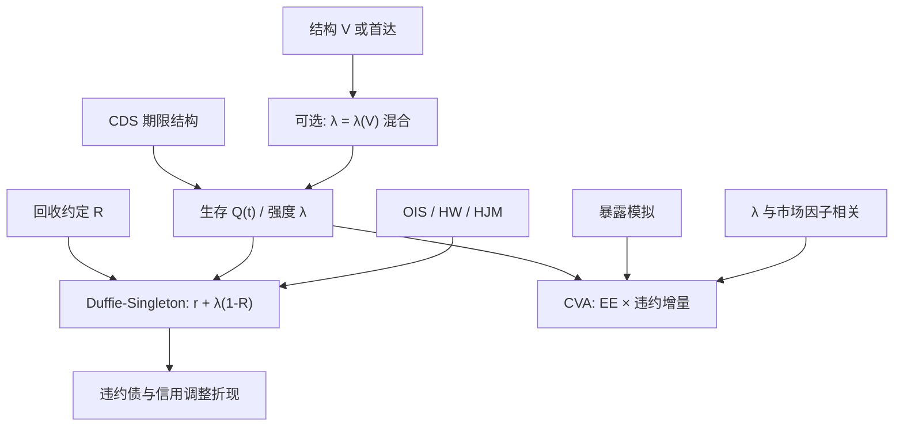

# 简化形式强度模型

    
把违约当成带强度的点过程，生存概率是强度的拉普拉斯变换；公司债折现可以写成无风险利率加上经回收调整的强度。

    <footer>—— Jarrow & Turnbull, Journal of Finance, 1995；Lando, Review of Derivatives Research, 1998；Duffie & Singleton, Review of Financial Studies, 1999</footer>

结构模型从资产价值推出违约。[Merton](/quant/merton-structural) 与 [Black-Cox](/quant/black-cox) 解释资本结构和契约，却难以把任意形状的 CDS 曲线当成今日初值。简化形式（reduced-form）把违约时间 $\tau$ 写成强度 $\lambda_t$ 的点过程：给定路径，短时间 $\mathrm{d}t$ 内违约概率约为 $\lambda_t\mathrm{d}t$，像一个条件泊松。Jarrow 与 Turnbull（1995）把信用风险接到衍生品定价；Lando（1998）用 Cox 过程（双重随机泊松）把强度写成外生因子的函数；Duffie 与 Singleton（1999）在「按市值回收」下得到违约债与无风险债平行的仿射折现。Jarrow、Lando 与 Turnbull（1997）用评级转移链给出离散状态的强度。本篇写这些公式如何校准 CDS、如何进入 CVA，以及利率模型——[Hull-White](/quant/hull-white)、[HJM](/quant/hjm)——如何与 $\lambda$ 耦合。它是[对手方信用](/quant/counterparty-credit) 的违约时钟，不是新的曲线因子交易法。

## 问题

交易台每天看到的是 CDS 平价利差的期限结构，不是企业的 $V$。需要一个违约机制：能精确重现今日生存概率，参数留下给期权和错向风险。强度模型的承诺是：把无风险利率模型里的短端 $r$ 换成 $r+\lambda$ 一类调整，债券公式几乎原样可用。问题有三：回收如何定义（面值、市值、等价回收），$\lambda$ 与 $r$ 是否相关，以及违约是否可料。Cox 过程在给定强度路径时违约仍是不可料的，因而能产生 Merton 给不出的短端利差；若 $\lambda_t$ 本身由连续观察的 $V$ 决定且在边界爆炸，又回到可料首达。

第二问题是多名字与对手方。单一强度校准单名 CDS；CVA 需要对手方强度与组合暴露的联合。独立假设把 CVA 写成 EE 与违约概率的乘积，错向风险要求 $\lambda$ 随市场因子变。结构模型内生相关，强度模型要外生指定，这是简化的代价。

### Cox 过程与生存概率

在滤过的信息下，若 $\tau$ 是强度 $\lambda$ 的 Cox 过程，则

$$
\mathbb{Q}(\tau\gt t\mid \mathcal{F}_t^\lambda)=\exp\Big(-\int_0^t \lambda_s\mathrm{d}s\Big),
$$

无条件生存是该指数的期望。公司零息债（回收为零）的价格是 $\mathbb{E}[\exp(-\int_0^T (r_s+\lambda_s)\mathrm{d}s)]$，与违约利率之和的零息债同构。Lando 强调：条件于强度路径，违约是泊松；强度本身可以是 CIR、跳扩散或宏观因子。Jarrow–Turnbull 早期版本常取 $\lambda$ 与 $r$ 独立、甚至确定性风险结构，便于把信用当成折现修正；后续文献把相关加回来。

强度是风险中性下的，不是历史违约频率。把评级历史迁移矩阵直接当 $\mathbb{Q}$ 下的生成元，会低估利差——JLT 要用风险中性调整后的迁移，或直接用 CDS 校准再解释。

## 方法

**Duffie–Singleton 市值回收。** 若违约时债权人得到当时未违约市值的分数 $R$，则违约债的价格满足与短端 $r+\lambda(1-R)$ 对应的折现，

$$
B(t,T)=\mathbb{E}\Big[\exp\Big(-\int_t^T \big(r_s+\lambda_s(1-R)\big)\mathrm{d}s\Big)\Big].
$$

于是任何仿射期限结构模型——Vasicek、CIR、Hull–White——都可以把信用利差当成第二个短端来用。回收为面值时公式不同，要在 $\tau$ 支付 $R$ 乘面值，生存与密度分开积分；CDS 的标准引用义务更接近面值回收加应计，校准应与 ISDA 标准 CDS 匹配，而不是图省事一律市值回收。

**校准。** 由 CDS 平价利差反解危险率或分段常数 $\lambda(t)$，得到生存曲线 $Q(t)$，再与折现 $P^D$ 一起给债券和 CVA 定价。仿射跳扩散下，Duffie、Pan 与 Singleton（2000）的变换方法给出债券与期权的准封闭公式，$\lambda$ 可以与 $r$ 相关。评级模型用生成元矩阵 $\Lambda$，利差是占有时间的函数；迁移风险使「仍是 BBB」的债也有利差波动，不只是违约。

**与利率耦合。** 独立时，信用调整的折现是无风险零息乘生存（再调回收）。相关时必须联合模拟或联合仿射。错向风险：令 $\lambda_t=\lambda_0\exp(\beta\cdot X_t)$，$X$ 是利率、股票或商品因子。$\beta$ 很难用违约样本估，常用压力与历史利差相关代替，并承认这是情景而非精确测度。

### CVA 与多曲线

对手方 CVA 在强度与暴露独立时，

$$
\mathrm{CVA}\approx (1-R)\sum_i P^D(0,t_i)\,\mathrm{EE}(t_i)\,\big(Q(t_{i-1})-Q(t_i)\big).
$$

$Q$ 来自对手方 CDS。暴露 EE 来自利率、外汇等市场模型，见对手方篇。利率用 OIS 折现，与[多曲线](/quant/multi-curve-ois) 一致；不要用 LIBOR 曲线既当折现又当信用。自身 DVA 用自己的强度，争议更大。SOFR 过渡后，标准互换的投影不再含银行 LIBOR 信用，但 CVA 的对手方强度仍然在——那是名字的 CDS，不是指数后备利差，见[SOFR 过渡](/quant/sofr-transition)。

## 机制

简化形式放弃微观违约机制，换取可校准性。$\lambda$ 上升，生存曲线下压，CDS 变贵，违约债价格下跌，与把短端上移同类。回收 $R$ 与 $\lambda$ 在一阶上共线：$(1-R)\lambda$ 进入损失，短端尤其难拆。市场惯例常固定 $R=40\%$ 再解 $\lambda$，于是「强度」含了回收约定。结构模型里回收由 $V$ 与边界决定，不会有这种会计自由度，但也校准不进 CDS。

不可料意味着：即使 $\lambda_t$ 连续，下一瞬间仍可能违约，短端利差约 $(1-R)\lambda_t$，可以按今日 CDS 钉住。这是相对 Merton / 远离边界的 Black–Cox 的决定性优势。代价是：杠杆下降时 $\lambda$ 不会自动下降，除非你把 $\lambda$ 写成股价或 DD 的函数。混合做法是结构生成强度水平、简化形式负责定价公式。

「简化」不是「更粗糙」的贬义，是相对结构微观而言：违约强度作为原语。它可以 internally 很复杂（随机 $\lambda$、跳、宏观因子）。不要把 reduced-form 理解成「用一个常数 hazard 打折」。

### 评级链与名字特异性

JLT 的马尔可夫链让利差随评级迁移跳，适合组合与指数。单名 CDS 流动性好时，直接用该名字的生存曲线，不必经过评级。映射（按评级、行业套一条通用 hazard）用于没有 CDS 的对手方，误差进入 CVA 的第一主成分。指数与单名的基差、以及 CTD 式的最便宜交割，是信用市场自己的「便利」，强度曲线不能解释全部，类似利率里的[互换价差](/quant/swap-spread)。

## 边界与工程取舍

不要用国债曲线减信用债收益率当 $\lambda$ 而不处理流动性与税收。不要在市值回收公式里塞进面值回收的 CDS 惯例。不要假设 $\lambda$ 与利率独立还去做大量接收固定的长期敞口——利率下跌、信用恶化的错向在 2008 年出现过。不要把强度模型的 $\lambda$ 解释成结构距离违约：单位不同，信息集合不同。

仿射模型保持与 Hull–White / CIR 同类的计算优势，但 $\lambda$ 可以为负除非用 CIR 型平方根或指数变换。负强度没有概率意义。跳强度能产生 CDS 微笑与指数分档，超出本篇；本篇的最小对象是生存曲线与 $r+\lambda(1-R)$ 折现。可转债用 $\lambda(S)$ 把股权与违约连回去，见可转债篇，那是强度框架下的结构味道。

引用时分清三条线：Jarrow–Turnbull（1995）衍生品与离散违约；Lando（1998）Cox 过程；Duffie–Singleton（1999）市值回收下的仿射折现。口称「Duffie–Lando 强度」而不指明论文，会把 1998、1999 与 2001 年不完全信息那篇混成一篇。

## 小结

- 简化形式把违约写成强度点过程，生存概率是 $\exp(-\int\lambda)$ 的期望，短端利差可按 CDS 钉住。
- Jarrow–Turnbull（1995）、Lando（1998）、Duffie–Singleton（1999）、Jarrow–Lando–Turnbull（1997）构成经典出处。
- 市值回收下违约债与 $r+\lambda(1-R)$ 的仿射模型同构，便于接到 Hull–White / CIR。
- CVA 用同一生存曲线乘暴露；错向风险要求 $\lambda$ 依赖市场因子，独立假设会偏低。
- 与 Merton / Black–Cox 分工：强度拟合价格，结构解释资本结构与契约；混合是 $\lambda(V)$。
- 出处：Jarrow & Turnbull, *Journal of Finance*, 1995；Lando, *Review of Derivatives Research*, 1998；Duffie & Singleton, *Review of Financial Studies*, 1999；Jarrow, Lando & Turnbull, *Review of Financial Studies*, 1997；Duffie, Pan & Singleton, *Econometrica*, 2000。
