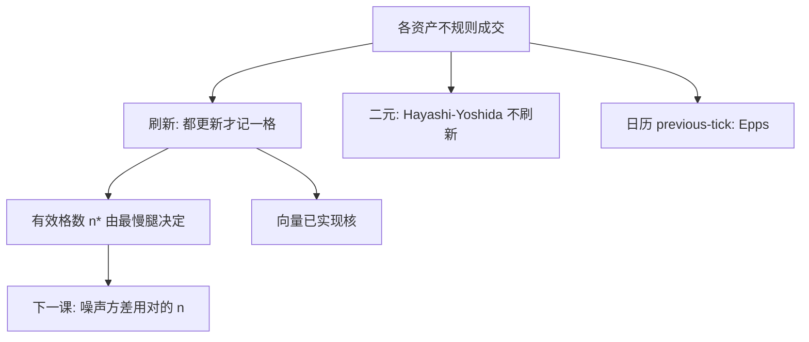

# 刷新时间与异步

所有资产都至少成交一次之后才记一个公共时刻，向量收益才没有陈旧坐标；代价是被最慢的那只腿决定时钟，快的腿在等待里走过的路被扔掉。

<footer>—— Barndorff-Nielsen, Hansen, Lunde and Shephard, Multivariate Realised Kernels: Consistent Positive Semi-definite Estimators of the Covariation of Equity Prices with Noise and Non-synchronous Trading, Journal of Econometrics, 2011</footer>

[已实现 beta](/quant/realized-beta) 要求分子分母同一时钟。Previous-tick 公共日历格会制造 Epps；[Hayashi–Yoshida](/quant/hayashi-yoshida) 不强制公共格，但噪声与正定性不友好。Barndorff-Nielsen 等人在多元已实现核里用**刷新时间**：从 $t_{j-1}$ 起等所有成分都更新，记 $t_j$，取向量收益再做核。本课缺口：把同步规则写成估计量的一部分，量化「丢信息」。下一课用密网格专门估噪声方差，刷新时间会改变有效 $n$，噪声识别跟着变。

## 问题

资产 $i$ 的成交停时 $\tau^{(i)}$。刷新时间 $t_j=\max_i \inf\{\tau^{(i)}\gt t_{j-1}:\text{该资产已更新}\}$ 的精确定义是：最小的 $t$ 使得每只资产在 $(t_{j-1},t]$ 都有至少一笔新观测。向量 $\Delta Y_{t_j}$ 的每一维都是新的（该段内最后一笔）。问题是 $t_j$ 的间隔由最慢资产决定：一只冷门股可以把一篮子的刷新降到几分钟一格，指数成分里的快股信息被丢掉。

[不等间隔采样](/quant/irregular-sampling) 已引入 refresh time；本课放在噪声修正的多元流程里：刷新之后才能套向量核，否则核的滞后对陈旧坐标无意义。

### 与 HY、previous-tick

| 规则 | 优点 | 代价 |
| --- | --- | --- |
| 刷新 | 向量同步、核可半正定 | 丢快腿、被慢腿拖累 |
| HY | 不丢重叠、二元干净 | $d\gt 2$ 拼矩阵、噪声 |
| 日历 previous-tick | 简单、正定外积 | Epps、零收益 |

没有占优。流动性接近的期货腿用刷新+核；一对一股票–期货用 HY；全市场截面用五分钟日历。

刷新时间不是「成交量时钟」。成交量时钟按累计 $V$ 走，刷新按「大家都出现过」。后者保证同步，前者保证风险量齐次。后课 business time 再写成交量时间。

## 方法

**算法。** 多指针扫各序列，维护每只最后成交时刻，当全部推进后输出一格。开盘：等到所有都开出来再开始，避免有的还在隔夜价。收盘：最后一组不完整刷新应丢弃或单独标记。

**之后。** 在 $\{t_j\}$ 上算多元已实现核（带宽按刷新后的 $n^*$ 与噪声）。$n^*$ 远小于原始 tick 数，噪声项 $2n\sigma^2$ 的 $n$ 要用 $n^*$。把原始 $n$ 套进 TSRV 公式会错。

**分组。** 大 $d$ 应按流动性分层刷新，或对因子用指数（单一快时钟）对个股 HY。不要对 500 只股票一个刷新时钟。

### 领先滞后

若真领先 3 秒，刷新的「同期」格仍可能把领先写进同一 $\Delta Y$（因为等慢的时候快的又走了）。刷新不消除经济领先，只消除陈旧报价。要测领先，应用指定滞后的 HY 或在刷新格上做滞后回归。

## 机制

Previous-tick 的零填充：未更新维收益为零，外积为零。刷新保证没有零填充的「假零」，每一维在该段都动过（至少一笔）。丢掉的是段内快维的多次波动——那些增量被压缩进段末价格差，中间路径的来回被净掉，类似稀疏采样的偏差，对 $IV$ 有平滑。慢维的长间隔若跨过宏观公告，一格里揉进异质 $\sigma$，该格噪声大。

核在刷新格上把短滞后协方差（噪声）扣掉。刷新后格点更疏，噪声相对 $IV$ 的比下降，核带宽可以更短。这是「先同步、再降噪」的顺序。

最慢 5% 的股票决定时钟时，刷新格数会崩。应设最大等待或把慢股移出向量，否则矩阵是「慢市场的协方差」，不是你以为的组合。

### 到噪声方差的交接

刷新改变有效采样频率，签名图的横轴应是刷新间隔而非原始 tick 间隔。下一课估 $\sigma_\varepsilon^2$ 时必须声明采样方案，否则把异步零收益当成噪声结构。

## 边界与工程取舍

期权、债券等极异步市场，刷新可能一天只有数格，核没有对象，应降 $d$ 或改 HY。夏令时、午休要重置刷新，不要跨会话等待。

工程：中等 $d$、要半正定核时用刷新；配对用 HY；截面用五分钟。报告 $n^*$、最慢腿、是否分层。不要声称「我们用了高频协方差」却在刷新后只剩 20 格还不做噪声修正。不要把刷新网格当交易时钟去回测——那是估计时钟。下一课：噪声方差估计。

## 小结

- 刷新时间构造无陈旧坐标的向量收益，是多元已实现核的标准前置。
- 时钟由最慢资产决定，快腿路径被压缩；大篮子必须分层。
- 它消除 Epps 式零填充，不消除经济领先滞后。
- 有效 $n^*$ 进入噪声公式；与 HY、日历格三分法按对象选。
- 出处：Barndorff-Nielsen, Hansen, Lunde and Shephard, *Journal of Econometrics*, 2011；异步对照 Hayashi and Yoshida, *Bernoulli*, 2005。
