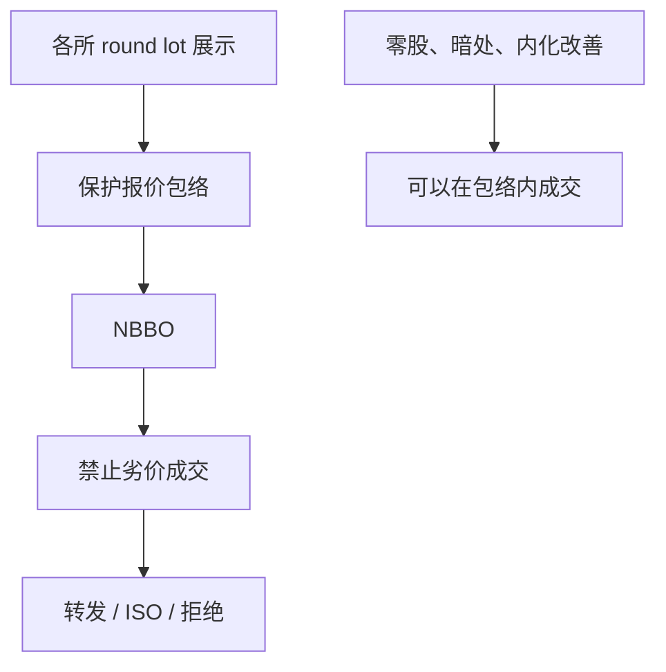

# Reg NMS 与订单保护

订单保护并不创造一张全国统一的限价簿。它只禁止在保护报价上以劣价成交，并把「最优」交给一套拼装规则：哪些报价受保护、用哪条时钟、多大尺寸才算数。

<footer>—— SEC Regulation NMS（2005），Rule 611；对照 Angel, Harris and Spatt 对二十一世纪股权市场结构的综述</footer>

[零售批发商](/quant/retail-wholesaler)对照全国最优来给出「不更差」。缺口是这个最优从哪来。Reg NMS 的订单保护规则（Rule 611）禁止 trade-through：不能以劣于另一场所保护报价的价格成交。[市场分割](/quant/market-fragmentation) 已把 NBBO 写成拼装物；[NBBO 构造](/quant/nbbo-construction) 与 [SIP](/quant/sip-vs-direct) 写时钟。本课只补设计层：保护什么、如何例外、以及保护如何与颠簸、内化、智能路由互相卡住。不重画多场所几何，不把 Rule 611 写成「全国 FIFO」。

## 问题

碎片化之后，同一股票有许多 BBO。若允许本所以劣于外所卖价的价格成交，客户在本所被「穿过」，全国价格优先被掏空。Rule 611 的回应是：对保护报价上的可立即成交订单，执行价格不得劣于其他场所的保护报价。代价立刻出现。第一，保护的是 round lot 展示报价，零股与部分暗处不在包络里，[手数](/quant/lot-size-odd-lot) 已说明合法的价差内成交。第二，没有统一时间优先：同样的价格在两个场所是两条队列，保护的是价格，不是队头。第三，转发去「保护」外所，要付延迟；ISO（跨所扫单）一类指令把合规外包给发送方。问题是：保护报价的虚拟全国簿，究竟保护了价格优先，还是保护了一场跨所速度竞赛。

[IEX 颠簸](/quant/speed-bump-iex) 已经点到：碎片化下狙击可以转到无颠簸场所，而订单保护可能强制把单送到当时 NBBO 所在地。规则与场所时钟绑在一起。

### 准入、亚分与保护是一套

NMS 不是一条规则。Rule 610 管场所准入与锁定/交叉报价；Rule 612 禁止一美元以上股票的亚分报价（成交仍可亚分改善）。批发商的亚 tick 改善合法，公开挂单不能挂在亚分上。于是「保护」的网格比内化网格更粗。把 611 单独当成市场质量开关，会漏掉：谁能挂进保护包络、格子有多细、接入是否公平。

锁定是买价等于外所卖价，交叉是买价高于外所卖价。延迟下 SIP 与直连对「是否锁定」的判断可以不一致。合规与交易用的最优不是同一条馈送。

## 方法

把每笔成交标成：是否发生在保护 NBBO 上、是否价差内、是否场外内化、是否 ISO 扫过外所。贸易穿过率下降不是质量充分统计量——穿过被禁之后，质量应看有效价差、保护深度、锁定交叉频率、以及转发延迟造成的错过。Angel–Harris–Spatt 把 NMS 之后的碎片化、费用竞争与电子做市写成同一张事实表。O'Hara 与 Ye（2011）问碎片化是否伤害质量，对象是这套规则下的均衡，不是无保护的反事实。

回测若在本所吃穿保护 NBBO 而不建模转发或拒绝，实施缺口被低估。经济最优还要加 [maker-taker](/quant/maker-taker)：最窄保护卖价未必是净费用最低的场所。

## 机制

订单保护把价格优先全国化，把时间优先留给各所本地。相对速度因此更值钱：谁先把保护报价改掉，谁改写全国包络；谁的吃单还对着过时保护报价，谁在做 BCS 式狙击。SIP 慢、直连快时，合规时钟与交易时钟分叉，[速度与市场质量](/quant/speed-market-quality) 的「相对延迟」被写进法规。批发商内化只要不劣于保护 NBBO，就不构成穿过——零售分割与订单保护是配套，不是对立。

对 Glosten 曲线：全国供给不是把各所深度相加。相加忽略转发延迟与各所队列不同步。可成交的「全国深度」是路由策略的函数。

## 边界

欧洲、香港、内地没有同一套 NMS。把 Rule 611 当全球默认，会把单一主簿市场的价格优先误写成跨所转发。保护报价定义随零股改革会变，经验系数必须钉住样本期。本课不讨论如何用 ISO 去抢外所队列。下一课把栅格本身当实验：Tick Size Pilot 在 NMS 已经禁止亚分报价之后，反过来加粗小盘股的 tick。

「全国市场」是监管修辞。微观结构对象仍是一簇场所加一条保护规则。

## 小结

- Rule 611 保护的是价格优先的包络，不是全国统一时间优先。
- 零股、暗处与批发商改善可以合法发生在包络内；亚分报价与亚分成交被 612 拆开。
- 保护转发把相对速度写进合规，与颠簸、SIP 延迟同一机制。
- 出处：SEC Regulation NMS（Rule 610/611/612）；Angel, Harris and Spatt 综述；O'Hara and Ye, *JFE*, 2011。
