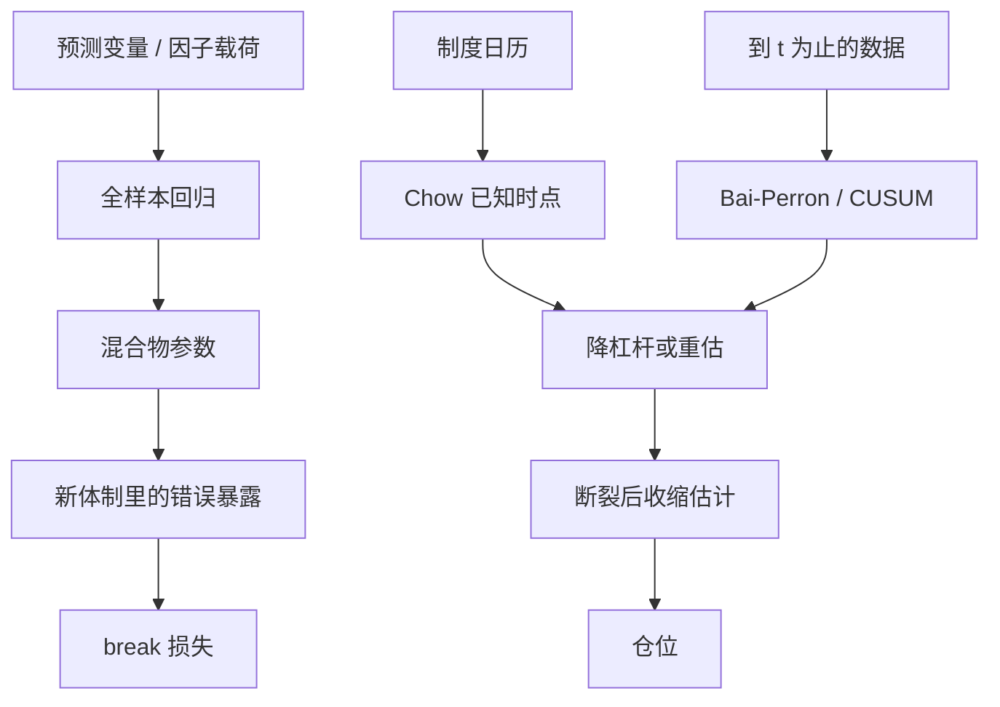

# 体制切换失效

股权溢价的预测关系若在未知时点发生断裂，全样本回归给出的「可预测性」既不是断裂前的关系，也不是断裂后投资者真正面对的关系。

<footer>—— 对照 Lettau and Van Nieuwerburgh, Reconciling the Return Predictability Evidence, RFS 2008；Pástor and Stambaugh 对溢价断裂的讨论</footer>

[体制切换](/quant/regime-switching-premia) 把收益写成有限个马尔可夫状态驱动的条件矩，滤波概率还可以进风险预算。本篇问的是相反的失败模式：你当成稳定的规则——因子溢价、对冲比、波动目标、相关矩阵——在某个未知时点换了参数，而检测、交易与风控仍按旧体制运行。Bai 与 Perron 把线性回归里的多断裂估出来；Chow 检验针对已知时点；Hamilton 的状态是反复来回的。失效（break risk）强调不可逆或极少逆转的那一类：政策框架、市场微观结构、指数编制、会计口径，一旦换了，旧样本的矩不再是新样本的无偏描述。

## 问题

设 $r_{t+1}=a+b\,x_t+\varepsilon_{t+1}$ 在 $t=\tau$ 处 $(a,b)$ 跳到另一组值。全样本 $\hat b$ 是两段的加权混合物，可能接近零（两段符号相反）或保持显著（两段同向但截距变了）。用混合物去做仓，等于在新体制里用错误的暴露。Pástor 与 Stambaugh（2001）讨论股权溢价的结构断裂：投资者若学习断裂，事后看到的平均溢价与事前要求的溢价不是同一条路径。Lettau 与 Van Nieuwerburgh（2008）指出，估值比预测收益的文献争议，有一部分可归为价格–基本面比的均值本身发生过移动；若不对均值做断裂调整，预测回归看起来不稳定。

配对与统计套利里，这就是[协整破裂](/quant/cointegration-break)：Gregory–Hansen 针对未知时点的水平或斜率转换。因子策略里，断裂可以是：做空成本制度变化、停牌规则变化、行业分类重画、或宏观政策把某一风格的现金流折现率永久改写。问题不是「要不要承认体制」，而是：**你用来估参数的窗口，是否已经跨越了一次不可忽略的断裂，以及你有没有把「断裂后参数未知」本身当成风险。**

### 反复切换与一次性断裂不是同一检验

Hamilton 体制假定状态会回来，转移矩阵给出期望持续期。Bai–Perron 的结构断裂假定换了就停在新参数上（或再换一次，但不是快速来回的遍历链）。用体制切换模型去拟合一次制度变革，会把新体制的样本估得很噪，并错误地给一个「回到旧体制」的正概率。用断裂模型去拟合波动的牛熊循环，会把每一次危机标成新世界，样本被切得无法用。选哪一套装置，是对数据生成过程的经济判断，不能只看样本内 SSR。

在回测里把「2008 之后单独估一套 beta」再把两段夏普拼起来，是用了全样本才知道的 $\tau$。实时只能用到 $t$ 为止的检测，断裂刚发生的那几年，新参数的标准误极大——这正是 break risk 的核心，不是可以事后补齐的细节。

## 方法

**已知时点。** Chow 把样本在预设 $\tau$ 切开，比较受限与不受限的残差平方和。适用于法规生效日、汇率制度宣布日、涨跌停幅度调整日。预设必须来自日历，不能来自「看图挑一个看起来断的点」。

**未知时点、多断裂。** Bai–Perron（1998, 2003）在部分结构下估 $\tau_1,\ldots,\tau_m$，并用信息准则或序列检验选 $m$。资产定价里常对溢价回归、或对因子载荷做滚动再加断裂搜索。代价是：搜索 $\tau$ 消耗自由度，临界值比 Chow 宽；小样本里一次闪崩会被认成断裂。

**学习与预测。** 即使你相信只断一次，投资者在断之前并不知道。Timmermann 以及 Pesaran–Pettenuzzo–Timmermann 一类工作强调：最优预测是对「是否已断、断在何处」的贝叶斯平均，而不是先检验再条件于「已断」的点估计。工程上，这意味着新信息到来时，仓位应朝无信息权重（更小杠杆、更接近基准）收缩，直到新体制的样本够用。

### 检测滞后是风险，不是手续费

统计检验要积累足够反常残差才会拒绝「无断裂」。交易账户在这段滞后里按旧 $\beta$ 加仓，亏损已经发生。因此操作规则不能是「等 Bai–Perron 显著再停」。更早的警报包括：滚动 $\hat b$ 与全样本的差距相对其标准误、残差 CUSUM、协整对的半衰期突然变长、以及与制度日历的对齐（即使 Chow 的时点只作为先验而不是唯一证据）。把检测阈值设得很严，等于选择更长的滞后、更大的 break 损失。

样本外「失效」有三种：alpha 本来就是[过拟合](/quant/overfit-as-risk)；拥挤把可交易性做掉；参数真的换了。前两种不会在 Bai–Perron 的回归系数里留下干净的一次跳跃。先分清对象，再决定是停策略、降杠杆，还是更新 $\beta$。

## 机制

经济机制是折现率、风险价格或现金流过程的一次移动。通胀目标制、利率零下界、指数纳入规则、做空禁令、会计标准，都会让旧的条件期望不再成立。统计机制是：全样本矩把两段过程混成一个没有人经历过的「平均年」——与 Hamilton 文中对线性模型的批评相同，只是这里可能永远不回到第一段。

对风险模型，断裂常表现为因子协方差的一次重排，而不是波动水平的暂时升高。[相关性崩溃](/quant/correlation-breakdown) 可以是压力期的暂时现象，也可以是断裂：例如某类资产被永久纳入同一监管资本篮子后，交易行为同质化。暂时与永久的区分，决定对冲是「等均值回复」还是「重建风险预算」。

### 与滤波体制的合用

可以把 Hamilton 滤波用在「来回」的波动状态上，把 Bai–Perron 用在「很少发生」的均值或载荷上，不要用同一个 $K=2$ 去承担两件事。滤波概率适合日度风险预算；断裂检测适合季度一次的模型重估。若把断裂检测做成每日自动改 $\beta$，会把每一次噪声都当成新世界，换手与过拟合一起上升。

## 边界与工程取舍

多重断裂的个数 $m$ 是设定。信息准则在异方差、肥尾下会误选。收益的信噪比低，真断裂可能被判成无，假断裂可能被一次危机打出来。稳健做法是：只对有制度解释的候选 $\tau$ 做 Chow，Bai–Perron 当探索而非自动交易信号；参数更新用衰减窗口或贝叶斯收缩，避免在 $\hat\tau$ 之后用 20 个点估一套全新的协方差。

不要用全样本平滑的体制标签去证明「某因子只在某体制有效」，再把该结论写进产品预期——那是用 $\mathcal{F}_T$ 讲 $\mathcal{F}_t$ 的故事。也不要因为一次断裂就把所有历史丢掉：旧样本对波动的数量级、对尾部形状仍有信息，只是对条件均值的方向要降权。

回测软件若允许「在样本里自动搜一个最优起点」，等于把 $\tau$ 也推进配置空间，[过拟合](/quant/overfit-as-risk) 与 break 检测会互相污染。起点必须预指定或来自制度日历。

## 小结

- 体制切换失效是参数在未知或已知时点改变后，仍按旧样本交易与风控所造成的损失。
- 反复马尔可夫体制与一次性结构断裂是不同装置；用错会给出虚假的回归概率或切碎样本。
- Lettau–Van Nieuwerburgh 与 Pástor–Stambaugh 说明溢价与预测关系对均值移动敏感；Bai–Perron、Chow 提供检测工具。
- 检测滞后期间的旧参数交易是风险的主要实现路径；实时不能使用全样本才知道的 $\tau$。
- 出处：Bai and Perron, *Estimating and Testing Linear Models with Multiple Structural Changes*, Econometrica, 1998；Pástor and Stambaugh, *The Equity Premium and Structural Breaks*, Journal of Financial Economics, 2001；Lettau and Van Nieuwerburgh, *Reconciling the Return Predictability Evidence*, Review of Financial Studies, 2008；Hamilton, *A New Approach to the Economic Analysis of Nonstationary Time Series and the Business Cycle*, Econometrica, 1989。
