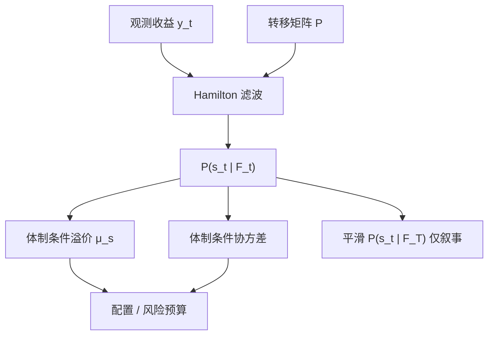

# 体制切换

把产出看成由不可见的离散状态驱动，状态本身服从马尔可夫链，就能在同一套线性方程里同时生成扩张的持续与衰退的骤降。

<footer>—— Hamilton, A New Approach to the Economic Analysis of Nonstationary Time Series and the Business Cycle, Econometrica 1989</footer>

资产收益的均值、波动与相关会在「平静」与「动荡」之间切换，而不是沿一条平滑的条件期望游走。Hamilton（1989）为美国产出写出马尔可夫体制切换：不可观测状态 $s_t$ 在有限集合上跳，观测方程的参数随 $s_t$ 变。随后 Ang 与 Bekaert、Guidolin 与 Timmermann 把同一装置接到国际配置、风格溢价与利率。体制切换要回答的不是「要不要择时」，而是：**风险溢价与协方差是否由离散状态生成，以及滤波得到的状态概率能不能进入信息集。** 它与 [宏观状态变量](/quant/macro-state-variables) 共享「状态驱动定价」，但状态在这里是潜变量，不事先等于某个 $cay$ 或利差。

## 问题

线性 VAR 或常数 beta 的 [条件 CAPM](/quant/conditional-capm) 假定参数缓变或对连续 $z_t$ 仿射。危机里相关向 1 靠拢、波动成倍跳升、若干风格溢价变号，更像分位数之间的断裂。若真实过程是离散体制，用全样本均值估溢价会把高波动体制的均值与低波动体制的均值混成一个没有人经历过的「平均年」。配置上，这会低估需要的尾部对冲，也会让恒定因子暴露在错误的体制里持续亏损。

Hamilton 的对象是：观测 $y_t$ 的条件密度依赖 $s_t\in\{1,\ldots,K\}$，$s_t$ 为时齐马尔可夫链，转移概率 $p_{ij}=P(s_t=j\mid s_{t-1}=i)$。要估的是各体制的均值与协方差、转移矩阵，以及 $P(s_t\mid \mathcal{F}_t)$。问题对资产定价的翻译是：体制若改变的是风险价格而不仅是现金流波动，溢价本身可切换；若只改变波动，均值溢价可以不变，但夏普与最优权重仍变。

### 体制个数无法从理论唯一钉死

$K=2$ 常被标成牛/熊或低波动/高波动，$K=3$ 有时分出「崩溃」。信息准则与似然比在体制切换里渐近不规则：部分参数在原假设下不可识别（某个体制概率为零时，该体制均值自由）。Hamilton 自己强调，体制是描述装置，不等于 NBER 衰退标签，也不等于可交易的买卖信号。选 $K$ 是设定选择，要用样本外密度、配置结果或与可观测宏观状态的对应来约束，而不是只看样本内似然。

用事后平滑概率 $P(s_t\mid \mathcal{F}_T)$ 画阴影再讲「熊市里价值有效」，是全样本标签。交易与检验只能用滤波概率 $P(s_t\mid \mathcal{F}_t)$，最多再加一期预测 $P(s_{t+1}\mid \mathcal{F}_t)$。平滑概率适合写经济史，不适合写回测。

## 方法

**Hamilton 滤波。** 给定上一期的体制概率，用转移矩阵推出预测概率，再用当期似然更新。高斯切换均值–方差模型里，这是有限混合的贝叶斯更新。估计用极大似然；波动持续很高时，常把各体制写成均值切换的 GARCH 或把方差也做成体制依赖。Ang 与 Bekaert（2002）在国际股票上估计熊市相关升高，并讨论配置含义：忽略切换会低估分散化失效。

**溢价的体制依赖。** 让 $E[r_{t+1}\mid s_t]=\mu_{s_t}$，或让因子载荷 $\beta_{i}(s_t)$ 与风险价格 $\lambda(s_t)$ 分体制。Guidolin 与 Timmermann 一类工作在股票、债券上放多个体制，显示最优组合随滤波概率大幅改权重。这与 [IC / IR](/quant/ic-ir-timing) 的择时相连：滤波概率是 $z_t$ 的一种，但它由收益自身反推，内生性强。

**与可观测状态并用。** 转移概率可以写成 logistic 于利差、期限结构、$cay$，得到时变转移（Filardo 型）。体制仍是潜变量，宏观变量只调节持续时间。这样可以把 Hamilton 装置接到宏观状态变量，而不是让二者抢同一个「状态」名字。

### 识别来自持续性，不是来自某一天的大跌

马尔可夫链的持续性 $p_{ii}$ 高，体制才是「一段时期」而不是「一个异常点」。若估计出的高波动体制平均只持续两天，模型多半在拟合跳跃或新闻，用体制溢价去讲商业周期就过度。诊断应看：各体制的期望持续期、滤波概率是否与 NBER 或危机日期大致对齐、以及把体制均值设成相等后似然掉多少。单凭某日暴跌被标成体制 2，不能说明溢价切换。

## 机制

机制分两层。统计层：混合分布能同时产生肥尾与波动聚集——在高波动体制多待几天，样本峰度自然上升，无需单独的 t 分布。经济层：投资机会集随离散事件改变（政策、流动性枯竭、风险偏好跳），投资者对冲的是体制风险，而不只是连续的消费增长。若定价核依赖 $s_t$，则同一现金流 beta 在坏体制里对应更高溢价，无条件截面会把这块读成异象，逻辑与条件 CAPM 相同，只是状态从连续 $z_t$ 换成离散 $s_t$。

转移矩阵决定溢价的期限结构。接近单位根的持续性让「坏体制」像持久风险，投资者愿意付高价格保险，均衡溢价在坏体制里可以更高或更低——取决于该体制是高风险价格还是负现金流新闻占优。模型本身不裁定符号，只提供条件矩如何分段。把估计出来的 $\mu_{\mathrm{bear}}$ 直接当可交易择时 alpha，跳过了「价格是否已经包含体制风险」这一步。

两个体制的无条件均值是稳态概率加权，不是样本日数加权。若你用滤波概率小于 0.5 的日子去算「牛市溢价」，既不是模型的 $\mu_1$，也不是可实现的策略收益。对象必须写清：模型参数、滤波规则下的实现，还是平滑标签下的叙事。

### 与阈值模型、平滑转移的差别

Tong 的阈值自回归用可观测变量穿越阈值来切换；Teräsvirta 的平滑转移让参数沿 logistic 渐变。Hamilton 的状态不可观测，即使宏观看起来「还好」，收益自身也可以把概率推向危机体制。对溢价，这意味着市场可以比宏观发布更早重新定价。代价是滤波噪声：收益的一周噪声就能让 $P(s_t=2)$ 大幅摆动，据此调仓会变成高换手的波动追随。

## 边界与工程取舍

似然对初值与 $K$ 敏感，局部极大常见。小样本里一个体制可能只被几次危机识别，参数标准误不可信。多元资产时，体制个数与协方差参数爆炸，常需对相关结构加约束（例如只让波动切换、相关跟体制走一条因子）。用日收益估体制再接到月频溢价，时间加总会改变持续性含义。

工程上，滤波概率可以进风险预算：当 $P(\text{高波动}\mid\mathcal{F}_t)$ 高时降杠杆、收紧动量暴露。这是风控规则，不是对 Hamilton 模型的检验。检验应看样本外对数分、校准的概率（高概率的日子是否真的更常实现该体制的矩），以及相对恒定配置的成本后增量。不要用全样本平滑阴影给因子贴「只在熊市有效」的标签后，再把同一全样本夏普写成产品预期。

体制切换不能替代 [多重检验](/quant/multiple-testing-factors) 纪律。在收益上搜 $K$、搜哪些资产进入观测向量、搜转移是否时变，等于搜分段均值。分段之后任何风格都会「在某体制显著」。预指定观测变量与 $K$，其余当稳健性。

## 小结

- Hamilton（1989）用马尔可夫潜状态驱动观测方程，使均值、波动与相关可以离散切换；资产上的对应物是体制依赖的溢价与协方差。
- 交易与检验只能用滤波概率，不能用全样本平滑标签。
- 体制个数与持续性是设定，不是数据自动给出的「牛熊真相」；短命的高波动体制更像跳跃拟合。
- 无条件溢价是稳态加权，与某套择时规则的实现收益不是同一个数。
- 滤波概率适合作为风险预算输入；当作 alpha 信号时，须样本外、成本后、相对恒定暴露来检验。
- 出处：Hamilton, *A New Approach to the Economic Analysis of Nonstationary Time Series and the Business Cycle*, Econometrica, 1989；Ang and Bekaert, *International Asset Allocation with Regime Shifts*, Review of Financial Studies, 2002。
