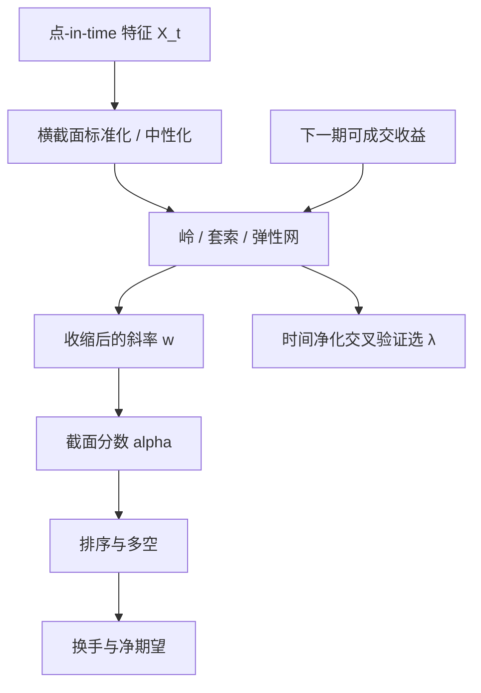

# 正则线性模型

收缩方法在最小二乘与空模型之间连续插值；惩罚不是装饰，而是在高维里让线性预测有定义的那一项。

<footer>—— 据 Hastie, Tibshirani and Friedman, The Elements of Statistical Learning 对岭回归与套索的论述整理</footer>

截面 alpha 的最老实写法仍是线性：把可交易特征堆进 $x_{it}$，用 $r_{i,t+1}$ 去估 $w$，再用 $\hat\alpha_{it}=x_{it}^\top\hat w$ 排序。特征一多——估值、质量、动量、换手、分析师修订、行业哑元——普通最小二乘就把噪声方向当成信号。Hoerl 与 Kennard（1970）的岭回归、Tibshirani（1996）的套索、Zou 与 Hastie（2005）的弹性网，把这件事从「再挑几个变量」改写成凸惩罚。Gu、Kelly 与 Xiu（2020）在实证资产定价里把惩罚线性当作机器学习的基准层，而不是被树模型取代的过时物。本篇只写这一层：惩罚如何改变可识别的 $w$，以及它在 A 股点-in-time 面板上仍会失败的方式。它与[协方差收缩](/quant/cov-shrinkage)同构，对象从 $\Sigma$ 换成了预测斜率。

## 问题

设 $t$ 日截面有 $N_t$ 只股票、$p$ 个特征。无惩罚的目标是

$$
\min_w\ \frac1{N_t}\|r_{t+1}-X_t w\|_2^2.
$$

$p$ 相对 $N_t$ 并不小：行业哑元、交互、滞后已经把 $p$ 顶到几十上百；再叠非线性基，普通最小二乘的设计矩阵病态。相关特征（账面市值与盈利、动量与反转）让 $X^\top X$ 的小特征值把系数炸开，样本内 $R^2$ 好看，样本外 IC 崩溃。这不是优化器脾气坏，而是[误差最大化](/quant/cov-shrinkage)在预测侧的翻版：未正则的 $\hat w$ 偏爱估得最不准的方向。

资产定价还多一条约束：你要的不是拟合历史收益，而是可交易的下一期排序。系数不稳定会直接变成换手。Hastie、Tibshirani 与 Friedman 把偏差–方差写成显式权衡：惩罚增大，有效自由度下降，方差下降，偏差上升。问题是选哪一种范数、惩罚相对哪一个尺度，以及验证集如何避免把未来写进特征——后者交给[防止未来函数](/quant/no-future-function)，本篇假定 $X_t$ 在 $t$ 日收盘后可获得。

### 最小二乘在截面上的两种病

第一种病是共线：价值与质量、规模与流动性高度相关，OLS 会把符号拆成「一个巨大正、一个巨大负」，经济上无法读。第二种病是稀疏错觉的反面：真正起作用的特征可能只有一小撮，但 OLS 把系数均匀洒在所有列上，噪声列分到的权重在下一期变号。套索针对第二种，岭回归针对第一种；弹性网承认两者同时存在。Gu–Kelly–Xiu 的线性基准表明，在特征已经标准化、并做行业或市值中性之后，惩罚线性往往已经吃掉树模型相对 OLS 的大部分增益——增益来自正则，不一定来自深度。

惩罚的对象是系数，不是预测本身。把收益 winsorize、把特征横截面标准化，是另一层稳健；它们改变的是 $X$ 与 $r$ 的尺度，不能替代 $\|w\|$ 上的约束。混在一个网格里调，最后说不清是谁在干活。

## 方法

岭回归在残差平方和上加 $\lambda\|w\|_2^2$，解为 $(X^\top X+\lambda I)^{-1}X^\top r$。$\lambda$ 把特征值从 $\xi_j$ 抬到 $\xi_j+\lambda$，逆不再爆炸。套索把惩罚换成 $\lambda\|w\|_1$，在 $p$ 大时把一部分系数精确打到零，相当于连续的子集选择。弹性网是 $\lambda\bigl(\alpha\|w\|_1+(1-\alpha)\|w\|_2^2/2\bigr)$：$\ell_1$ 做选择，$\ell_2$ 在高度相关的一组特征之间分摊，避免套索在共线簇里任意挑一个。Zou 与 Hastie（2005）证明，纯套索在 $p>n$ 时最多选出 $n$ 个变量，且对相关变量不稳定；弹性网修的就是这两条。

估计应在时间上滚动，而不是全样本一次。每个再训练日 $t$，只用 $t$ 之前的 $(X_s,r_{s+1})$，用净化后的验证窗选 $\lambda$（见 purged k-fold）。特征必须先做横截面标准化或分位变换，否则惩罚会按原始量纲偏爱低方差列。行业、市值中性可以放进 $X$ 的残差化，也可以放进组合构造；不要两头都做却只报告一次。评价用下一期截面 IC、分位多空与[扣费后净期望](/quant/net-edge)，不要用样本内 $R^2$。

### 惩罚与组合排序不是同一实验

线性模型给出每只股票一个分数，随后仍要[排序形成多空](/quant/long-short-sort)。惩罚改变的是分数的平滑程度，不自动给出断点、加权与持有期。把套索选出的十个特征再拿去等权打分，等于丢掉了它估出来的相对幅度；把岭回归的分数直接按市值加权持有，则换手由分数的自相关决定，与 $\lambda$ 耦合。正确的报告是：固定排序规则，只让 $\lambda$ 变，画出 IC、换手、净夏普对 $\lambda$ 的路径。Hastie 等人强调用交叉验证选惩罚；金融里验证窗必须尊重时间与事件依赖，否则「最优 $\lambda$」本身是过拟合。

## 机制

岭回归的机制是收缩：每个主成分方向上的系数被乘以 $\xi_j/(\xi_j+\lambda)$。大特征值（共同因子）几乎不缩，小特征值（噪声）被按死。于是预测靠近低维因子结构，这与基本面风险模型把收益写成 $Bf+\varepsilon$ 是同一几何，只是这里收缩的是预测系数而不是协方差。套索的机制是软阈值：在正交设计下，系数按绝对值减去 $\lambda$ 再截断。相关设计下没有这么干净的图，但直觉仍是「付一笔固定的 $\ell_1$ 税，不够大的系数活不下来」。弹性网让同一簇里的特征一起进、一起出，适合「账面、盈利、现金流其实是同一价值簇」这种资产定价现实。

可交易性上，收缩降低换手，因为 $\hat w_t$ 对样本扰动不那么跳。这是正则相对无惩罚 OLS 最被低估的好处：夏普的改善常常来自成本，而不是来自更高的毛 IC。过强的 $\ell_1$ 会把慢变量（价值）留下、把快变量（短期反转）删掉，策略在制度上更像低换手风险溢价；过弱则回到噪声换手。$\lambda$ 因此既是统计量，也是换手旋钮。

不要把套索的零系数读成「该特征无定价能力」。它只是在当前惩罚、当前相关结构下没进模型。换一个样本年、换一种中性化，同一特征可以复活。稳定的说法是系数路径，不是某一 $\lambda$ 上的活跃集。

### 点-in-time 面板上的额外偏倚

A 股的因变量常被涨跌停截断：真实意愿收益不可观测，OLS 与惩罚回归都把截断当真实 $r$。这会把「封板后的动量」写成可线性拟合的 alpha，其实是不可成交的价格。停牌、新股、ST 进出样本造成非随机缺失。正则不修复缺失机制；它只是让你在脏数据上得到一个更平滑的错误。正确顺序是：先按交易所规则构造可成交收益与可获得特征，再谈 $\lambda$。把市值、行业做成特征而不做中性，惩罚可能把规模当成最强的一列——那是[规模暴露](/quant/size-neutral)，不是新 alpha。

## 边界与工程取舍

正则线性假定近似线性可加。阈值效应、状态依赖、拥挤非线性，套索不会帮你发现，只会把它们摊成偏差。树模型与神经网络可以表达这些，但把自由度交回去；没有惩罚与净化验证，复杂度只是把过拟合从系数挪到结构。Gu–Kelly–Xiu 的比较有用，恰恰因为他们给了惩罚线性一个公平的位置：它是必须先打败的基准，不是故事的反派。

超参不要在全样本上用夏普去选。$\lambda$ 选得让样本内多空最漂亮，等于把验证集变成训练集。也不要把岭回归的 $\lambda$ 与 Ledoit–Wolf 的 $\delta$ 混成一个「收缩系数」：前者惩罚预测权重，后者收缩协方差，进入组合的方式不同。实务上的稳健栈往往是：点-in-time 特征、横截面标准化、弹性网或岭、滚动再训练、再用组合层的权重约束做第二层正则。两层都要，一层不够。

标准化必须用 $t$ 日可获得的截面均值与方差，或用过去窗口。用含 $t+1$ 的全样本均值去中心化，是最廉价的未来函数。惩罚再漂亮，也救不了输入里的泄漏。

## 小结

- 高维线性 alpha 的失败首先是未惩罚的病态设计矩阵，不是「线性太简单」。
- 岭回归收缩共线方向，套索做连续子集选择，弹性网在相关簇上同时选择与分摊；出处见 Hoerl–Kennard（1970）、Tibshirani（1996）、Zou–Hastie（2005）与 ESL。
- 惩罚降低有效自由度，往往同时降低换手；$\lambda$ 是统计旋钮也是成本旋钮。
- 评价必须用可成交的下一期收益与样本外 IC，而不是样本内 $R^2$。
- 截断收益、非随机缺失与特征泄漏不属于正则能修的层。
- 惩罚线性是机器学习定价的基准层，见 Gu, Kelly and Xiu, *Review of Financial Studies*, 2020。
- 出处：Hastie, Tibshirani, Friedman, *The Elements of Statistical Learning*；Tibshirani, *JRSS-B*, 1996；Zou and Hastie, *JRSS-B*, 2005。
