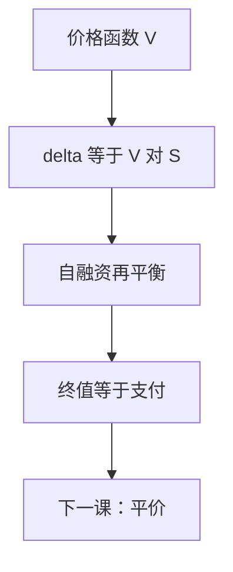

# 复制与 delta

完备市场里，期权是动态持仓：$\Delta_t=V_S(t,S_t)$ 股标的，余下资金放货币市场。连续再平衡使终值几乎必然等于支付。

<footer>—— 据 Black and Scholes, 1973；Harrison and Pliska, 1981；Shreve, Stochastic Calculus for Finance II, 第 6 章整理</footer>

上一课[Black–Scholes 作为 PDE](/quant/bsm-as-pde)给出 $V(t,S)$。缺口是把 PDE 解翻译成交易：持有多少 $S$、多少债券，才能复制 $g(S_T)$。价格等于复制成本，不是另找一个期望再解释一遍。本课只钉 delta 与自融资，不把离散再平衡的误差写成市场微观结构。

## 问题

鞅表示已经保证存在某个 $\phi$，使贴现 $V$ 等于初值加 $\int\phi\,\mathrm d(\mathrm e^{-rt}S)$。缺口是认出 $\phi$ 就是 $V_S$。用 Itô 展开 $V(t,S_t)$，扩散系数是 $\sigma S V_S$；标的的扩散系数是 $\sigma S$。自融资组合 $(\Delta,\Gamma)$（$\Delta$ 份股票，$\Gamma$ 份债券）要匹配这两个扩散，故 $\Delta=V_S$。剩下的价值放债券，PDE 保证漂移也匹配。没有这一步，「风险中性期望」和「对冲组合」仍是两套语言。

自融资：没有外加现金，$\mathrm d\Pi=\Delta\,\mathrm d S+\Gamma\,\mathrm d B$。消耗或注入现金会破坏复制恒等式。

### Delta 不是「方向性观点」

$\Delta$ 是复制比率，由 $V$ 的偏导决定，不是对后市涨跌的押注。把 $\Delta=0.6$ 读成「六成把握看多」，对象从对冲变成预测。$P$ 下你可以有观点；复制在 $Q$ 的动力学上匹配扩散，不表达观点。

离散再平衡留下 Gamma 误差，量级是 $\tfrac12 V_{SS}(\Delta S)^2$ 与 $\sigma^2 S^2\Delta t$ 的差。连续极限里二次变差对齐，误差消失。这是理想化接口，不是交易系统。

## 方法

自融资组合价值 $\Pi_t=\Delta_t S_t+\Gamma_t B_t$。令 $\Delta_t=V_S(t,S_t)$，$\Pi_0=V(0,S_0)$，则在 BSM 假设下 $\Pi_T=g(S_T)$ a.s.。看涨的 $\Delta=\Phi(d_1)\in(0,1)$，看跌 $\Delta=\Phi(d_1)-1\in(-1,0)$——闭式下一课才写，本课只需 $\Delta=V_S$。Gamma $V_{SS}$ 描述 delta 对 $S$ 的敏感度，决定再平衡频率的尺度，不是本课的独立定价量。

多维时 delta 是梯度 $\nabla_S V$，每个可交易标的一行。不完备时不存在精确 $\Delta$，只存在投影对冲；那是不全市场留下的接口。

## 机制

匹配扩散项消去 $\mathrm d W$，组合瞬时方差为零，收益率被 PDE 钉在 $r$。这是 1973 的论证，与「贴现 $V$ 为 $Q$-鞅」互译。$V_S$ 随 $S$ 与 $t$ 变，所以必须连续调整：静态持仓只能复制线性支付。凸性（Gamma）使期权不能被静态的股票加债券代替——这正是期权有时间价值的交易侧。$V_S$ 对看涨落在 $(0,1)$ 是边界行为的推论：复制不能超买现货，也不能变成净空头超过一张看跌所能提供的范围。

融资：$\Delta$ 增大时从货币市场抽现金买股，减小则反向。自融资记账把这些内部划转算清。交易成本会破坏理想复制，本课程不把它们写进 PDE。

## 边界

本课不讨论离散对冲最优频率、不引入买卖价差、不写限价簿吃单。美式的 delta 在行权边界上有折，最优停课再提。后课默认：BSM 价格是复制成本，$\Delta=V_S$ 是股票持仓。下一课[Put–call 平价作为无套利](/quant/put-call-parity-arb)给出不依赖动态模型的静态关系。

## 小结

- 复制：$\Delta=V_S$，余下资金放货币市场，自融资。
- 匹配扩散消去 $\mathrm d W$；PDE 匹配漂移。
- Delta 是对冲比率，不是涨跌观点。
- 精确复制依赖完备与连续再平衡。
- 出处：Black–Scholes 1973；Harrison–Pliska 1981；Shreve SDE II 第 6 章。
