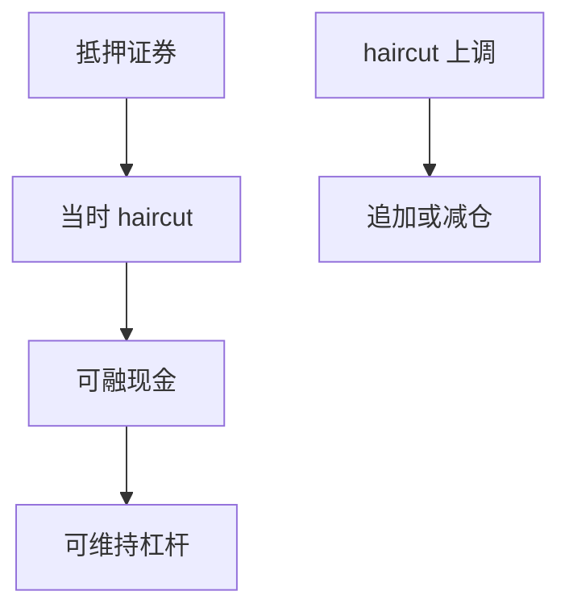

# 回购与抵押品

回购是带抵押的短期借款：你交出证券、拿回现金，到期反向操作。Haircut 决定同一张债券能换多少资金；抵押品降级时，杠杆比价格先塌。

<footer>—— 据 Duffie, Special Repo Rates, Journal of Finance, 1996；Gorton and Metrick 对回购与 haircut 的讨论整理</footer>

上一课[借券费率](/quant/stock-loan-fee)是证券出借的价格。本课转到现金腿：回购（repo）用证券换现金。多头杠杆的机构实现往往不是 Reg T 保证金，而是回购与 Prime 融资。缺口是把**抵押品与 haircut**写成资金约束。不重写借券费，尽管 special repo 与借券在机制上相通。

## 问题

无约束回测把国债、公司债、股票当成同样可融资的名义。回购市场上，国债 haircut 低，信用债与股票 haircut 高，危机中 haircut 上调等于抽走杠杆。Gorton–Metrick 把 2008 年描述为 haircut 驱动的挤兑：价格尚未跌完，可借现金已经下降。缺口是回测每日用**当时 haircut**计算可融资金，而不是用一个常数杠杆乘市值。

Duffie 指出 special repo 利率会因该券被追捧而下跌（现金出借人接受更低利息以借到该券），与上一课 special 借券费是同一稀缺的两面。

### Haircut 不是债券久期

久期描述价格对利率的敏感；haircut 是对手方与清算规则决定的抵押折扣。长久期国债仍可能 haircut 很低。把风险模型的 VaR 直接当成 haircut，会在回测里用错约束。本课把 haircut 当制度输入，可随评级、集中度、CCP 规则变，但不在此推导最优折扣。

同一证券作为融券抵押与作为回购抵押，折扣规则可以不同。不要把借券保证金率直接抄进回购账户。

## 方法

持仓按类别映射到当时 haircut，可融资额 = $(1-h_t)\times$ 抵押市值。目标杠杆超过可融资额则降仓，走保证金课的拒绝开仓逻辑。抵押品价格下跌或 $h_t$ 上调，触发追加抵押或减仓；追加失败走缺口强平。Haircut 时间序列必须 PIT：用危机后才升高的折扣回填危机前，会让策略在 2007 年就已经「预知」无法加杠杆。

GC 回购利率进入后课资金底；本课先把数量约束（能借多少）与价格约束（什么利率）分开。数量先绑死。

股票与国债不得共用 haircut 常数。$h_t$ 与抵押市值同时变时先追加后减仓。事后监管校准的折扣不得回填危机前。数量约束先于 GC 利率。

## 机制

回购把资产负债表的资产变成现金，同时制造到期必须轧平的滚动风险。滚动失败（repo run）是强平的机构版本：不是股票维持线，而是隔夜合约不再续作。因子若依赖杠杆放大的价值或多空，危机里先碰到滚动与 haircut，再碰到价格。纸面回测在 2008 年仍用 2006 年的杠杆常数，是制度前视。

CCP 清算会统一部分 haircut 与保证金，下一课讲。双边回购的折扣更散、更易在压力中跳变。

按资产类别映射当时 haircut，可融现金 = $(1-h_t)$ × 抵押市值。$h_t$ 上调或抵押市值下跌，先追加后减仓，失败走缺口。Haircut 时间序列用当时市场惯例或 CCP 参数，2008 年用 2008 年的折扣，不要用事后监管校准值回填。GC 利率留给资金底；本课先把「能借多少」绑死。股票抵押与国债抵押不得共用一个折扣常数。

## 边界

不写 GMRA 合同条款汇编，不给 MBS 估值。下一课[中央对手清算](/quant/ccp-clearing)把双边对手风险换成 CCP 的违约基金管理。后课默认：杠杆由当时抵押与 haircut 决定；常数杠杆倍数不是机构可交易路径。

后课 CCP 会把部分折扣规则统一；双边回购仍然更散、更顺周期。本课数量约束先于利率。危机月 haircut 上调与价格下跌同时发生，常数杠杆回测没有这条路径。抵押品降级按当时评级与当时折扣，不按事后才调低的评级回填。

## 小结

- 回购用证券换现金；haircut 决定换多少。
- 危机中折扣上调会先于价格抽走杠杆。
- special repo 与借券费是同一稀缺的两面。
- Haircut 必须 PIT，不能用危机后规则回填。
- 数量约束（能借多少）先于利率（资金底）。
- 出处：Duffie (1996)；Gorton and Metrick 回购与 haircut 讨论。
