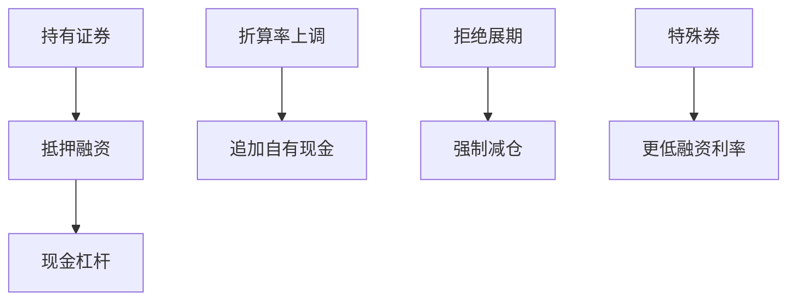

# 回购市场与融资

回购用证券换现金并约定买回：它是短期利率的实现场所，也是杠杆的管道。特殊券与一般抵押品把同一国债分成两种融资价格。

<footer>—— Gorton and Metrick, Securitized Banking and the Run on Repo, JFE, 2012；Krishnamurthy, Nagel and Orlov, Sizing Up Repo, Journal of Finance, 2014；对照 Tuckman 对回购与融资的教科书处理</footer>

[上一课](/quant/securities-lending)把券的租用停在借券。[固收 RV](/quant/fi-relative-value)已预告杠杆在 repo。本课的缺口是**现金腿**：回购（repo）与逆回购如何决定杠杆成本、折算率（haircut）与挤兑。Gorton 与 Metrick（2012）把 2007–09 的回购挤兑写成证券化银行的运行；Krishnamurthy、Nagel 与 Orlov（2014）从规模上校准「回购市场有多大」。后课期权到期会用到融资与保证金的同一条现金约束。中国银行间回购在债市进阶课续写，本课给一般机制。

## 问题

买入持有国债的经济收益，必须减去融资：用该券做抵押借现金的利率。GC repo 利率跟踪政策利率与准备金；特殊券 repo 利率可以显著更低（现金出借人为拿到特定券而接受更低利息）。对空头，特殊性表现为难以借到券或必须支付借券费；对多头融资，特殊性表现为更便宜的融资——同一现象的两面。问题是 RV 与基差交易的「中性」建立在 repo 曲线可滚动；一旦 haircut 上调或对手停止展期，杠杆被抽走，残差变成方向，与 1998、2008、2020 的路径一致。

期限：隔夜、远期起息、定期。隔夜滚动有展期风险；定期锁定成本但占用授信。三方回购经清算银行，双边回购对手集中度更高。折算率随波动与券种跳升时，同样的组合突然需要更多自有现金——这是去杠杆的机械通道，不是「模型算错久期」。

### 回购挤兑与 CCP 保证金同时抽现金

危机里 VM、haircut、基金赎回可以同日要钱。只对冲利率 DV01、不对冲融资流动性，账上中性、现金上爆。Adrian 与 Shin 一类工作强调经销商杠杆的亲周期性；本课只要把 haircut 与展期当成状态变量进回测情景，而不是把 repo 利率当常数利差。

美国 ON RRP、中国银行间质押式回购、交易所标准券回购，法律结构不同，经济同构：抵押、折算、到期买回。不要用一个 ticker 的回购利率去贴现所有市场。

## 方法

每笔需要融资的持仓标注：抵押券、haircut、利率、到期、对手或 CCP。滚动假设必须显式：每日展期 vs 锁定期限。压力情景：haircut +5～20 个百分点、GC 利率跳升、特殊券变为 GC（融资优势消失）、对手授信削减。容量先满在授信与合格抵押，而不是在债券 DV01。与[结算失败](/quant/settlement-fails)联动：缺券 fail 会破坏 repo 交割，融资与借券互相咬住。

会计：回购是抵押融资还是卖出，影响杠杆展示，不影响经济风险。研究应按经济暴露记账。ETF 与期货的隐含融资应与 repo 对照，找出便宜的杠杆管道，同时计入基差与保证金。

### 特殊性进入定价

持有成本模型里，特殊券的 repo 利率替换一般 $r$。期现、债券期货 CTD、股票融资盘都应对 $r$ 选用对的那个。用国债 GC 去贴现公司债 RV，融资项会系统性偏。点-in-time 的特殊性清单与借券清单一样，属于研究基础设施。

## 机制

回购把证券变成货币弹性：高信用抵押品几乎是钱，haircut 小；一旦抵押品信息变差，haircut 跳升，弹性消失，出现挤兑。这与 CCP 瀑布不同：可以发生在双边或三方，不必等正式违约。对量化：杠杆策略的真实风险预算是「融资市场仍愿意以昨日条款展期」的概率。该概率在平静期接近 1，在压力期不是。

与撮合的距离：repo 多数不在股票 LOB 上交易，而在双边、电子平台或交易所回购。微观结构课的价差公式不能直接套；深度应以授信与券源计。不要把股票 tick 图拿来画回购流动性。

## 边界

不提供利用客户托管券违规加杠杆、或隐瞒回购杠杆的做法。[固收 RV](/quant/fi-relative-value)已声明边界。主权债、信用债、股票质押式回购的合格性与监管资本权重不同，不能一个 haircut 打天下。

## 小结

- 回购是杠杆与短期利率的实现；GC 与特殊券是两种价格。
- 容量与爆仓首先来自 haircut 与展期，不是来自 DV01 算错。
- 融资条款必须点-in-time 进回测，常数利差会低估危机。
- 出处：Gorton and Metrick, *JFE*, 2012；Krishnamurthy, Nagel and Orlov, *JF*, 2014。
