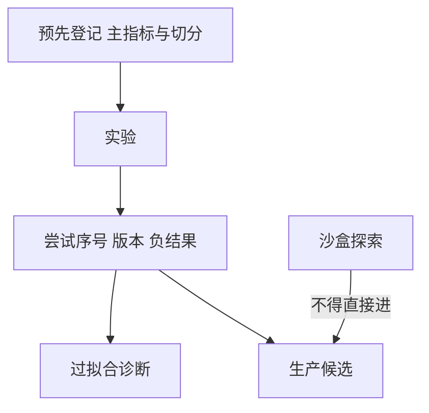

# 研究日志与纪律

每次试错都是一次假设检验。不记账的试错让显著性在实验室里被用尽，样本外只剩被选中的那条曲线。

<footer>—— Harvey, Liu and Zhu, … and the Cross-Section of Expected Returns, RFS, 2016；Bailey, Borodin, López de Prado and Zhu, The Probability of Backtest Overfitting, 以及 CSCV 方法；McLean and Pontiff, JF, 2016</footer>

[上一课](/quant/backtest-vectorization)选定引擎。[特征商店](/quant/feature-store-research)已要求实验元数据。本课的缺口是**人的试错过程**：Harvey、Liu 与 Zhu（2016）指出多重检验下多数「因子」过不了更高的 t 阈值；Bailey 等把回测过拟合概率写成可计算对象；McLean 与 Pontiff（2016）记录发表后衰减。后课生产监控处理上线之后；本课处理上线之前的实验室账本。

## 问题

研究员改参数、换宇宙、换清洗、加一个过滤器，直到曲线好看。若不记录尝试次数与失败，报告里的 t 统计量对应的是被选择的极值，而不是预先登记的假设。问题是把研究当临床试验：预先登记问题、允许的数据范围、主要指标；偏离必须另开实验号，不能覆盖。特征版本与代码哈希是必要但不充分——还要记「这是第几次尝试同一故事」。

发表偏差在实验室内部同样存在：只有正结果被写进备忘录。日志应包含负结果与「因泄漏作废」的实验，否则团队会重复踩同一块未来函数。McLean–Pontiff 的样本外衰减有一部分来自数据开采与费用；内部日志是降低自己开采强度的工具。

### 主要指标必须预先锁死

若主指标可以在夏普、Calmar、换手调整后收益、特定子期之间切换，多重检验没有上界。登记：样本外切分点、成本模型版本、是否允许在危机子期上「解释掉」。子期分析是探索，不能回头改主指标。与[过拟合](/quant/backtest-overfitting)课的 CSCV 结合：日志提供尝试次数的下限，CSCV 提供过拟合概率的估计。

纪律不是反对探索。探索放在沙盒宇宙，结果标为 exploratory，不得直接进生产候选。生产候选必须来自登记实验。

## 方法

每条实验记录：假设陈述、特征版本、宇宙、引擎类型、成本、尝试序号、主指标、是否泄漏作废、结论。存储与代码仓库挂钩。周会审查的是日志完整性，不只是曲线。复制：另一人仅凭日志能复现数字；不能复现则实验无效。

与数据商对照、黄金样本失败，应自动作废依赖该字段的实验，而不是手动挑一个「看起来没坏」的子期。变更管理与[交易所故障](/quant/exchange-outages)里 Knight 的教训同构：配置漂移要留痕。

### 中国样本的额外登记项

制度分段：涨跌停比例、注册制、程序化规则、融券政策，必须以生效日写入实验，禁止用现行规则回填全样本。否则「全 A 十年夏普」是一个从未存在的市场。

## 机制

多重检验把噪声的尾部变成「发现」。记账不能消灭噪声，但能阻止把尾部当唯一叙事，并为更高阈值提供尝试次数输入。Harvey–Liu–Zhu 的建议阈值随尝试次数上升；没有日志就没有分母，阈值无法校准，默认应更保守。

衰减：即使诚实，拥挤与费用也会降低样本外。日志把「我们内部已经衰减」与「市场拥挤」分开：前者看登记后的第一次样本外；后者看实盘后课容量。

## 边界

本课不写如何把日志做得很完整以通过合规检查、同时仍隐藏尝试。隐瞒尝试次数属于研究不端。个人隐私与未公开持仓不要写进可外发的日志。

## 小结

- 试错次数是检验的分母；无日志则 t 值不可信。
- 主指标预先锁定；探索与生产候选分轨。
- 制度生效日必须登记，禁止现行规则回填历史。
- 出处：Harvey, Liu and Zhu, *RFS*, 2016；McLean and Pontiff, *JF*, 2016；Bailey 等 CSCV。
