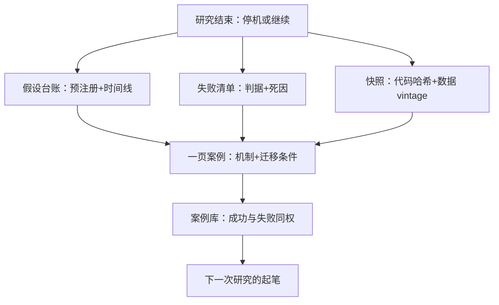

# 复盘与案例写作

研究部门的资产不是净值曲线，是写下来的证据链：哪个假设在何时以何种判据生死，下一次搜索从哪里起笔。

<footer>—— 据 Arnott, Harvey and Markowitz, Journal of Financial Data Science, 2019；López de Prado, Advances in Financial Machine Learning, 2018 整理</footer>

[上一课](/quant/live-monitoring-handoff)的触发器把停机的策略自动送回研究账户，附带版本号与对账数据；本课处理闭环的最后一环：无论停机还是继续，一次研究结束都要沉淀成可复用资产——假设台账、失败清单、代码与数据快照。量化主干的课序到此结束：从问题的起源、数据的审计、信号的检验，到组合、成本、风险、上线、监控，最后落回这份复盘；后面没有下一课，只有带着这条链再走一遍的下一次研究。

## 问题

不复盘有三种代价。其一，同一个坑再挖一次：没有失败清单，搜索会反复撞同一种死法，而且每次碰撞都在暗处消耗一次试验——$N$ 被系统性低估，多重检验折价随之失效，第一单元的纪律在统计上作废。其二，成功归因错误：赚钱不等于假设为真，把因子暴露、运气或执行红利记成 alpha，下一次扩规模时连本带利还回去。其三，组织记忆断裂：过程停在个人脑子里，人一走，同一问题从零重开，连「为什么当初没走这条路」都无人能答。三者共同指向一个事实：研究的产出不是那笔策略，是证据链本身。

## 方法

沉淀物固定四件，缺一不收。**假设台账**：预注册的主假设、次要假设、判据与终止规则，加上实际发生的时间线——何时晋级、何时回滚、何时停机，直接取自监控日志与晋级版本，不靠回忆补写。**失败清单**：每个被拒假设一行，写问题、判据、拒绝原因。失败研究与成功同一模板：写清「当时为何合理」与「哪条判据杀死了它」，禁止以一句「效果不好」归档——没有死因的失败不是数据，是情绪。**快照**：代码哈希、数据 vintage、配置发布，与[研究、模拟、实盘隔离](/quant/research-sim-prod)的版本发布物是同一件事的收尾一半：能复现，才谈得上复盘。**案例**：一页纸——机制假设、结果、迁移条件：这条教训在什么前提下适用于下一个问题。

迁移条件是案例与吐槽的区别：「这个信号死于参与率」是吐槽；「凡持仓集中于 ADV 后 20% 名字的信号，容量检验先于显著性检验」是案例——后者能被检索，也能被反驳。

## 机制

复盘的统计机制是 $N$ 的完整性：被拒假设进台账，试验总数才是真数，折价与过拟合概率才可计算。纪律至此完成闭环——预注册把自由度锁在事前，监控把实盘改动锁成新试验，复盘把所有试验锁进同一本账；任何一环缺位，其余环节的统计承诺都兑现不了。经济机制是搜索的复利：失败清单把隐性搜索轨迹变成显性资产，新问题起笔于旧证据；案例写作让跨策略的模式显形——容量、拥挤、成本低估这类死法在不同信号里反复出现，见过三次的人不再需要第四次。

## 边界

复盘不是追责：以惩罚收尾的组织只会隐藏试验，$N$ 的低估更严重——免责是数据质量的前提，责任只落在流程违规上。快照不是活代码：依赖漂移让「能跑」逐年腐化，复现要靠容器与数据 vintage 双冻结。案例库只收成功，就重新制造幸存者偏差：负结果必须与成功同权可见、同样可检索。数据许可限制快照的流转范围，案例应引用口径与判据而非搬运数据本身。最后，复盘自身也要有截止：证据链写到停机或当期决策为止，不无限回写——把复盘写成新研究，是另一种形式的样本内。

## 小结

- 研究的沉淀物四件：假设台账、失败清单、可复现快照、带迁移条件的一页案例。
- 失败与成功同模板归档，死因必须落在判据上；「效果不好」不是数据。
- $N$ 的完整性靠台账维持，多重检验折价在实盘阶段依然有效。
- 复盘免责、案例同权、快照双冻结；负结果可检索才不产生幸存者偏差。
- 出处：Arnott, Harvey and Markowitz, *JFDS*, 2019；López de Prado, *AFML*, 2018；版本与隔离原则见[研究、模拟、实盘隔离](/quant/research-sim-prod)。
