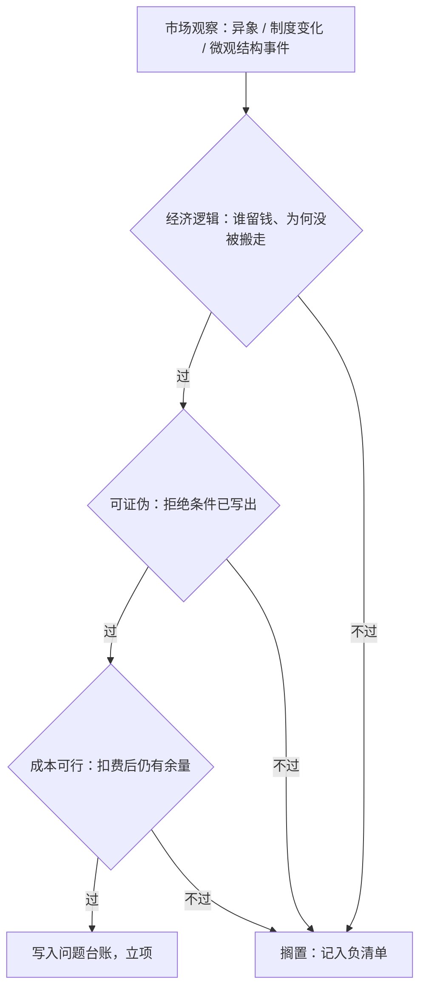

# 研究问题的起源

「市场有效」从来不能被单独检验：它总是和一个具体的定价模型绑在一起被检验。所以每一个异象都同时是两个问题——市场的问题，和模型的问题。

<footer>—— 据 Roll (1977) 对资产定价检验联合假设的表述；Fama (1998) 的回应整理</footer>

[上一课](/quant/simulator-impact-bias)把 RL 课序收束在冲击模拟器上：校准支撑外的量必须凸化或截断动作，评估环境不得弱于训练环境。那根主线保护的是「答案」这一端——不许环境送免费的分。本课是「从问题到组合」的第一课，把注意力挪回「问题」这一端：一次量化研究的起点不是数据集，而是一个能被拒绝的问题。后课默认你已经带着这样的问题进来。

## 问题

市场每天把观察免费送到你面前：[季节性与日历异象](/quant/seasonality-anomalies)的日历效应、彩票型的极端收益溢价、[2010 闪电崩盘](/quant/flash-crash-2010)这样的微观结构事件、[指数调入调出](/quant/index-rebalance)的流量冲击。观察不缺，缺的是把观察变成**可检验问题**的那一步。研究大多死在开始而不是结尾：数据窥探从选题就开始了——选择检验哪条规律，本身已经花掉一次试验（Lo and MacKinlay 1990）；[过拟合次数与试错](/quant/backtest-overfitting)把这笔账算在 Sharpe 上，而选题时的隐性试错不进任何台账。

好问题有三个判据。其一，**经济逻辑**：回答「谁把钱留在桌上、为何套利者不搬走」；信息有成本、注意力有限、机构受约束都是正经答案，「历史数据里它出现过」不是。其二，**可证伪**：预先写出拒绝条件——若观察到什么，这个问题就死。其三，**成本可行**：信号强度扣掉交易成本与容量后还剩什么；统计显著与经济显著是两道门，[经济显著性 vs 统计显著性](/quant/econ-vs-stat-sig)已经分开过。

### 用三个判据过一遍 PEAD

本单元全程用同一个案例：盈利公告后的价格漂移。观察是 Ball 与 Brown 1968 年就量过的现象：盈利意外为正，公告后收益继续偏正。经济逻辑：投资者消化信息慢、机构受约束；可证伪：若意外最高组的后续收益不再系统性高于最低组，假设死；成本可行：季度级换手。三道全过才立项。

McLean 与 Pontiff 给异象衰减定了价：可预测性样本外衰减约四分之一，发表后衰减过半。选题时就要假设——你想到的问题，别人也想到了。

## 方法

把观察写成一句固定句式的假设：对（对象与事件），若市场对（信息）反应不足或过度，则（方向与组合构造）在（期限）内应有可区分的收益差异；若不出现，假设被拒绝。拒绝条件写在句子里，不留到事后。三个判据变成三道闸：

立项输出两样东西：一句带拒绝条件的假设，一条台账记录。台账制度在[研究日志与纪律](/quant/research-log-discipline)里已经立过，本课第一次喂给它内容。

## 机制

三个判据各挡住一类典型的死法。经济逻辑挡「数据里的巧合」：没有机制的问题，机制环境一变，规律没有理由留下；Grossman 与 Stiglitz 的道理——信息完全有效则无人有动机研究，可研究的问题必然伴随成本或约束。可证伪挡「不可错的问题」：把任何结果都解释成支持的研究无法积累知识；且检验失败杀掉的是「假设＋定价模型」这一对，不是市场本身。成本可行挡「纸上异象」：扣不掉成本的可预测性不是研究问题，只是回测统计量。

三个判据是过滤而非打分。被搁置的问题进负清单，它与正面结果一样是资产：防止同一个观察半年后被当作新想法再挖一遍。## 边界

本课只解决「问题是否够格被回答」，不管「是否为真」。微观结构事件类问题往往制度特定，拒绝条件要写成「在此制度下」；异象类要防联合假设的另一种误用——别把模型的失败全推给市场。也不要把选题与信号挖掘混为一谈：对既有信号换参数重跑，归[多重检验与 p-hacking](/quant/multiple-testing-factors) 管辖。问题立项之后仍只是纸面合同；下一课把合同锁死在碰数据之前。

## 小结

- 研究的起点是可被拒绝的问题，不是数据集；数据窥探从选题计次。
- 三个判据：经济逻辑（谁留钱、为何没被搬走）、可证伪（拒绝条件写进句子）、成本可行（扣费后有余量）。
- 被搁置的问题进负清单；负清单是防止重复挖掘的资产。
- 检验失败杀掉的是假设与定价模型这一对，不要单独给市场定罪。
- 本单元后续各课以盈利公告后漂移为全程案例。
- 出处：Roll (1977) 与 Fama (1998) 的联合假设口径；Grossman and Stiglitz (1980)；Lo and MacKinlay (1990)；McLean and Pontiff (2016)；Ball and Brown (1968)。
