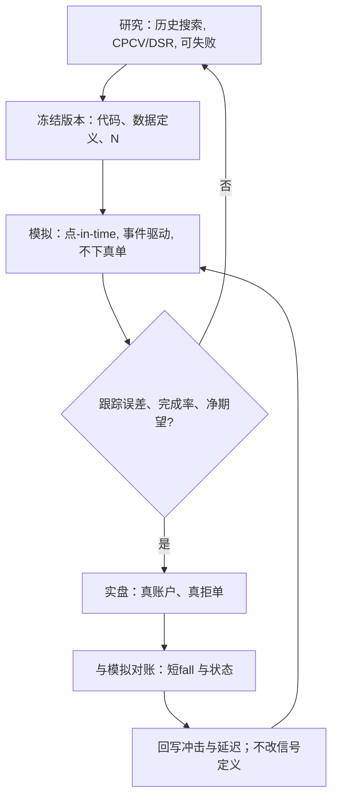

# 研究、模拟、实盘隔离

回测协议若允许用后来的结果回头修改定义，样本外就消失了。研究、模拟与实盘必须分开记账：同一套代码意图，三种权限、三种数据、三种成功标准。

<footer>—— 据 Arnott, Harvey and Markowitz, A Backtesting Protocol in the Era of Machine Learning, Journal of Financial Data Science, 2019；López de Prado, AFML, 2018</footer>

量化系统最常见的塌陷不是撮合引擎写错，而是三种环境互相污染：研究里看过全样本的特征进了模拟；模拟里用理想成交调过的参数直接进实盘；实盘亏损后又回到研究里改定义，把刚才那段实盘变成新的样本内。Arnott、Harvey 与 Markowitz（2019）把回测写成必须遵守时间顺序的协议。López de Prado 把回测过拟合写成统计事实：试验次数与环境混用会把任何噪声做成夏普。Narang 对「黑箱」的讨论也强调研究与交易作业分离。本篇写的是架构上的隔离——权限、数据版本、订单出口与评价指标——而不是组织口号。隔离的目的是让评估器保持无偏，让实盘事故可追溯。

## 问题

研究环境的目标是发现：搜索空间大、允许失败、可以使用完整历史、可以看[CPCV](/quant/cpcv) 路径分布。模拟环境的目标是逼近：同一策略代码、点-in-time 数据、事件驱动的订单与成交、但订单不离开公司。实盘环境的目标是执行：真实账户、真实拒单、真实部分成交、真实迟到。三种目标互斥。若研究能对实盘下单，搜索会变成生产事故；若实盘参数能不经冻结就写回研究仓库，[滚动检验](/quant/walk-forward)的检验段被污染；若模拟用研究的中点成交假设，模拟的作用只是给研究夏普盖一个章。

Bailey 等人所谓的试验次数 $N$，在混用环境里会系统性被少报：研究网格算一遍，模拟再调一遍滑点，实盘再改一次时段过滤，三次都看了结果，却在 DSR 里填 $N=1$。隔离首先是把每一次「看过结果再改」限制在研究账户里，并使模拟与实盘的改动必须开出新的、带版本号的试验。

### 三种成功标准不要共用一张表

研究看的是统计：PBO、DSR、嵌套样本外、经济逻辑。模拟看的是可执行性：完成率、拒单、与研究权益曲线的跟踪误差、在声明的[成本情景](/quant/cost-sensitivity)下是否仍过零。实盘看的是实施缺口：相对模拟的短fall、成交相对决策价、风控闸门是否误触发。用实盘夏普去「验证」研究里已经调过二十轮的信号，是把实盘当第三折交叉验证且没有清洗。短的实盘路径噪声极大，Lo（2002）对夏普抽样误差的警告在这里最硬。

纸上交易若由人看着实时价格点「假如成交」，它既不是模拟也不是实盘：没有状态机、没有队列、没有拒单。它只能当操作演练，不能当统计证据。

## 方法

代码意图尽量单一：信号、目标仓位、风控检查应是同一库的同一版本。隔离发生在边界上。研究边界：只读历史存储，禁止接入实盘订单网关，数据允许「事后完整版」但必须标记，不能无标记地与点-in-time 混用。模拟边界：只读点-in-time 与实时缓冲的只读副本，订单进入模拟撮合或仿真交易所，成交写模拟账本。实盘边界：只有被冻结版本的策略进程能拿到下单凭证；参数来自配置发布，而不是来自笔记本。

配置发布是隔离的中枢。每次从研究晋级到模拟、从模拟晋级到实盘，都应产生不可变的版本：代码哈希、特征定义、宇宙、成本假设、风控阈值、$N$ 的声明。Arnott–Harvey–Markowitz 要求研究决策按时间记录；工程上就是这个发布物。晋级标准预指定：例如模拟跟踪误差低于某阈值、完成率高于某阈值、[容量](/quant/capacity-participation)在目标 $A$ 上 $\mu_{\mathrm{net}}\gt 0$。未达标准不得用「先上实盘看看」绕过——那会把实盘变成搜索。

### 数据与时钟的隔离

研究可以用修订后的基本面做探索，但晋级到模拟的管道必须切换到当时可得版本，见[迟到数据](/quant/late-data-recon)。时钟同样：研究可以在日频 bar 上扫信号，模拟必须用将用于实盘的事件时钟与延迟假设。三种环境对时源、夏令时、交易所日历的处理必须一致，否则隔离只隔离了下单，没有隔离「什么叫同一时刻的价格」。López de Prado 对金融时钟与数据结构化的讨论，在架构上的含义是：模拟与实盘共享时钟语义，研究若用另一种聚合，必须把聚合代码当作特征定义的一部分版本化。

共享数据库、靠「约定不写生产表」做隔离，几乎总会在某次紧急修复时被打破。应用账户权限与网络策略强制：研究角色对订单网关无路由。

## 机制

隔离降低的是两类错误。第一类是评估偏差：看过未来或看过实盘再改规则。第二类是操作风险：实验代码碰到真钱。Narang 把投资过程写成可审计的作业，而不是写成个人英雄的笔记本。统计上，隔离使 $N$ 可数——每一次晋级是一次登记过的试验，而不是聊天记录里的一次「再试一下」。这与 Harvey–Liu 对回测多重检验的要求一致：暗数必须变成明数。

跟踪误差是隔离是否有效的诊断。若模拟与研究长期吻合得过分完美，通常是模拟太天真（中点成交、无拒单），而不是策略太稳健。若实盘与模拟迅速分叉，可能是延迟、部分成交、身份成本或数据版本不一致。分叉应驱动回写冲击函数与状态机，而不是驱动立刻改信号。改信号等于打开研究环境，试验计数加一，晋级流程重来。

### 人的通道与紧急变更

完全禁止人干预并不现实：交易所故障、错价、风控误杀需要人工。隔离要求紧急变更走单独通道：短暂的权限提升、事后复盘、变更记入版本，而不是给研究笔记本开一个长期的生产凭证。人工下单若绕过策略状态机，实盘账本与模拟就永久不可比，[订单状态机](/quant/order-state-machine) 的对账会失败。可审计的做法是：人工指令也作为事件进入同一状态机，只是来源标记为 manual。

## 边界与工程取舍

隔离有摩擦。小团队会觉得发布流程慢。摩擦是特征：它逼你把搜索留在研究里。不要用「我们是同一个 Git 仓库」冒充隔离——仓库可以共享，运行身份与数据版本不能共享。也不要为了隔离复制三份互相漂移的策略代码；意图单一、边界隔离，比三份分叉更能保证「模拟验证的就是将要上实盘的东西」。

监管与投资者报告需要的是实盘，不要把模拟曲线放进月报当业绩。Bailey 等对回测过拟合的警告，对「模拟实盘」一词同样适用。模拟的价值是在晋级关卡上拒绝，不是在对外叙事上替代。若资源只够维持两套环境，应放弃「研究级模拟」（中点、无状态机），保留接近实盘的模拟，让研究明确停留在历史评估器上。

晋级通过后仍应限制实盘规模沿容量曲线爬升。隔离防止的是定义污染，不防止冲击。小规模实盘是校准 $g(q)$ 的数据源，不是已经验证过的满仓许可。

## 小结

- 研究、模拟、实盘的目标分别是发现、逼近、执行；共用账户、共用未标记数据或共用成功标准会摧毁样本外。
- Arnott–Harvey–Markowitz 的协议与 López de Prado 对过拟合的分析，都要求试验可数、决策按时间记录；配置发布把这一点工程化。
- 代码意图应单一，隔离发生在权限、数据版本、时钟与订单出口上。
- 模拟与实盘的分叉用来校准执行，不用来当场改信号；改信号即新试验。
- 紧急人工必须进入同一状态机并留版本，否则对账失败。
- 出处：Arnott, Harvey and Markowitz, *JFDS*, 2019；López de Prado, *Advances in Financial Machine Learning*, 2018；Bailey, Borwein, López de Prado and Zhu, *Notices of the AMS*, 2014；Narang, *Inside the Black Box*；Lo, *FAJ*, 2002。
