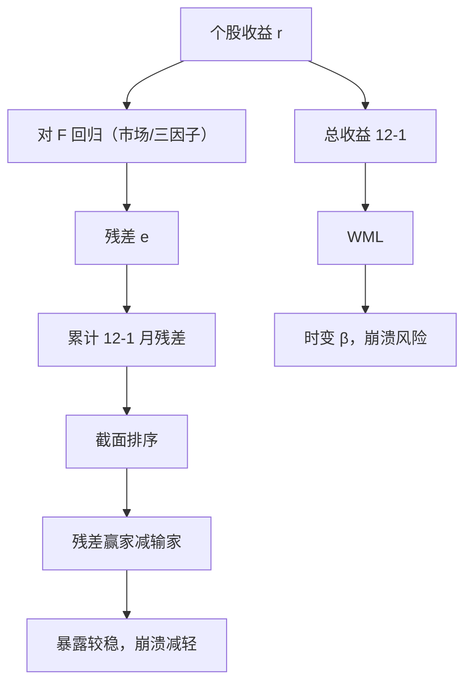

# 残差动量

    
对 Fama–French 残差而不是原始收益排序，得到的动量组合对市场与风格的时变暴露更弱，从而减轻动量崩溃时那种系统性的β踩踏。

    <footer>—— Blitz, Huij & Martens, Residual Momentum, Journal of Empirical Finance, 2011</footer>

[上一课](/quant/pca-stat-arb)用 PCA/SVD 或 ETF 抽共同因子，交易残差的均值回归；对象是正交补，半衰期会时变甚至变号。那是短 horizon 残差回归，符号可能与中期相对强度相反。普通 [WML](/quant/momentum-wml) 按 12−1 总收益排序，混着 $\beta$、价值、行业与特异部分；崩溃往往发生在市场反转时，旧暴露变成错误方向。缺口是把排序变量换成因子回归残差的累计，试图保住特异动量、削掉时变的因子赌注。本课写这条残差动量，必须与上一课的短 horizon 残差策略分账，不重推 SVD。

## 问题

Jegadeesh–Titman 的 WML 在长期样本里有显著溢价，也在 2009 年一类反转里出现左尾。Daniel 与 Moskowitz 把崩溃写成：市场急跌后反弹时，输家（高 $\beta$、困境）的反弹远大于赢家。若你交易的是总收益动量，你在形成期末持有的就是那段市场的方向性暴露。问题是如何把「相对强度」从「谁刚好吃到了因子」里拆出来。

残差动量的假设是：投资者对特异信息反应不足，对共同因子的反应已经较快地进入价格（或因子本身不该进动量组合）。于是对

$$
r_{it}=\alpha_i+\beta_i^\top F_t+e_{it}
$$

在形成期上估 $\hat e$，再对 $\hat e$ 的累计排序。这样赢家输家在 $F$ 上的事后暴露应更接近中性。若溢价主要来自因子时机，残差动量会变弱；若溢价来自特异反应不足，残差动量应保留 alpha、降低崩溃。Blitz 等人的样本支持后者在美股上成立，但幅度对因子模型选择敏感。

### 残差不是新的资产

$e_{it}$ 是回归残差，不能直接买。组合仍是买卖股票，只是排序键变了。若 $F$ 估得差（行业漏了、滚动窗口太短），残差里仍有因子，中性是假的。若 $F$ 估得过满（把弱因子和噪声都放进去），特异动量被洗掉，策略接近无信号。选择 $F$ 与选择 PCA 统计套利的 $K$ 是同一类偏差-方差问题，目标却相反：残差动量要保留可预测的 $e$，PCA 统计套利要交易 $e$ 的短端回归。

残差动量的形成期仍应跳过最近一个月，以免把[短期反转](/quant/short-term-reversal)与微观结构噪声吃进排序。Blitz 等人沿用 12−1 结构，不是把残差再拿去跑一周反转。

## 方法

常见实现。每月，用过去 36 个月（或形成期本身）对市场、SMB、HML 做回归，取 $t-12$ 到 $t-1$ 的残差之和（或残差的 $t$ 统计量之和）排序。独立 $2\times 3$ 或十分位，价值加权，持有 1 个月。行业调整版本先在行业内做回归或先减去行业收益，再排序，以去掉行业动量。Blitz、Hanauer 与 Vidojevic 等后续工作把残差动量做到其他市场与因子模型（四因子、五因子），结论大体是：相对总收益动量，残差版的市场 $\beta$ 更稳、最大回撤往往更小，长期溢价是否更高则不一定。

与 PCA 残差交易的差别要写进规格。残差动量是中等 horizon（月频、持有月），信号是累计残差的延续；Avellaneda–Lee 是短 horizon 的残差回归。两者可以在同一组股票上符号相反。同时跑必须拆开风险预算，否则「动量腿」与「反转腿」在残差空间里对敲，只留下成本。

### 估计窗口与前视偏差

回归窗口若包含持有期，就是前视。必须严格用 $t$ 月末可获得的信息估 $\beta$，再形成 $t+1$ 月组合。日频残差再累计，会引入非同步交易：小盘的 $\beta$ 低估使残差吸收了滞后市场，残差动量里会混进 Dimson 式的薄交易溢价。应用滞后市值加权或把滞后市场放进 $F$。成本上，残差排序仍会偏向小盘、低价，价值加权是最低限度的可交易性过滤。

「残差」若来自包括动量因子本身的回归，等于把 WML 从排序键里抠掉，策略会接近零。残差动量的 $F$ 应是你认为不该出现在相对强度里的风险，而不是把一切已知溢价都中性化到没有信号。

## 机制

行为叙事：对盈利公告、分析师修正等特异信息反应不足，形成残差延续；对市场与宏观消息反应更快。风险叙事：残差累计仍可能代理未建模的弱因子或拥挤，溢价是对那一维风险的补偿。崩溃减轻的机制更机械：总收益动量在熊市形成低 $\beta$ 赢家、高 $\beta$ 输家，反弹时空腿爆炸；残差排序削弱了这一条件 $\beta$ 的极化，故左尾改善。这并不消除拥挤：残差赢家若被同一批量化账户持有，平仓时特异相关一样会升。

与行业动量的关系。Moskowitz 与 Grinblatt 的行业动量解释了总收益动量的一部分。行业中性或行业残差后，个股动量变弱但仍常显著。残差动量若未做行业调整，行业轮动会进入 $\hat e$。报告应同时给行业中性表，避免把行业时机写成特异 alpha。

### 换手、借券与容量

残差排序的换手通常不低于 WML，因为 $\beta$ 每月重估，排名比总收益更抖。换手上升直接吃[交易成本后的可交易性](/quant/net-edge)。空腿仍是过去残差差的股票，往往难借、有新闻。容量估测要把「价值加权、排除最低流动性组」当作基准，而不是等权十分位。新兴市场与 A 股上，因子模型本身不稳定（政策市、涨跌停），残差里会留下大量共同政策冲击，残差动量退化成隐性的杠杆市。

## 边界与工程取舍

不要把残差动量宣传成「没有崩溃的动量」。Daniel–Moskowitz 的崩溃有一部分来自输家期权式反弹，残差不能把困境期权从价格里拿掉。因子模型更换（FF3 到 FF5、加上盈利与投资）会改排序，样本内挑模型是多重检验。国际复制要注意会计与规模断点不可直接用 NYSE。

与 PCA 统计套利、距离配对的边界：残差动量是月频因子溢价，持有期以月计，成本模型用月度换手；统计套利是日频或更短的残差回归，成本模型必须用有效价差。混在一张「统计套利」报表里会让夏普不可解释。若残差动量的 alpha 在扣费后只存在于小盘，它就不是机构可扩展的因子，尽管论文里的三因子 $\alpha$ 仍然显著。

Blitz–Huij–Martens 2011 年用的是当时的三因子残差。你若在 2020 年代用五因子再加动量去「纯化」，需要自己的样本外，不能把 2011 年的表当作新模型的证据。

## 小结

- 残差动量用因子回归残差的 12−1 累计排序，试图保留特异相对强度、削弱总收益动量里时变的 $\beta$ 与风格赌注。
- Blitz–Huij–Martens（2011）显示美股上崩溃往往减轻；这不等于溢价更高，也不等于左尾消失。
- 残差不可直接买卖；窗口、因子选择与行业处理决定中性是真是假。
- 换手通常不低，可交易性仍取决于加权、流动性过滤与借券；小盘等权纸面结果不能当容量。
- 与短horizon残差回归策略符号可能相反，必须分账。
- 出处：Blitz, Huij and Martens, *Journal of Empirical Finance*, 2011；总收益动量见 Jegadeesh and Titman, 1993；暴露时变见 Grundy and Martin, 2001；崩溃见 Daniel and Moskowitz, 2016。
