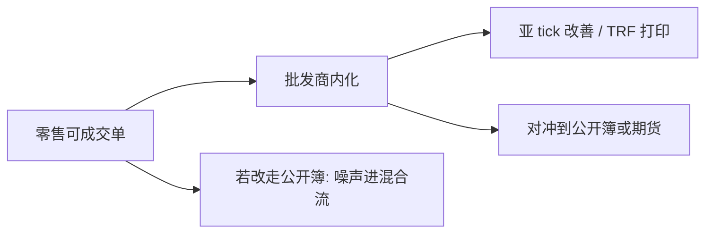

# 零售流与批发商

把可立即成交的零售单从公开簿抽走、交给少数批发商内化，等于按客户类型分割市场。价差改善可以发生在客户层，公开深度与发现则取决于被抽走的流里有多少噪声、多少信息。

<footer>—— Easley, Kiefer and O'Hara, Cream-skimming or risk sharing?, Journal of Finance, 1996；对照 Battalio, Journal of Finance, 1997</footer>

[期权多腿](/quant/options-complex-orders)已经点到：零售结构常被批发商内化，股票市价单同样如此。缺口是场所层。美国可立即成交的零售流多数不进公开 [LOB](/quant/lob-structure)，而由批发商对照全国最优内化，再打印到场外磁带。[PFOF](/quant/pfof-payment-flow) 写的是引流契约；[零售流识别](/quant/boehmer-retail-flow) 写的是统计痕迹。本课写批发商作为一类匹配场所：它如何筛选对手方、如何对照公开报价成交、以及公开簿因此少了什么。不重推 [Kyle](/quant/kyle-model) 的单市场 $\lambda$，也不把零佣金写成福利定理。

## 问题

公开连续簿把所有主动单混在同一条队列里，做市商用混合流的平均毒性定价，见 Glosten–Milgrom。批发商的生意是把零售可成交流单独拿出来：若这批流平均上较少与知情单对撞，内化的期望价差捕获可以高于在公开 BBO 上做市，一部分以价格改善还给客户、一部分以支付还给经纪商。Easley–Kiefer–O'Hara 问的是奶油撇脂还是风险分担：抽走非知情流，会不会让留下的公开簿更毒、报价更宽。Battalio 则问第三市场是否只是成本竞争。问题不是「内化违法」，而是分割之后，客户有效价差、公开深度与价格发现三套指标会分叉。

期权上同一逻辑更重：复杂单的筛选更难，批发商若只接「看起来像对冲」的腿，方向性结构仍可能漏到公开复杂簿。股票与期权不要混成一个系数。

### 内化对照的是哪一个最优

批发商通常承诺不劣于当时公开最优，并给出亚 tick 改善。对照物是保护报价拼出来的全国最优，不是本所队头。于是零售成交可以印在 NBBO 内部，而不在任何一张展示簿上减少队列。公开做市商看不见这批对手方，[限价对市价的选择](/quant/limit-vs-market-choice) 在零售侧被经纪商代理掉了：客户以为自己在「市价」，实际对手是批发商的存货与对冲。

最佳执行义务约束的是经纪商对客户的平均质量，不是强制每笔都去公开竞价。Rule 605/606 让平均可被审计，单笔路径仍不透明。

## 方法

把流分成：零售可成交、机构主动、公开限价。质量分三张表。客户表：有效价差、实现价差、价格改善相对同期保护 NBBO。公开表：NBBO 宽度、近端深度、做市商实现价差。发现表：场外打印对中点后续移动的贡献，相对交易所主动腿。识别零售流用 BJZZ 一类痕迹，但制度一变痕迹会漂，必须与 606 路由份额交叉。

比较静态：若把同一批零售单强制送去公开簿，价差可能因噪声增加而窄，也可能因排队与费用而并不改善客户——两套结果都要报，不能只用「本应送去竞价」当反事实。不要把 [Kyle](/quant/kyle-model) 的 $\sigma_u$ 直接加上零售量：内化后公开做市商看见的 $u$ 已经变了。

## 机制

批发商是知情筛选后的库存中介。筛选来自经纪商路由，不是来自公开身份披露。平均毒性低，则内化像低 $\lambda$ 的私下批量；一旦遇到知情零售或被机构伪装成零售，库存立刻要到公开市场对冲，毒性被转嫁给展示报价——与期权复杂成交后的对冲时钟同构。公开簿因此同时少了噪声掩护、多了批发商的对冲单。平静期价差仍可很窄（HFT 做市还在）；新闻期批发商更频繁地把单「吐回」交易所，公开深度在最需要噪声的时候更薄。

对执行：机构母单若与零售内化对撞，看不见对手；只能从 TRF 亚美分与成交后漂移推断场所质量。把零售内化当成「免费的暗池中点」，会忽略批发商有权择单、有权拒单。

## 边界

这是美国零售股票与期权的结构。欧洲、香港、内地的佣金与集中竞价不能用同一套批发商模型。批发商集中度高，经验系数跟着几家客户结构走。Meme 事件是压力样本，不是机制起源。下一课要问：内化所对照的「全国最优」本身由哪条规则拼出来——没有订单保护，改善二字没有法定锚。

不要用本课去设计如何把机构流伪装成零售。对象是市场分割，不是路由规避。

内化仍以公开保护报价为尺。下一课写这把尺的法律来源：没有订单保护，就没有可强制的全国最优，价格改善的分母会改。

## 小结

- 批发商按客户类型分割可成交流：客户可获价格改善，公开簿失去部分噪声掩护。
- 内化对照保护 NBBO，成交不必减少任何一张展示队列。
- 奶油撇脂与成本竞争可以并存，必须分客户、公开、发现三套指标。
- 出处：Easley, Kiefer and O'Hara, *Journal of Finance*, 1996；Battalio, *Journal of Finance*, 1997；对照 SEC Rule 605/606 与 Harris 对内化的讨论。
