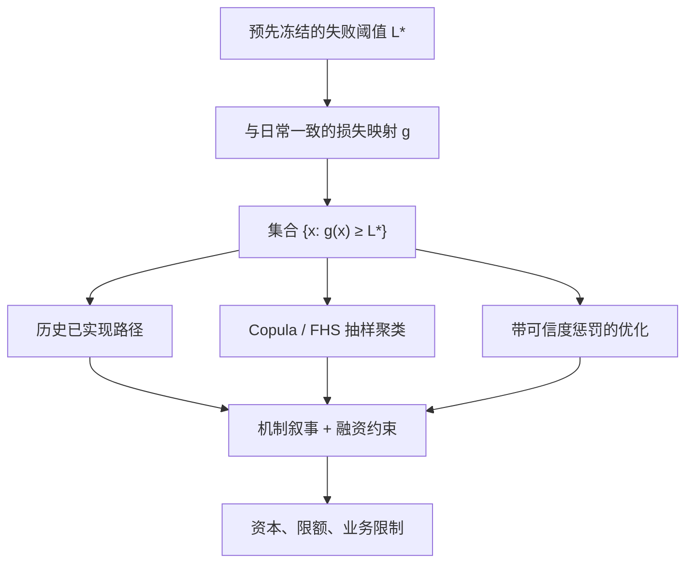

# 反向压力测试

正向压力从情景走到损失；反向压力从「何种损失已经不可接受」走到仍能解释该损失的因子移动，再问这些移动在经济上是否说得通。

<footer>—— 对照 CEBS, Guidelines on Stress Testing, 2010；BCBS 与各国监管对内部资本程序中反向压力的公开要求</footer>

[压力 VaR 与 FRTB](/quant/stressed-var-frtb) 把一段历史压力年套在今日头寸上，问资本是多少——方向是**情景 → 损失**。反向压力测试（reverse stress test）把方向倒过来：先定义失败事件（资本充足率跌破门槛、流动性耗尽、保本产品穿地板、策略强制清盘），再在风险因子空间里寻找能导致该事件的情景集合，并评估其可信度。英国 FSA/PRA 与欧银 CEBS 在 2009–2010 年前后把这一程序写进银行内部资本与流动性评估的公开指引：它不是又一种 99% 分位数，而是对「模型认为不可能、但一旦发生会让企业无法继续」的显式搜索。本篇写识别问题、可信度约束，以及它与 Copula、相关性崩溃情景的接口。

## 问题

记损失映射 $L=g(x)$，$x$ 为风险因子变化。正向压力指定 $x^\star$（历史一周、假设平行加息），计算 $L(x^\star)$。反向指定阈值 $L^\star$（例如一年利润、一级资本的某一比例），求集合

$$
\mathcal{S}(L^\star)=\{x:\ g(x)\ge L^\star\}.
$$

$\mathcal{S}$ 一般是高维曲面外侧的一整块，不是一个点。任意挑一个使 $g(x)=L^\star$ 的 $x$ 没有信息量：可以让单一名字跌 99%，也可以让所有因子各动一点点。问题是在 $\mathcal{S}$ 上加**可信度**（plausibility）与**叙事**（哪条融资链、哪组相关），使输出是少数可讨论的情景，而不是优化器的一个任意解。

失败事件必须预先定义，且与经营约束一致。交易台的「最大可接受单日亏损」与集团的「无法展期批发融资」不是同一 $L^\star$。把反向压力做成「搜历史上使今日 ES 最大的 12 个月」，那是 FRTB 选压力期，对象仍是资本公式，不是企业失败。

### 识别不足是设计特征

$x$ 的维数远高于一个标量 $L^\star$，逆问题先天欠定。这不是缺陷：真正要的是**若干条机制不同的路径**都能走到失败，好让管理层看到不只一种死法。欠定若用「最小欧氏范数的 $x$」来破，会得到所有因子都动一点的模糊情景，往往既不可交易也无法对冲。破欠定的合法约束来自经济结构：融资篮子必须一起动、曲线须保持无套利形状、流动性枯竭时深度下降，而不是来自 $\ell_2$ 正则。

反向压力的输出若只有一个「最坏 $x$」，多半是优化器选了惩罚函数，不是风险被识别了。最低交付应是一组情景：相关崩溃型、单一名称集中型、融资枯竭型、跳缺口型，各自达到同一 $L^\star$。

## 方法

**先固定 $g$ 与 $L^\star$。** $g$ 必须与日常损益归因同一套头寸与定价器，否则找到的 $x$ 在真实账簿上走不出 $L^\star$。线性希腊字母映射会漏凸性：反向搜到的利率平移可能在全定价下走不到失败，或反过来。对期权、预付、CPPI，必须全定价。$L^\star$ 写成可审计的会计或监管量，含税、含资金成本、含已经承诺的分红与回购。

**在 $\mathcal{S}$ 上搜索。** 实务几条路。（1）历史：在长样本里找 $g(x_t)\ge L^\star$ 的日期，当作已实现反向情景——样本外失败若从未出现，集合为空，不能因此宣称安全。（2）蒙特卡洛：从 Copula 或 FHS 抽 $x$，保留超过 $L^\star$ 的路径，再聚类成典型失败模式。（3）优化：最小化可信度惩罚（马氏距离、Copula 密度的负对数、或「与历史压力的偏离」），约束 $g(x)\ge L^\star$。第（3）条必须把相关结构写进惩罚，否则最优解会走相关矩阵的零特征向量——统计上「便宜」、经济上荒谬。

**可信度。** 马氏距离 $x^\top\Sigma^{-1}x$ 用平静期 $\Sigma$ 时，会把相关崩溃判成极不可信，而这正是危机的特征。应至少用压力期 $\Sigma$ 或厚尾 Copula 密度当惩罚，并单独放一条「强制融资篮子相关接近 1」的情景，见[相关性崩溃情景](/quant/corr-break-scenario)。叙事层：每个定量 $x$ 配一段机制（谁被迫卖、抵押品是谁、多长时间内无法对冲）。

### 与正向压力、反向 CoVaR 的接口

正向压力回答「指定 2008 年，我们亏多少」；反向回答「要亏掉生命线，市场得怎样」。两者应互相校准：若历史 2008 已经超过 $L^\star$，反向集合非空且含真实路径，资本与业务限制必须先按正向结果收紧。若历史从未达到 $L^\star$，反向给出的 $x$ 是外推，应标明哪些因子的移动超出样本最大。Adrian–Brunnermeier 的 CoVaR 是条件分位，不是反向压力；但「系统已在其 VaR 时机构的条件损失」可以当作一种 $L^\star$ 的输入，问还需要多大的特异冲击才会失败。

流动性反向：失败可以是现金而非 P&amp;L。此时 $g$ 是现金流映射，情景含保证金上调、担保品折价、客户赎回。市场反向与融资反向分开跑，再看交集——Brunnermeier–Pedersen 的螺旋正在交集上。

## 机制

正向模型的尾巴被历史与 Copula 参数截断：从未见过的联合极端，密度接近零，日常 VaR 不会报。反向把截断拿掉，问截断之外是否仍有经营上不可接受的点。机制是模型风险的显式化：不是「99.9% 足够」，而是「那 0.1% 以及模型赋权为零的区域，是否包含一种我们活不下去的死法」。

搜索算法的机制决定你会看见哪一种死法。$\ell_2$ 最小移动偏向分散的小冲击；$\ell_1$ 偏向少数因子的大冲击；按融资篮子分组的块正则偏向相关崩溃。应预先声明正则族，并报告多种正则下的情景，避免只交付让现有对冲看起来仍有效的那种。

CPPI 的反向问题特别干净：失败 = 缺口，因子 = 再平衡窗口内风险资产收益与无法交易时长。临界跌幅 $\approx 1/m$ 是解析的一阶答案，仿真再补跳跃与停牌。见 [CPPI / TIPP](/quant/cppi-tipp)。

### 治理：谁有权改 $L^\star$

$L^\star$ 一松，反向集合变远，情景看起来「更极端、因此不必行动」。这是最常见的内部套利。$L^\star$ 应与恢复与处置计划、契约条款、监管最低资本绑死，修改须走与风险偏好相同的批准链。定量团队可以建议映射 $g$ 的改进，不能在同一轮测试里既改门槛又改情景。

## 边界与工程取舍

反向压力不能替代日常限额与 FRTB 资本：它没有置信水平，不能加总进一个乘数。高维优化昂贵且不稳定，因子必须先压缩到可叙事的十到几十个（曲线关键点、信用指数、主要外汇、波动、融资利差），其余用映射。定价器若在极端 $x$ 上不收敛，应先修定价，而不是把这些 $x$ 从 $\mathcal{S}$ 里删掉——删掉的往往是真正的失败模式。

不要用反向压力去「证明」当前组合安全：空集合只说明在你的 $g$、你的因子空间、你的搜索预算下没找到，不说明不存在。不要把反向情景直接当交易观点去做空。不要在泄漏的全样本上搜 $x$ 再宣称样本外稳健。

公开监管文本要求开展反向压力，并不规定唯一算法。模型卡应写：$L^\star$ 定义、因子清单、惩罚/Copula、聚类方法、与 2008/2020 历史路径的对照。缺这些，反向压力只是工作坊叙事。

## 小结

- 反向压力从失败事件反推因子情景，补的是正向压力与分位数资本看不到的模型截断区。
- 逆问题欠定，必须用经济结构（融资篮子、无套利、流动性）而不是随意正则来筛选情景。
- 交付应是一组机制不同、均达到同一 $L^\star$ 的情景，并与历史压力对照。
- $L^\star$ 与 $g$ 须冻结并与经营、监管约束对齐；放宽门槛不是风险下降。
- 出处：CEBS, *Guidelines on Stress Testing*, 2010；BCBS 对内部资本与流动性评估中压力测试的公开原则；FSA/PRA 对反向压力的监管论述；机制背景见 Brunnermeier and Pedersen, 2009。
