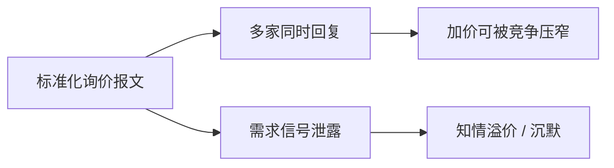

# RFQ 平台

电子询价把「打电话问几家」收成报文：同一数量、同一方向、有限回复窗。它加快搜索，也把需求信号同时发给一圈对手；竞争与泄露是同一按钮的两面。

<footer>—— Hendershott and Madhavan, Click or Call? Auction versus Search in the Over-the-Counter Market, Journal of Finance, 2015</footer>

[场外经销商](/quant/otc-dealer-market) 把匹配写成搜索与议价。缺口是搜索被平台化之后：请求报价（RFQ）成为一类场所协议——债券、期权复杂单、大宗股票、部分外汇都在用。[公司债 OTC 询价](/quant/corporate-bond-otc) 已从执行会计写过债券 RFQ；本课写跨品种的设计比较：RFQ、可点击指示价、语音、以及公开限价簿各解决哪一类同时性。不提供「询几家最合适」的操作清单。

## 问题

客户提交：工具、方向、数量、回复截止。平台把请求发给一组经销商，经销商选择回复或沉默，客户选择成交或放弃。与 [LOB](/quant/lob-structure) 的差别是：没有公共时间优先，没有对全市场有效的深度，价格对所询数量歧视。与一对一电话的差别是：请求被标准化、可审计、可同时竞争。Hendershott 与 Madhavan（2015）把电子拍卖式询价与语音搜索对照：电子化降低搜寻摩擦，也可能改变谁愿意提交存货。问题是协议如何权衡三点——竞争（多家同时回）、泄露（需求被看见）、以及赢家诅咒（回复者知道别人也在看）。

期权复杂单已经用过 RFQ：多腿同时性靠询价网而不是靠每一种结构一张簿。股票大宗的「上楼」或电子询价是同一逻辑的尺寸维。

### 点击成交不是变薄的 LOB

部分平台在 RFQ 之外展示可点击的指示性报价。深度通常只覆盖小规模，价格常常「参考」而非承诺，经销商仍可拒绝。把它当成公开 BBO，会把电子零售层当成整个 OTC。协议分层：可点击（小额即时性）、RFQ（机构目标规模）、语音（冷门、大额、复杂条款）。混成一个价差，小单的窄加价会淹没大单的搜索成本。

平台若向经销商披露「正在询几家」，竞争加剧，泄露也加剧。不披露则经销商按先验回复，加价含不确定性补偿。这是透明课在询价网上的版本。

## 方法

对象是 RFQ 生命周期，不是打印价。状态：发送时刻、受询名单规模、回复数、最优回复相对基准偏离、成交与否、从发送到成交的时间、未成交后的机会成本。填成率与回复率是流动性一等指标。Hendershott–Madhavan 的识别靠同一资产在电子拍卖与语音之间的分流，而不是把所有 OTC 成交当同质。跨品种比较时，只比较协议特征（是否匿名、是否披露询价家数、回复是否对全市场可见），不要比较名义基点——债券与期权的经济对象不同。

赢家诅咒：若只有被选中的回复「赢」，经销商会把被捡风险写进加价。这与限价单被捡同构，只是没有公共簿上的期权金，而是写进每一条回复。

## 机制

RFQ 把 Duffie 搜索的「随机相遇」改成「有限期的多边询价」。竞争压低加价，接近一次性密封拍卖；泄露提高逆向选择，接近把 $y$ 提前告诉一圈做市商。均衡加价是两者之差。沉默也是策略：库存不对、或把你识别成知情，最优回复是不回——观测到的回复分布是被选择过的，平均加价低估未成交意图的成本。

对公开市场的反馈：经销商中标后要到对冲工具上卸库存（国债期货、CDS、标的股票）。RFQ 成交是 OTC 事件，冲击可以出现在有 LOB 的腿上。期权复杂询价已经写过这一时钟；债券与外汇同样。

## 边界

各平台的匿名、披露、最小数量、是否允许 last look 式确认，差异大。把「电子化」当成单一虚拟变量，会把 RFQ 与后课的全对全混在一起。本课不覆盖如何选择受询名单以获取更好价格。下一课专写债券：电子 RFQ 普及之后，全对全能否把经销商从中心位置挪开。

回测用 RFQ 最优回复当「可成交中点」，忽略沉默与事后拒绝，会编造不存在的流动性。

## 小结

- RFQ 是标准化的多边询价，不是慢一点的市价单，也不是公共限价簿。
- 竞争与泄露同在；回复率、填成、相对基准偏离才是质量。
- 可点击指示价、RFQ、语音是分层协议，不能合成一个价差。
- 问得太多则胜者诅咒加重、拒报上升；问得太少则竞争不足。
- 出处：Hendershott and Madhavan, *Journal of Finance*, 2015；搜寻基准见 Duffie, Gârleanu and Pedersen, *Econometrica*, 2005。
