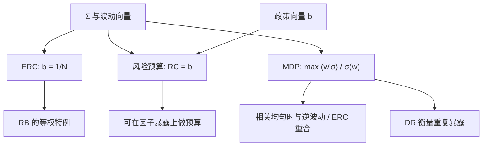

# 最大分散 / 风险预算

分散化比率是加权波动之和除以组合波动；把它最大化，得到的最分散组合在相关结构里尽量避免重复暴露。更一般地，风险预算指定每一块欧拉贡献的份额，等权贡献只是预算全相等的特例。

<footer>—— Choueifaty & Coignard, Toward Maximum Diversification, Journal of Portfolio Management, 2008；Roncalli, Introduction to Risk Parity and Budgeting, 2013</footer>

[风险平价](/quant/risk-parity) 把每项资产的风险贡献钉在 $1/N$。真实的配置往往要先定预算：股票 40% 的风险、利率 30%、信用 20%、商品 10%，或因子上价值与动量各一半。这就是风险预算（risk budgeting）：给定向量 $b\gt 0$、$b^\top\mathbf{1}=1$，求 $w$ 使 $\mathrm{RC}_i(w)=b_i\sigma(w)$。Choueifaty 与 Coignard（2008）从另一条轴出发：最大化分散化比率 $\mathrm{DR}(w)=(w^\top\sigma)/\sqrt{w^\top\Sigma w}$，得到最分散组合（MDP）。本篇写预算问题的解、MDP 与 ERC 何时重合、以及欧拉分配在因子与 CVaR 上如何推广。它仍不使用 $\mu$，但把「平」推广成「按政策分配」。

## 问题

战略配置用语言说「不要让股票吃掉全部风险」，数字上却只钉名义权重。风险预算要求政策直接写在贡献 $b$ 上，再让优化器找实现该贡献的 $w$。$b$ 来自投资委员会而不是来自 $\Sigma$，这是与 ERC 的政治差别：ERC 的 $b=\mathbf{1}/N$ 把决策藏进资产列表的切法；预算把切法与份额分开——先决定有哪些风险块，再决定每块多少。

MDP 问的是另一个规范性目标：在波动尺度上尽量分散，等价于最小化组合与各资产波动向量之间的「重复」。它不直接钉 $b$，但产出一个有明确权重的组合，其隐含贡献一般不是等权。问题是弄清三条规则的关系：最小方差、ERC、MDP，它们都只看 $\Sigma$（及波动向量），却对应不同的一阶条件，不能互相改名。

### 风险块如何定义

预算的对象可以是资产、资产类、国家、或因子暴露。若在 300 只股票上做 $b_i=1/300$，你会接近 ERC，并对高度相关的两只科技股重复给预算。更合理的是先把 $\Sigma$ 写成因子结构，对因子贡献做预算，个股特异风险另设上限。Bruder 与 Roncalli（2012）把预算方法用到风险暴露的管理上：先映射到因子，再在因子上解 $w$。块的定义错误时，精确求解预算只是精确地执行一个错误的政策。

分散化比率的分子 $w^\top\sigma$ 用的是各资产自己的波动，不是边际贡献。DR 高表示组合波动远小于「假装资产不相关时的加权波动」。它惩罚相关，也惩罚在高相关簇里重复下注。DR 不是夏普，里面没有 $\mu$。

## 方法

风险预算：在 $w\gt 0$ 下解

$$
\frac{w_i(\Sigma w)_i}{w^\top\Sigma w}=b_i,\qquad i=1,\ldots,N.
$$

Roncalli 给出与加权 ERC 类似的优化表示，例如最小化 $\tfrac12 w^\top\Sigma w-\sum_i b_i\ln w_i$（在适当约束下）。$b=\mathbf{1}/N$ 回到 ERC。数值仍是凸或可用循环缩放稳定求解，前提是 $\Sigma$ 正定、$b\gt 0$。某个 $b_i=0$ 意味着该资产权重必须为 0，应从集合删除。允许卖空时贡献可正可负，会计要改成多头预算与空头预算分离，或对 $|w|$ 的暴露预算，否则「负贡献」难以解释给投委会。

MDP：

$$
\max_{w\ge 0,\,w^\top\mathbf{1}=1}\ \mathrm{DR}(w)=\frac{w^\top\sigma}{\sqrt{w^\top\Sigma w}},
$$

其中 $\sigma$ 为对角波动向量。一阶条件表明 MDP 的权重与 $\Sigma^{-1}\sigma$ 成比例（在无约束或内点解时）。Choueifaty、Froidure 与 Reynier（2013）进一步讨论 MDP 的性质：它最大化「有效的独立风险源」直觉，且在所有相关相等时与逆波动 / ERC 一类解重合。相关结构有块时，MDP 会在块内稀疏、在块间分散，行为接近「先选代表再配权」，这与最小方差的稀疏是亲戚但目标不同。

### 欧拉分配到因子与尾部

组合风险 $R(w)$ 若正齐次，欧拉给出 $R(w)=\sum_i w_i\partial R/\partial w_i$。因子模型里 $w$ 通过 $x=B^\top w$ 映射到因子暴露，可以把贡献写到因子上：$\mathrm{RC}_k^{\mathrm{fac}}=x_k\partial R/\partial x_k$。风险预算可以在 $x$ 上做而不是在 $w$ 上做，再在满足 $x$ 的前提下对特异风险做二次惩罚。CVaR、期望缺口在适当条件下也齐次，Denault（2001）讨论合作博弈式的资本分配；实务中尾部预算比波动预算对估计更敏感，窗口里少一次崩盘，$b$ 的实现就会跳。用尾部预算时，$\Sigma$ 应换成尾部依赖结构或情景集，不要把正态 VaR 的 $b$ 解释成「已管理极端风险」。

## 机制

预算机制是带权的等贡献：高 $b_i$ 的资产被允许保留更高的 $w_i(\Sigma w)_i$，直到缺口补平。政策意图（「我们就是要比债券多承担股票风险」）被翻译成可检查的数：事后把已实现贡献与 $b$ 画在同一张图上，偏离来自 $\Sigma$ 估计或再平衡滞后，而不是来自口头的 60/40。MDP 的机制是提高 DR：等价于在波动标准化之后，尽量降低组合在相关矩阵意义下的二次型，即避开拥挤的线性相关簇。若两只资产相关为 1，MDP 只会持有波动调整后更「便宜」的那一个，DR 不会因为重复持有而提高。

与 [Markowitz](/quant/markowitz) 切点的差别仍是 $\mu$：切点在超额收益方向上主动集中，MDP 与预算在风险方向上按政策分散。当 $\mu$ 与波动成正比且相关均匀，若干规则会碰巧接近；这种碰巧不能当成一般等价。Choueifaty 强调 DR 与「多样性」的联系，但多样性是对 $\Sigma$ 而言的，不是对经济叙事而言的——两个业务不同但收益高度相关的公司，在 MDP 里仍算重复。

最大分散不是最大数量。持有 200 只高度相关的股票，DR 可以低于持有 20 只低相关的资产类。用持仓个数当分散化指标，与本篇的对象无关。

### 与 ERC 的包含关系

ERC 是风险预算在 $b_i=1/N$ 时的特例。MDP 一般不是 ERC。当所有相关相等，波动不同，MDP、ERC 与逆波动重合。当波动相等、相关不等，MDP 与 ERC 仍可能不同：MDP 更倾向把权重从高相关簇中抽出以致稀疏，ERC 则倾向于在簇内摊薄以维持每只都有一份贡献——同一簇里的多个名字会各占 $1/N$ 的预算，这正是「资产列表切得太碎」时 ERC 的缺陷，也是应在因子或簇上做预算的原因。选 MDP 还是预算，先问政策要的是一个规范性的分散目标，还是一张必须遵守的 $b$ 表。

## 边界与工程取舍

不要把 MDP 的样本内 DR 最大化到不能再高再去做回测：$\Sigma$ 的估计误差同样会被最大化，只是目标从 $\mu$ 换成了相关结构。应对 $\Sigma$ 收缩，并对 DR 做样本外。不要用 MDP 替代信用与流动性预算：相关矩阵看不见挤兑。不要在因子预算上用高度共线的因子（价值与低波动在某些样本里撞车）还要求精确 $b$，应先正交化因子再预算，见因子纯化。

$b$ 的来源若是上一次回测的最优，风险预算就退化成样本内 Markowitz 的改写。$b$ 应低频、由政策给定，只在制度变化时改。再平衡使已实现贡献围绕 $b$ 波动；应报告贡献的跟踪误差，而不是只报告事前精确等于 $b$。多空组合、期权、可转债这类非线性工具，欧拉对 $w$ 的线性暴露可能不够，需要用情景或希腊值把工具映射到风险块后再预算。

Roncalli 的书把风险平价与预算放在同一套欧拉语言里，避免市场把「risk parity」注册成某一个杠杆债券产品。写内部模型时应说 ERC、RB 还是 MDP，并写出 $b$ 与 $\Sigma$ 的日期，避免产品营销名进入风险报告。

## 小结

- 风险预算求解 $\mathrm{RC}_i=b_i$，把政策写在欧拉贡献上；ERC 是 $b_i=1/N$。
- 最分散组合最大化 $\mathrm{DR}=(w^\top\sigma)/\sigma(w)$，内点解与 $\Sigma^{-1}\sigma$ 成比例，惩罚相关簇里的重复下注。
- 相关均匀时 MDP 与 ERC / 逆波动重合；相关成块时 MDP 更稀疏，ERC 在过细的资产列表上会重复给预算。
- 因子映射后的预算比在高度相关的个股上平价更符合「风险块」直觉；尾部度量也可欧拉分配，但对估计更脆。
- 这些规则都不使用 $\mu$，因此不替代有观点时的 Black–Litterman，只替代不可用的历史均值切点。
- 出处：Choueifaty & Coignard, *Journal of Portfolio Management*, 2008；Choueifaty, Froidure & Reynier, *Journal of Investment Strategies*, 2013；Bruder & Roncalli, 2012；Roncalli, *Introduction to Risk Parity and Budgeting*, 2013；资本分配见 Denault, *Journal of Risk*, 2001。
