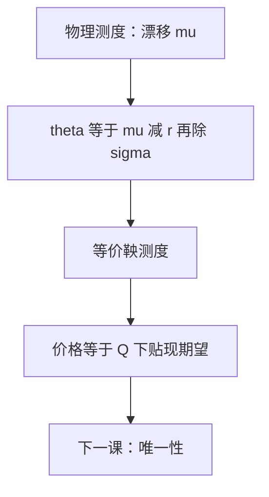

# 风险中性测度

无套利当且仅当存在等价测度 $Q$，使贴现资产价格为 $Q$-鞅。价格是 $Q$ 下贴现期望，不是 $P$ 下用 $\mu$ 折现。

<footer>—— 据 Harrison and Pliska, Stochastic Processes and their Applications, 1981；Shreve, Stochastic Calculus for Finance II, 2004, 第 5 章整理</footer>

上一课[Girsanov 测度变换](/quant/girsanov-measure)给出任意漂移平移。缺口是选出那一个 $\theta$：让贴现标的 $S/B$ 成为鞅。这不是投资者风险中性的心理学假设，而是无套利的概率翻译。本课只钉这条等价，不讨论唯一性——唯一性是下一课完备市场。

## 问题

真实测度 $P$ 下 $\mathrm d S=\mu S\,\mathrm d t+\sigma S\,\mathrm d W$，$\mu$ 含风险溢价，不可直接拿来贴现取期望：不同资产 $\mu$ 不同，组合的折现率没有单一数字。缺口是换到 $Q\sim P$，使 $\mathrm d S=r S\,\mathrm d t+\sigma S\,\mathrm d W^Q$（利率先当常数）。此时 $\mathrm e^{-rt}S_t$ 为 $Q$-鞅，未定权益 $H$ 的价格为 $\mathrm e^{-rT}\mathbb E_Q[H]$。没有 $Q$，复制价格和对冲比率都还没有概率表达式。

Harrison–Kreps / Harrison–Pliska 把「无套利」与「存在等价鞅测度」焊在一起。本课用这条第一基本定理的可用形式，不把离散模型的证明重写。

### 风险中性不是「投资者不在乎风险」

$Q$ 下超额回报为零，是因为已经把风险溢价吸进测度。$P$ 下投资者仍可以厌恶风险，$\mu>r$ 完全合法。把 $Q$ 读成偏好假设，后面不全市场里「许多 $Q$」会变成许多偏好，对象错位。$Q$ 是定价测度，不是描述测度。

贴现因子 $B_t=\mathrm e^{rt}$ 是本课的计价物。随机利率时要换成储蓄账户 $\exp(\int r)$，预告在[利率不是常数](/quant/stochastic-rate-preview)。

## 方法

市场含无风险 $B$ 与 GBM 标的 $S$。取 $\theta=(\mu-r)/\sigma$（$\sigma\neq 0$），Girsanov 给出 $Q$。则

$$
\mathrm d S_t=r S_t\,\mathrm d t+\sigma S_t\,\mathrm d W^Q_t,
$$

且 $V_t=\mathrm e^{-r(T-t)}\mathbb E_Q[H\mid\mathcal F_t]$ 是贴现鞅的可料表示候选。欧式看涨 $H=(S_T-K)^+$ 的价格因此是 $Q$ 下对数正态期望——闭式留给 Black 公式课。本课只锁定：$P$ 中的 $\mu$ 退出定价公式。

复制：若 $H$ 可写成 $\int\Delta\,\mathrm d S$ 加货币市场，则该 $\Delta$ 的损益在 $Q$ 下为鞅，初值等于上述期望。对冲细节是[复制与 delta](/quant/replicating-delta)。

## 机制

无套利禁止「零投入、非负收益且正概率严格为正」。若贴现 $S$ 在某等价测度下为鞅，则任何可积可料策略的贴现价值也是局部鞅，取期望得不到严格优势——存在 $Q$ 推出无套利（技术条件上要可容许策略）。反过来，有套利则没有任何 $Q$ 能让所有贴现资产走平。这是第一基本定理的方向。$\theta=(\mu-r)/\sigma$ 把每个噪声源上的超额回报标准化，正是 Girsanov 的旋钮对准「取消 $\mu-r$」。

$Q$ 与 $P$ 在零集上一致，故 $S>0$、$T<\infty$ 等 $P$-a.s. 事件在定价里原样保留。改变的只是路径权重，不是支撑集。

## 边界

本课假设常数 $r$、一个布朗、$\sigma\neq 0$，以便 $Q$ 立刻存在。多资产、随机 $r$、跳，会让「存在」与「唯一」分开。后课默认：欧式未定权益先写成 $\mathrm e^{-rT}\mathbb E_Q[H]$；$P$ 下的 $\mu$ 不进价格。下一课[完备市场与唯一测度](/quant/complete-unique-measure)问这个 $Q$ 是不是仅有的一个。

## 小结

- 无套利 $\Leftrightarrow$ 存在等价测度使贴现资产为鞅。
- 风险中性是定价测度，不是偏好假设；$\mu$ 退出公式。
- GBM 下 $\theta=(\mu-r)/\sigma$ 经 Girsanov 给出 $Q$。
- 价格 $=Q$ 下贴现期望；波动率不变。
- 出处：Harrison–Pliska 1981；Shreve SDE II 第 5 章。
