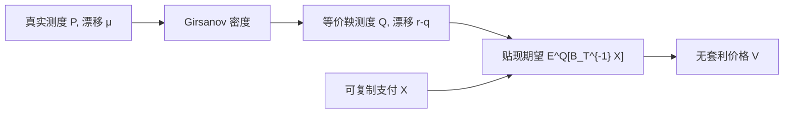

# 风险中性定价

    
在无套利的证券市场中，价格过程在适当的计价物下是鞅；或有索取权的价值等于其支付在等价鞅测度下的贴现期望。

    <footer>—— Harrison and Pliska, Martingales and Stochastic Integrals in the Theory of Continuous Trading, Stochastic Processes and their Applications, 1981</footer>

Black-Scholes 用对冲消掉 $\mu$，Cox-Ross 1976 年已指出：一旦可复制，定价可以在一个「所有人风险中性」的假想经济里完成，真实偏好只决定 $\mu$，不进入期权价。Harrison 与 Kreps（1979）在多期离散市场把这句话写成定理：无套利当且仅当存在等价鞅测度；Harrison 与 Pliska（1981）把它接到连续交易与随机积分，完全市场对应鞅测度唯一。此后「风险中性定价」不再是修辞，而是第一基本定理与第二基本定理：存在性给无套利，唯一性给完全、因而给唯一复制价格。本篇写测度更换与贴现期望，不把 [Black-Scholes 公式](/quant/bsm) 的推导再做一遍，只说明公式为什么是 $\mathbb{Q}$ 下的积分。

## 问题

真实世界里股票的漂移是 $\mu$，投资者厌恶风险，$\mu$ 通常大于 $r$。若把期权支付直接在 $\mathbb{P}$ 下用 $r$ 贴现，一般会算错：风险更大的支付应有更高的期望收益，折现率不是无风险利率。逐合约去估风险溢价不可操作。无套利提供另一条路：若支付可被交易资产复制，其价格必须等于复制组合的成本，与持有人的效用无关。问题是把「复制成本」表示成一个概率 $\mathbb{Q}\sim\mathbb{P}$ 下的期望，使所有交易资产的贴现价格都是 $\mathbb{Q}$-鞅，于是任意可复制支付 $X$ 满足

$$
V_t = B_t\mathbb{E}^{\mathbb{Q}}\bigl[B_T^{-1}X\bigm|\mathcal{F}_t\bigr],
$$

$B$ 为货币账户。这样就把未知的风险溢价从期权公式里消去，只留下标的在 $\mathbb{Q}$ 下的漂移——由无套利钉死为 $r-q$。

不完全市场里复制失败，鞅测度不唯一，区间定价出现。Harrison-Pliska 的框架同时解释为什么 Black-Scholes 有唯一价、为什么随机波动若不可交易就没有唯一价。美式支付是停时上的本质确界，仍在同一测度下取，见 [提前行权](/quant/american-exercise)。

### 第一定理与第二定理

离散有限市场：等价鞅测度存在当且仅当无套利（在适当的可容许策略类下；连续时间要对策略加可积性以免翻倍策略）。这是第一基本定理。第二基本定理：市场完全——凡可积支付皆可复制——当且仅当等价鞅测度唯一。Black-Scholes 有一个布朗驱动一只股票，市场完全，$\mathbb{Q}$ 唯一，欧式期权有唯一无套利价。Heston 若波动不可交易，通常不完全，需要指定市场价格或直接校准期权，而不是从 $\mu$、$\kappa$ 唯一推出。

「风险中性」不是声称投资者真的风险中性。它是：存在一个与 $\mathbb{P}$ 等价的测度，在该测度下用 $r$ 贴现是对的。投资者可以非常厌恶风险，只要厌恶已经反映在标的价格 $\mu$ 里，期权不再收第二次。

## 方法

几何布朗运动在 $\mathbb{P}$ 下为 $\mathrm{d}S=\mu S\mathrm{d}t+\sigma S\mathrm{d}W^{\mathbb{P}}$。Girsanov 把布朗运动改成

$$
W^{\mathbb{Q}}_t = W^{\mathbb{P}}_t + \frac{\mu-r}{\sigma}t,
$$

市场风险价格 $\lambda=(\mu-r)/\sigma$ 被吸收进测度密度

$$
\frac{\mathrm{d}\mathbb{Q}}{\mathrm{d}\mathbb{P}}\Big|_{\mathcal{F}_t}=\exp\Bigl(-\lambda W^{\mathbb{P}}_t-\tfrac12\lambda^2 t\Bigr).
$$

于是 $\mathrm{d}S=r S\mathrm{d}t+\sigma S\mathrm{d}W^{\mathbb{Q}}$（有股利则漂移 $r-q$）。欧式看涨

$$
C_0=e^{-rT}\mathbb{E}^{\mathbb{Q}}[(S_T-K)^+]
$$

在对数正态下积出 Black-Scholes。外汇、期货要换计价物：股票测度下 $S$ 本身是鞅（经股利调整），$N(d_1)$ 出现；现金测度下货币账户是计价物，$N(d_2)$ 出现。远期测度把折现债券当计价物，利率衍生品的支付不再与随机贴现因子纠缠。

### 从单期复制到鞅

单期二叉树已经是定理的玩具版：唯一的 $p^*$ 使 $S$ 的贴现期望成立，期权价是该 $p^*$ 下的贴现期望，与真实 $p$ 无关。多期把单期接起来，贴现价格沿树是鞅。连续极限里随机积分代替有限复制，Pliska 要求随机积分为鞅而不是局部鞅，以排除自杀策略。实践中 Black-Scholes 的 $\Delta$ 对冲在理想条件下是复制；有跳跃或随机波动时，$\Delta$ 只是最小方差对冲，残差风险对应测度不唯一。

数值上，[蒙特卡洛](/quant/mc-pricing) 直接在 $\mathbb{Q}$ 下抽样路径；[二叉树](/quant/binomial-tree) 用 $p^*$ 倒推；PDE 的漂移项用 $r-q$ 而不是 $\mu$，三者是同一测度的三种算法。用 $\mathbb{P}$ 抽样再人为选折现率，除非折现率正好补上风险溢价，否则与无套利不一致。

## 机制

无套利把可交易资产的瞬时超额收益与它们对布朗的暴露绑在一起：相同的 $\lambda$ 必须适用于股票与由股票复制的期权。因此期权的 $\mu_V$ 满足 $(\mu_V-r)/\sigma_V=(\mu-r)/\sigma$，这正是 PDE 里消掉 $\mu$ 的代数来源。风险中性期望不是「世界变成中性」，而是换了一套概率权重，使贴现价格没有漂移。等价保证零概率事件一致：$\mathbb{P}$ 下几乎必然的事在 $\mathbb{Q}$ 下也几乎必然，不会把真实里正概率的暴跌写成不可能。

不完全时，不同的 $\mathbb{Q}$ 对应不同的风险价格过程，给出不同的期权价，都与已交易资产无套利相容。市场用香草期权去「选定」一个 $\mathbb{Q}$，这就是隐含分布与 [波动率曲面](/quant/vol-surface) 的含义：曲面是 $\mathbb{Q}$ 下 $S_T$ 的分布信息，不是 $\mathbb{P}$ 下的预测。预测要回到真实测度，需要风险溢价假设，不能从无套利单独得出。

风险中性密度 $p^{\mathbb{Q}}(S_T)$ 可由香草价格对执行价求二阶导得到，这是 Breeden-Litzenberger（1978）的结果，不是 Harrison-Pliska 的定理。前者是静态抽取，后者是动态无套利的概率基础；二者在完全市场里相容。

### 计价物与远期测度

货币账户不是唯一计价物。以股票为计价物，$N(d_1)$ 是该测度下看涨结束实值的概率；以到期零息债为计价物（远期测度），支付 $C$ 的价格是折现债券乘上远期期望，随机利率不再与贴现纠缠。外汇把国外货币账户引进来，漂移变成利率差。计价物更换是同一无套利价格的不同写法，不是另一套偏好。选错计价物却沿用 $r$ 贴现，等于把测度密度漏掉一块。

## 边界

连续时间的无套利需要排除翻倍策略与非可积的随机积分；教科书里的「存在 $\mathbb{Q}$」在无界停时、气泡、无限水平下会变细。利率不为常数时，货币账户本身随机，必须明确计价物；外汇有国内与国外利率两个账户。存在红利、融券费、保证金不对称时，$r-q$ 要改成持有成本，测度仍然存在，只是漂移换成 repo 与分红的净成本。

「用风险中性 MC 算价格」假定你已经接受了动力学在 $\mathbb{Q}$ 下的形式。若动力学来自历史估计，那是 $\mathbb{P}$，直接代入会系统性地用错漂移。校准期权是在估 $\mathbb{Q}$；估历史协方差是在估 $\mathbb{P}$。做风险管理和做定价不是同一测度上的同一项作业。美式、障碍、可转债的支付仍在选定的 $\mathbb{Q}$ 下取期望或本质确界，算法变，测度叙事不变。

Harrison-Kreps 处理的是离散多期与有限资产；Harrison-Pliska 处理连续交易。引用时不要把 1981 年的随机积分定理说成 1973 年 Black-Scholes 已经陈述的内容。1973 年是 PDE 复制，鞅语言是随后十年的整理。

## 小结

- 无套利等价于存在等价鞅测度；完全市场等价于该测度唯一（Harrison-Kreps, Harrison-Pliska）。
- 可复制支付的价格是货币账户计价下的 $\mathbb{Q}$-条件期望，折现用 $r$，不用含风险溢价的主观折现率。
- Girsanov 把股票漂移从 $\mu$ 改到 $r-q$；$\mu$ 进入测度密度，不进入欧式公式。
- $N(d_1)$ 与 $N(d_2)$ 对应不同计价物下的实值概率，都是 $\mathbb{Q}$ 族里的对象。
- 不完全市场没有唯一 $\mathbb{Q}$，香草曲面是市场选定的定价测度信息。
- 树、PDE、MC 是同一 $\mathbb{Q}$ 期望的三种计算；用 $\mathbb{P}$ 路径配 $r$ 贴现一般会错。
- 出处：Harrison and Kreps, *Journal of Economic Theory*, 1979；Harrison and Pliska, *Stochastic Processes and their Applications*, 1981；过程替代的定价思想见 Cox and Ross, *Journal of Financial Economics*, 1976。
