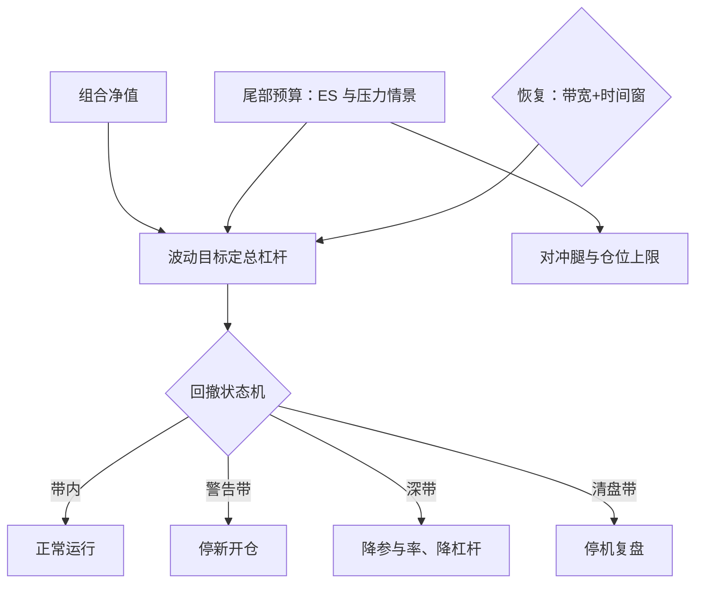
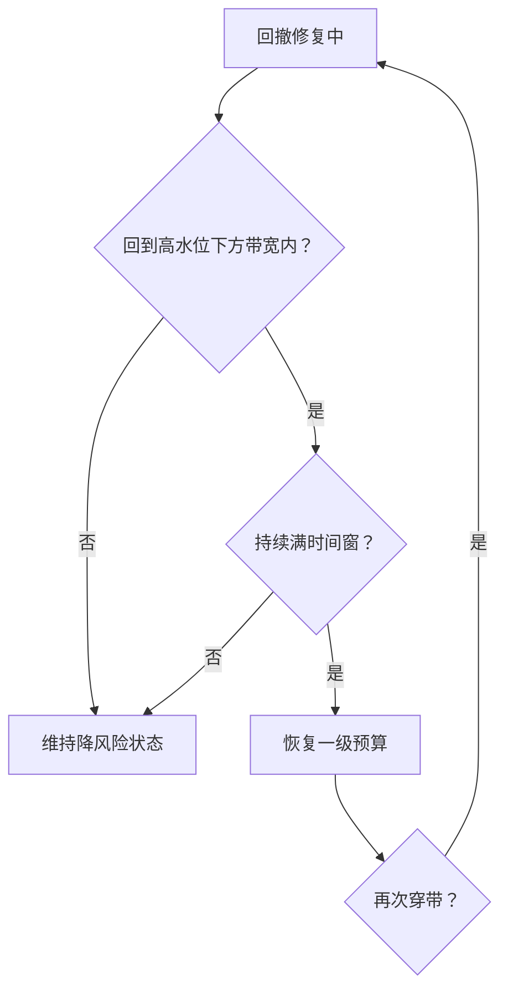

# 风险叠加：回撤与尾部

alpha 层回答买什么，overlay 层回答活多久；两层记同一本账，但触发器、数据与权限必须分开。

<footer>—— 据 Moreira and Muir, Journal of Finance, 2017；Jorion, Value at Risk 整理</footer>

[上一课](/quant/execution-cost-forecast-cap)把毛权重折成净期望，但成本只修分布的均值；清盘的是路径——从高水位回撤到某个深度，委托就走人了，均值再好看也无人能等到兑现。本课在 alpha 层之上叠一层风险 overlay：回撤控制、波动目标、尾部保护。设计的要点不是各工具的参数怎么调，而是职责分离：overlay 是独立于信号的规则层，触发了就执行，不许拿「alpha 还在」当豁免理由。

## 问题

净期望是分布的均值，清盘线是路径的泛函。回撤有两个成分：alpha 衰减，单调地坏；共同因子波动，会回来。overlay 的职责是保住组合等到「会回来」那部分的生存权，同时不去干预信号本身。两种错误要预先排除。其一，没有 overlay，靠信心扛回撤：回撤最深处做的决定，通常是全市场最贵的一笔。其二，用回撤表现直接改信号参数：这既把实盘路径当成了新的验证集，又让触发器本身变成被调参的对象——两层混编后，样本外与保护同时消失。

「泛函」听着吓人，意思很简单：它吃进的不是单个数，而是整条曲线。净期望只问「平均能赚多少」，对路径形状不敏感；清盘线问的是「路径有没有在某一天跌破某个深度」——只要你倒霉的顺序不对，均值再好也出局。这就是期望漂亮却死在半路的原因。

### 三层叠加，各自的职责

波动目标层：$L_t=\sigma^\star/\hat\sigma_t$ 把绝对风险钉在政策带上，预测器、再平衡频率与执行方式的取舍见[波动目标 vol targeting](/quant/vol-targeting)。回撤层：从高水位回撤带触发降风险，写成状态机——警告、降杠杆、冻结加仓、停机；恢复条件与触发条件同时预指定，否则「跌时减仓、涨时空仓」的棘轮会把每次波动都变成永久损耗。尾部层：用 [VaR](/quant/var-methods) 与 [Expected Shortfall](/quant/expected-shortfall) 度量尾部预算；该防哪些情景不由想象给出，由[反向压力测试](/quant/reverse-stress-test)搜出来——overlay 的触发器至少要能活着穿过那组情景。

尾部保护有 carry：深虚看跌或领口在平静期看着像纯损耗，总被事后「优化掉」。预算必须写进政策并计入 $\mu_{\mathrm{net}}$，而不是每年续期时重新辩论一次。

数字实例（波动目标层）：政策带 $\sigma^\star=10\%$，某日组合预测波动 $\hat\sigma_t=20\%$，则 $L_t=10\%/20\%=0.5$——总杠杆砍到一半；几天后波动回落到 $12.5\%$，杠杆放大回 $0.8$。注意放大与降杠杆同样要守状态机与流动性约束：波动平静下来时，恰恰是所有人一起加杠杆的拥挤时刻。

## 方法

叠加顺序自下而上：先波动目标定总杠杆，再回撤状态机管路径，尾部预算决定对冲腿与仓位上限。杠杆的总上界与[分数 Kelly 的边界](/quant/fractional-kelly-bound)取更紧的一个——波动目标的缩放与 Kelly 分数是同一风险预算的两个表达，只让一个当主约束，另一个当检验，叠满是双重乐观。状态机的每一级写明动作与数据：警告级只停新开仓，降杠杆级减参与率再减杠杆，停机级才平仓；触发数据用收盘核算还是日内实时，要在冻结时写清。恢复用带宽加时间窗：回撤修复到高水位下方带内、且持续若干个决策周期，才恢复一级预算。

## 机制

职责分离的机制是避免双重调参：alpha 参数在研究环境冻结，overlay 参数由政策量——回撤容量、清盘线、流动性——导出，两边不共享自由度。触发一次降杠杆，alpha 层不做任何响应；这正是为什么触发器必须可执行：降杠杆发生在流动性变差、成本模型上移的时刻，[上一课](/quant/execution-cost-forecast-cap)的保守分位成本在这里自动收紧可执行集。波动目标能成立靠波动聚类与近齐次缩放；但同质规则在拥挤时互相放大抛压，所以降风险优先动参与率与最深的流动性，而不是先甩最贵的那腿。

恢复机制是 overlay 最容易漏写的一半。去杠杆付的是确定性成本（错失反弹），恢复决策的对称错误同样致命；带宽加时间窗把「感觉像企稳」翻译成可审计的条件，复核口径与触发相同。

恢复侧的状态机长这样：

常见误区：用「扣掉 overlay 后收益更高」来质疑这层保护。这就像责怪保险「没理赔就是白交保费」——overlay 的价值只在坏情景兑现时到账：躲过一次 40% 回撤，比每年多赚 2% 值钱得多，因为跌 40% 要涨 67% 才回本，而多数账户等不到那一天。

## 边界

overlay 不产生 alpha：波动管理组合的样本内增益不可外推成本层功劳，Moreira–Muir 的机制在条件收益同步上升的信号上会砍掉边缘。跳空日触发器来不及——日内实时也只能在成交可执行后动作，真正的防线是事前的仓位上限与期权腿；A 股 T+1 与涨跌停进一步限制去杠杆速度，缩放腿优先放在可回转工具上。核算上两层用同一本账，KPI 必须分开：alpha 层看净期望，overlay 层看越带次数、执行缺口与存活概率——用净值表现考核 overlay，会诱导它在应该触发时沉默。

## 小结

- 清盘线是路径的泛函；overlay 保生存权，不干预信号定义。
- 三层各司其职：波动目标定杠杆，回撤状态机管路径，尾部预算防情景；杠杆上界与分数 Kelly 取更紧的一个。
- 触发与恢复同时预指定，恢复用带宽加时间窗，防止棘轮与二次入坑。
- 两层不共享自由度：alpha 参数冻结在研究环境，overlay 参数由政策导出。
- 出处：Moreira and Muir, *JF*, 2017；VaR 与 ES 的口径见站内 [VaR：历史、参数、MC](/quant/var-methods) 与 [Expected Shortfall](/quant/expected-shortfall)。
