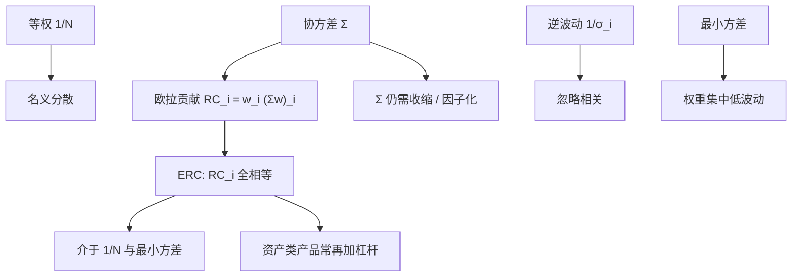

# 风险平价

等权风险贡献组合落在最小方差与等权之间：每项资产对组合波动的欧拉贡献相同，而不是名义权重相同，也不是方差最小。

<footer>—— Maillard, Roncalli & Teiletche, The Properties of Equally Weighted Risk Contribution Portfolios, Journal of Portfolio Management, 2010</footer>

均值–方差切点被 $\mu$ 的估计毁掉之后，一条路是 [Black-Litterman](/quant/black-litterman) 把 $\mu$ 锚在均衡上，另一条路是不再使用 $\mu$。风险平价（risk parity）把目标改成：让各资产（或各资产类）的风险贡献相等。Qian（2005, 2006）从风险预算的可加性讲起；Maillard、Roncalli 与 Teiletche（2010）把等风险贡献（ERC）写成优化问题，并证明它介于 $1/N$ 与最小方差之间。本篇写 ERC 的定义、存在唯一性、与逆波动的关系，以及杠杆在「股票–债券风险平价」里扮演的角色。一般的不等预算留给下一篇 [最大分散 / 风险预算](/quant/risk-budgeting)。

## 问题

60/40 的名义权重不是 60/40 的风险：股票波动远高于债券，组合方差几乎全是股票的。若投资者在资产类层面要分散的是风险而不是美元，名义等权与市值加权都会把风险堆到高波动、高相关的那一类。最小方差则走向另一极端：权重集中在低波动资产，股票几乎消失。问题是找一个不依赖 $\mu$、只依赖 $\Sigma$ 的配置规则，使每个成分的边际风险贡献相同，从而在风险空间而不是名义空间里分散。

「风险」这里首先是组合波动 $\sigma(w)=\sqrt{w^\top\Sigma w}$。欧拉齐次性给出 $ \sigma(w)=\sum_i w_i\partial\sigma/\partial w_i$，于是可以定义贡献 $\mathrm{RC}_i=w_i(\Sigma w)_i/\sigma(w)$（或对 $\sigma^2$ 的贡献 $w_i(\Sigma w)_i$）。ERC 要求 $\mathrm{RC}_i$ 全相等。是否对 $\sigma$ 还是对 $\sigma^2$ 做平价，在正权重下等价于同一组一阶条件。VaR / CVaR 平价需要欧拉分配仍成立（正齐次），那是推广，不是 2010 年这篇 JPM 的对象。

### 与等权、逆波动、最小方差的位置

等权 $w_i=1/N$ 忽略波动与相关。逆波动 $w_i\propto 1/\sigma_i$ 忽略相关，只修各资产自己的尺度。最小方差用满 $\Sigma$，但目标是总波动最小，允许贡献集中。ERC 用满 $\Sigma$，目标是贡献相等。Maillard 等人显示：在多资产、正相关的典型情形，ERC 的总波动介于最小方差与等权之间，集中度也介于两者之间。它不是「更优的 Markowitz」，它是另一条不看 $\mu$ 的规范性规则。当相关全相等且波动不同，ERC 退回到逆波动；当波动相等且相关不同，ERC 给相关更低的资产更高权重。

风险平价基金在 2000 年代靠杠杆把债券波动抬到与股票可比，使名义上债券很重、风险上两边接近。杠杆把融资、利率凸性与挤兑变成一等风险，这些不在 $\Sigma$ 的历史股票–债券相关里。ERC 公式不包含杠杆约束。

## 方法

在 $w>0$、$w^\top\mathbf{1}=1$ 下，ERC 满足

$$
w_i(\Sigma w)_i = w_j(\Sigma w)_j \quad\forall i,j,
$$

即 $w\circ(\Sigma w)=\lambda\mathbf{1}$。等价于最小化

$$
\sum_{i,j}\big(w_i(\Sigma w)_i-w_j(\Sigma w)_j\big)^2
$$

或用对偶型 $\min_w \tfrac12 w^\top\Sigma w$ s.t. $\sum_i \ln w_i\ge c$（Maillard–Roncalli–Teiletche 给出与对数障碍的联系）。数值上可用牛顿法解 $w\circ(\Sigma w)=\lambda\mathbf{1}$，或循环坐标：反复按 $\mathrm{RC}_i$ 相对 $1/N$ 的缺口缩放权重再归一。$\Sigma$ 必须正定；估计上仍应收缩或因子化，否则「平价」会精确地平在噪声上。

多资产类实务：先在类内做 ERC 或市值，再在类之间做 ERC，形成分层风险平价。股票–债券两资产时，解析解存在：权重与波动、相关有显式关系，债券权重大于 50% 当且仅当债券更「便宜」地提供风险单位。加入商品、信用、新兴市场后，相关矩阵的块结构主导：一个被其余高度相关的类，即使波动不高，权重也会被压下去。

### 欧拉贡献必须匹配风险度量

若报告用的是 VaR 但优化用的是波动，平价对象与报告对象不一致。Qian（2006）强调：对正齐次的风险度量，贡献可加，预算有意义。对非齐次的度量（某些偏离度、带常数项的效用），「贡献之和等于总风险」失败，平价没有会计意义。实现上应固定一个齐次度量，把 $\Sigma$ 与该度量用同一套收益窗口来估。用期权隐含波动替换 $\Sigma$ 的对角、相关仍用历史，是常见混合，需在文档里写清，否则 ERC 的一阶条件不再对应任何单一 $\Sigma$。

## 机制

ERC 的机制是把高波动、高相关资产的权重压到其边际贡献降到与其他资产相等为止。与最小方差不同，它不继续压缩到低波动资产独占——对数屏障或等贡献约束阻止权重趋向稀疏。与等权不同，它承认波动尺度。结果是一种「强制分散」：在 $\Sigma$ 估计可靠时，没有任何一类可以在风险里偷偷占多数。这正是 60/40 做不到的。

对冲基金式的风险平价还依赖**杠杆**：把低波动类加杠杆，使该类的 RC 能达到 $1/N$ 而名义组合仍有足够的预期收益。公式层面，ERC 在单纯形 $w^\top\mathbf{1}=1,w>0$ 上定义，杠杆是事后乘一个标量，或把融资当成额外资产放进 $\Sigma$。融资利率、挤兑与再平衡，使事后的已实现 RC 偏离事前。2018 年与 2020 年这类策略的同步去杠杆，说明「平价」在压力里会通过波动上升与相关上升同时破裂——$\Sigma$ 不是常数。

等风险贡献不是等损失。同一次市场下跌中，股票的 RC 事前可以等于债券，事后损失仍可几乎全来自股票，因为相关与 beta 在压力下跳了。ERC 是对当前 $\Sigma$ 的会计，不是对尾部的保险。

### 再平衡与波动目标

波动上升时，ERC 会降低该资产权重，这与波动目标、风险预算再平衡是同一方向。高频再平衡吃掉交易成本，并在动量市里持续卖出赢家。实务用带状再平衡或对 $\Sigma$ 做指数平滑，接受短时的贡献偏离。这与 [Markowitz](/quant/markowitz) 约束换手是同一类工程，不是对 ERC 定义的修改。评价风险平价应看净交易后的样本外 RC 是否仍大致平坦，而不是看事前优化器打印的完美 $1/N$。

## 边界与工程取舍

不要在包含衍生品、期权卖方、非线性敞口的账本上只用线性 $w$ 的 $\Sigma$ 做 ERC。不要把风险平价写成「不用估计任何东西」：$\Sigma$ 仍要估，只是不估 $\mu$。不要用一个全球股票指数与一个全球债券指数的两年相关，去给杠杆 3 倍的风险平价产品做唯一风险依据。资产定义先于平价：把所有股票合成一类再与债券平价，和把十个行业分别平价，是两个不同组合。

卖空与多空因子组合上，正权重假设失败，ERC 要推广到多头与空头分预算，或对因子暴露做平价，见风险预算。相关接近 1 的重复资产会让 ERC 把它们当成两个贡献者而重复计数——应先把重复资产合并成因子或合成，再平价。Maillard 等人的存在唯一性在 $w>0$、$\Sigma$ 正定下成立；边界上有零权重时，需要把那些资产从集合里拿掉再解，不能让算法在零附近振荡。

「风险平价优于均值方差」的回测，常常是在 $\mu$ 用样本均值、$\Sigma$ 不收缩的不公平对照里赢的。对照应是收缩最小方差或市值加权。ERC 的优点是稳定、可解释、不依赖 $\mu$；不是样本外夏普的定理保证。

## 小结

- 风险平价的核心是等风险贡献（ERC）：$w_i(\Sigma w)_i$ 对所有 $i$ 相等，不使用 $\mu$。
- Maillard、Roncalli 与 Teiletche（2010）刻画 ERC 介于等权与最小方差之间；相关均匀时回到逆波动。
- Qian 强调齐次风险度量下贡献可加，否则「预算」没有会计意义。
- 股票–债券风险平价的历史形态依赖对低波动类加杠杆，融资与挤兑是模型外风险。
- $\Sigma$ 仍要认真估计；平价不是免估计，只是免均值。
- 出处：Qian, PanAgora, 2005 与 *Journal of Investment Management* 传统下的风险贡献论文, 2006；Maillard, Roncalli & Teiletche, *Journal of Portfolio Management*, 2010。
