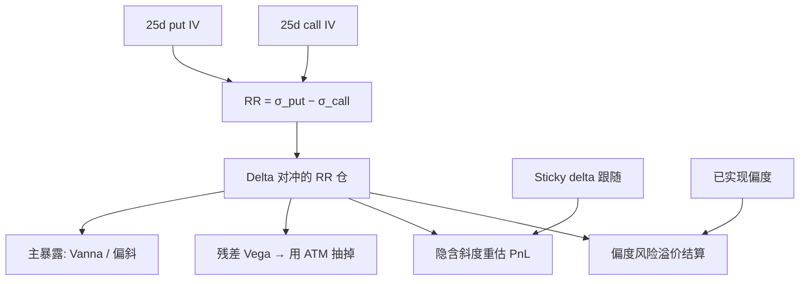

# Risk reversal 偏度交易

    
风险反转是同一 Delta 的虚值看涨与看跌之差，交易员用它给偏斜标价并对冲；它是微笑的斜度坐标，不是无模型三阶矩，也不是偏度风险溢价本身。

    <footer>—— 外汇报价惯例见 Castagna–Mercurio vanna-volga；偏度溢价见 Kozhan–Neuberger–Schneider；指数期权矩见 Bakshi–Kapadia–Madan</footer>

[偏度风险溢价](/quant/skew-risk-premium) 写 $\mathbb{Q}$ 与 $\mathbb{P}$ 下三阶矩之差；[Vanna / Volga](/quant/vanna-volga) 把 RR 当三张对冲工具之一。本篇写 **RR 作为交易**：25-delta 风险反转的定义、希腊字母、与 sticky 规则的互动，以及它如何加载 Bakshi–Kapadia 意义上的左尾保险。不把 BKM 积分公式推成矩篇，不把 KNS 复制再写一遍。

## 问题

外汇经纪商报三张数：ATM 波动、25-delta 风险反转、25-delta 蝶式。股权较少直接报，但同样可以在 25-delta 看跌与看涨的隐含波动上取差：

$$
\mathrm{RR}_{25}=\sigma_{\mathrm{imp}}(25\delta\ \mathrm{put})-\sigma_{\mathrm{imp}}(25\delta\ \mathrm{call}).
$$

指数上 RR 为负且绝对值常随期限先陡后缓。交易 RR 就是交易这条斜度：买 RR（约定买看跌卖看涨，或按符号买「更贵的一侧」）是买左尾、卖右尾。问题是：Delta 对冲之后还剩什么暴露、现货移动时 sticky 如何把 RR 变成 Vanna PnL、以及 RR 与无模型偏度何时同向何时分道。

RR 是两个点的波动差，权重不是 $K^3$ 的矩积分。翼部更远的崩盘保险在 RR 里只有一部分；更深的看跌价差或偏度互换才靠近三阶矩。把 25d RR 减历史偏度写成 KNS，口径错了。

### 符号、Delta 惯例与远期

25-delta 是 Black Delta 还是带溢价的现货 Delta，外汇有 premium-included 惯例，股权通常是现货或期货 Delta。同一「25d」对应的 $K/F$ 随水平、期限、偏斜而变：波动升高时 25d 看跌更虚。RR 的执行价对不是固定 $K$，现货大动后要换月换执行价才能保持 Delta。这与 sticky delta 同一坐标，见 [sticky delta / strike](/quant/sticky-delta-strike)。远期、利率、分红进入 Delta 定义，跨市场比较 RR 必须先对齐惯例。

指数 RR 为负表示看跌 IV 高于看涨 IV。有人把 RR 定义成 call 减 put，符号相反。策略文档必须写公式，不能只写「做多偏斜」。

## 方法

**腿。** 买 25d 看跌、卖 25d 看涨（股权指数上通常是买左尾），两腿都 Delta 对冲到近零。一阶上：净 Vega 是两腿 Vega 之差，因虚值 Vega 小于 ATM，净 Vega 不大但不为零；净 Vanna 是主暴露（偏斜移动）；净 Volga 较小，蝶式才是 Volga。现货大动后 Delta 漂，须再平衡，否则 RR 变成方向性看跌。

**对冲清单。** ATM Vega：用跨式或方差互换把平行波动抽掉，留下斜度。Gamma：两腿 Gamma 不对称，左尾看跌在下跌时 Gamma 升，净 Gamma 会变成多头——这是特征不是故障，但要限额。融资与借券：个股 RR 的看跌腿有早行权与借券，指数欧式干净得多。

**与溢价的关系。** Bakshi–Kapadia 的 Delta 对冲收益在虚值看跌上更负：左尾更贵。买 RR 的无条件期望因而常为负（付偏度溢价），卖 RR 收溢价、在崩盘日偿还。KNS 证明这笔溢价不能被方差溢价完全解释，故卖 RR 不是「又一种卖方差」。检验应控制 VRP 或 ATM 跨式 PnL。BKM 的隐含偏度与 RR 同向，但翼截断对偏度积分更敏感，对 25d RR 较轻——流动性好的点更适合交易，较差的翼更适合诊断。

### 现货趋势、sticky 与假 PnL

负偏斜、sticky delta 下，现货下跌抬 ATM 与左翼，RR 往往更负（绝对值变大）。买 RR 的一方在趋势下跌中可能靠 Vanna 赚钱，即使已实现偏度并不更负——赚的是微笑跟随。现货上涨、偏斜钝化时相反。归因必须把「实现三阶矩」与「隐含斜度重估」分开，否则会把 sticky 写成偏度 alpha。SSR 高的短到期上，这一项尤其大。

## 机制

风险中性密度左偏，使虚值看跌的 Black 波动高于对称看涨。RR 是这一偏斜在两个流动性点上的有限差分。买 RR 近似买一只「方向性的 Vega」：对左翼 vol 多头、右翼空头。崩盘时左翼跳升、相关上升，RR 更负，买方获利；卖方是在卖共跳保险的一维投影，与 dispersion、买指数看跌重叠但 Grees 不同。

与方差互换的差别：方差条带对正负跳在扩散极限里对称（跳余项另计），RR 天生不对称。可以同时卖方差、买 RR，近似把二阶溢价与三阶溢价分开——这是 KNS 在可交易腿上的对应。Heston 的 $\rho$ 同时生成 RR 与部分方差微笑，一因子不能让交易员独立标定两者；要把 RR 当独立因子，模型至少需要跳或独立的偏斜因子，或直接用市场 RR 当工具而不用模型生成它。

### 外汇 RR 与股权 RR

外汇 RR 是报价单位，正负随货币对（哪边是高息、哪边是崩盘货币）。股权指数 RR 几乎总是看跌溢价。商品介于其间。把外汇 vanna-volga 的 3×3 矩阵原样搬到 SPX，工具流动性与美式/欧式惯例都不同，权重会偏。股权上更常见的是用上市执行价最接近 25d 的香草，接受 Delta 不是整数 25。

25d 不是神圣的。10d RR 更接近尾部、更贵、更噪；风险管理可看 10d，交易账常停在 25d。两者的价差本身是尾部相对浅偏斜的信号。

## 边界与工程取舍

上市网格使「25d」随波动漂移，历史时间序列若用固定 $K$ 会混进 sticky strike。应存 Delta 坐标的 RR，或同时存固定 $k$ 的偏斜。事件日（FOMC、财报、选举）短端 RR 可以跳，与持久偏斜不是同一风险。不要用 Heston 校准后的模型 RR 去替代市场 RR 做交易信号：模型 RR 是 $\rho$ 的函数，已被香草用过。

卖 RR 的保证金与尾部限额应按崩盘情景重定价整条左翼，而不是按当日 Vega。与 dispersion 同时做时，崩盘 PnL 高度相关，总账面的共跳限额要合并。粗糙短端会让短到期 RR 更陡，用半鞅模型标定短 RR 会系统性偏贵或偏便宜，取决于你站在哪一侧。

Bakshi–Kapadia 测的是 Delta 对冲香草的平均收益，虚值看跌贡献最大的一块负均值。RR 买方是在买这块；无条件买 RR 不是 alpha，是付保险费。

RR 对冲障碍或二元时，是 vanna-volga 的工具，不是对路径产品的完整对冲。障碍还依赖未来微笑是否还在，RR 只锁定今日斜度的一阶。

## 小结

- 风险反转是同一 Delta 上 put IV 减 call IV，是偏斜的交易坐标，不是无模型三阶矩。
- Delta 对冲后主暴露是 Vanna；平行 Vega 应用 ATM 抽掉；净 Gamma 随现货非对称漂移。
- 无条件买 RR 在指数上平均付偏度溢价（与 Bakshi–Kapadia、KNS 同向）；卖出在崩盘偿还。
- Sticky 跟随会产生隐含斜度重估 PnL，须与已实现偏度分开记账。
- 外汇按 RR 报价，股权按执行价上市，惯例与符号必须写清。
- 出处：Castagna and Mercurio；Bakshi, Kapadia and Madan, 2003；Bakshi and Kapadia, 2003；Kozhan, Neuberger and Schneider, 2013。
