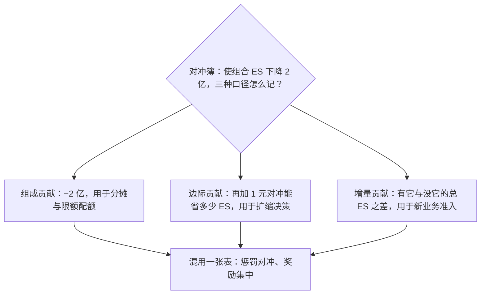
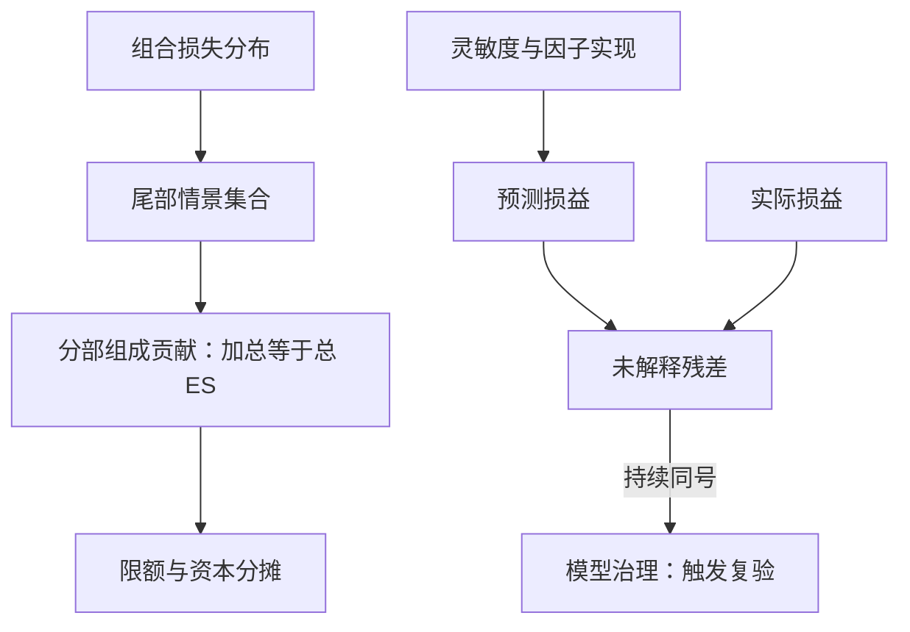

# 风险归因

归因是把总数拆成责任：谁占了组合风险的几成、当日损益对不对得上预测——拆不干净的组合，限额与考核都立在流沙上。

<footer>—— 据 Litterman, *Hot Spots and Hedges*, 1996；Tasche, *Capital Allocation to Business Units and Sub-Portfolios*, 2008 整理</footer>

[上一课](/quant/rk-stress-system)用情景库覆盖了分位数之外的世界，但压力与分位数给出的都是总量；总量不能问责——哪本账簿贡献了几成风险、当日损益为什么与预测不符，需要拆解。本课写风险归因与损益归因：前者决定限额与资本的分配，后者是模型健康的前哨。后课默认已经读完本课。

## 问题

两类归因被混用是第一错。风险归因问「风险在哪」：分部对组合尾部损失的贡献；损益归因问「钱从哪来」：因子暴露的实现路径。前者拆分布，后者拆路径，算法不同。第二错在拆法：按名义或市值权重把风险比例分摊——与实际贡献无关，对冲账簿还会被记成大风险。第三错是不对账：预测损益与实际损益的差没有台账，「未解释」长期漂移而无人追，模型或数据的问题被平均数淹没。错在哪的后果：风险归因拆错，限额分错桌；损益归因不对账，模型漂移发现不了，下一课的治理就接不到信号。

常见误区：把归因表当成精确到分的会计。尾部贡献是条件期望的估计，窗口一换排名就变；拆到持仓级主要剩抽样噪声。归因用来定方向与问责层级，不用来争小数点后第二位。

## 方法

风险归因用 Euler 分解：对正齐次的风险测度，组合损失可拆成与持仓成比例的分量，使分部贡献之和恰等于总量。对 [Expected Shortfall](/quant/expected-shortfall)，尾部条件期望给出自然的形式：

$$\mathrm{ES}_\alpha(L)=\sum_i \mathrm{ES}_{i,\alpha},\qquad \mathrm{ES}_{i,\alpha}=-\mathbb{E}\big[X_i \,\big|\, L \ge \mathrm{VaR}_\alpha(L)\big],$$

即「在组合落入尾部的那 $1-\alpha$ 条情景里，分部 $i$ 平均亏多少」。模拟框架下逐条尾部路径取平均即可算，不追加模型。三个概念分开用：组成贡献（component，份额，用于分摊）、边际贡献（marginal，再加一单位的斜率，用于决策）、增量贡献（incremental，有与无的差，用于准入）。[因子在组合中的边际贡献](/quant/fz-marginal-contribution)课已在因子层面算过这些量，本课把它落到机构分部与账簿。损益归因按日对账：预测损益由灵敏度乘因子实现再加 Gamma、Vega 修正构成，与实际损益的差记入未解释项；[Brinson 归因](/quant/brinson)那套配置-选择分解只适用线性股权簿，期权簿不适用。

术语翻译：损益归因的「预测损益」就是用昨天的风险传感器（Delta、Gamma、Vega）乘以今天市场实际走了多少，推算「如果模型没错，今天该赚多少」；它与真实盈亏的差就是「未解释项」。它像体重秤的校准码——秤本身准不准，靠每天拿已知重量试一下才知道。

组成与边际可以差出符号：一个对冲分部的组成贡献是负的——它降低了总风险；按正数分摊的表里它「占资源」，按边际看它每加一单位都在省资源。分摊用 component，扩缩决策用 marginal，混用一张表会同时惩罚对冲和奖励集中。

## 机制

为什么 Euler 是问责的前提：可加性让每个分部拿到自己那份分散化折价，分部决策之和与总部目标一致——Tasche 证明按组成贡献计费时，各分部在边际收益越过资本成本时扩张，总部利润同时最大化；按独立资本计费则重复收费，惩罚了分散化本身。VaR 在非椭圆分布上不满足次可加性，分量可能不存在或为负，所以归因建立在 ES 上——这是 [Expected Shortfall](/quant/expected-shortfall) 课的连贯性在治理层的兑现。未解释损益是前哨信号：持续同号的残差意味着某个因子映射、定价近似或数据口径坏了；把它当噪声平滑掉，等于关掉模型治理的预警线——治理课的持续监测，一半的输入就来自这张对账表。

数字实例：99% ES 是最差 1% 情景的平均损失。若组合一日 ES=1 亿，股票簿在最差的 250 条路径里平均亏 1.2 亿、对冲簿平均赚 0.2 亿，则组成贡献为 1.2 亿与 −0.2 亿，加总恰等于 1 亿——对冲簿在分摊表上是「负占用」。

## 边界

Euler 分解要求对齐次性：ES 满足，VaR 一般不满足；用 VaR 归因的机构至少要检查分位外的分量符号。尾部条件贡献对情景窗口敏感，换窗口换排名，归因表要带窗口声明。归因粒度越高噪声越大：分解到账户级尚可，到持仓级主要剩抽样噪声。归因不替代压力：它拆的是当前分布的尾部，情景覆盖的机制不在里面。Brinson 分解与因子暴露管理是另一门课的主题，本课只划清适用域。

## 小结

- 风险归因拆分布（谁贡献尾部），损益归因拆路径（钱从哪来），算法与用途都不同。
- 组成贡献按尾部条件期望计算，加总恰等于总 ES；VaR 非次可加，归因宜建在 ES 上。
- 三个概念分工：分摊用 component，决策用 marginal，准入用 incremental。
- 未解释损益是模型健康的前哨，持续同号的残差必须进入复验流程。
- 出处：Litterman, *Hot Spots and Hedges*, *Journal of Portfolio Management*, 1996；Tasche, 2008；Rockafellar and Uryasev, *Journal of Risk*, 2000；连贯性基础见本站 Expected Shortfall 课。
