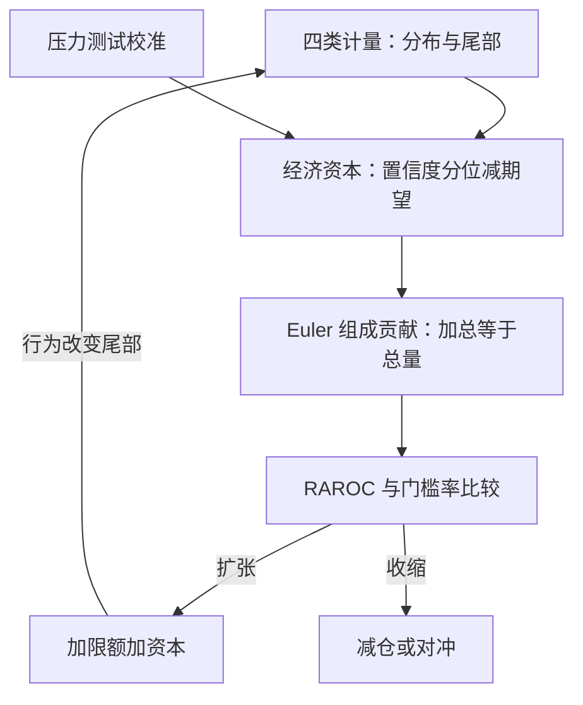

# 资本配置

经济资本回答「要多大的家底才扛得住坏年景」，资本分配回答「这份家底怎么摊到每张桌子并标上价」——前者是计量，后者是治理与激励。

<footer>—— 据 Tasche, *Capital Allocation to Business Units and Sub-Portfolios*, 2008；Matten, *Managing Bank Capital*, 2000 整理</footer>

[上一课](/quant/rk-limit-system)把偏好翻译成限额，限额的分母是资本；分母怎么算、怎么摊、怎么定价，是本课的三件事。总量靠经济资本，分摊靠 Euler 分解，定价靠 RAROC 与门槛率的比较——上一课的归因课在此升级为资本课。后课默认已经读完本课。

## 问题

三段各有缺口。总量：监管资本是规则口径，与机构真实的联合尾部不同——规则组合给出的是可比较的下限或粗上界，拿它当家底就错配。分摊：各分部独立资本相加大于总资本，分散化收益是真的，但不知道归谁；按独立资本比例分摊，重复收费，惩罚了分散化；平均分摊，补贴了高边际风险的分部——两种懒办法都扭曲激励。定价：业务不上资本价，就会无限扩张表内风险，直到撞上限额——限额是硬墙，价格是斜坡；只有墙没有坡的体系，最后都变成限额边上的寻租。错在哪的根源是一个：资本分配不只是会计问题，它是各分部做决策时面对的相对价格，价格错了，行为就错。

## 方法

总量：经济资本定义为一年持有期、高置信度下的意外损失，$\mathrm{EC}_\alpha=\mathrm{VaR}_\alpha(L)-\mathbb{E}[L]$，置信度对应目标评级（AA 附近取 $99.95\%$ 量级）；市场、信用、操作各类分别算出分布，再用相关性矩阵加总并保留分散化收益，压力测试校准尾部——计量单元四课的产出在此汇总。分摊：用[风险归因](/quant/rk-attribution)的 Euler 组成贡献，$\mathrm{EC}_i$ 加总恰等于 $\mathrm{EC}$，每个分部自动拿到自己的分散化折价；对冲性业务的贡献可为负，记为负占用。定价：$\mathrm{RAROC}_i=(\text{收入}_i-\text{成本}_i-\text{期望损失}_i)/\mathrm{EC}_i$，与门槛率（股权成本）比较决定扩张或收缩；等价地用 EVA：利润减 $\mathrm{EC}$ 乘门槛率。

负占用不是会计玩笑而是激励设计：一个年省下大量总资本的对冲簿，Euler 贡献为负；若制度只按正数分摊，总部等于在惩罚降低风险的业务。但负占用也要求治理看住「制造对冲再吃补贴」的套利——激励设计的两侧都要堵。

## 机制

为什么 Euler 类分摊是激励一致的：Tasche 证明，按组成贡献计费时，各分部在自己的边际收益越过资本成本处扩张，总部利润同时最大化——分部最优与总部最优重合，才谈得上「放权」。分散化收益归分部会引来搭便车的质疑，回应是：收益本来就在总资本的下降里，不分给创造它的人，只会鼓励各分部独立扛风险、组合层重复付资本。RAROC 的坑在门槛率的同质性：用同一个股权成本比所有业务，抹掉了业务间 beta 与相关性的差异，周期性业务被系统性高估；修正要回到组合层的相关性，而不是给每个分部单独讲故事。最后是反身性：配置改变行为，行为改变尾部——去年的相关性与贡献不是明年的，资本模型的校准必须滚动，这与[体制切换失效](/quant/regime-break-risk)的教训同源。

## 边界

Euler 分解要求对齐次性：ES 满足，VaR 在一般分布上不满足——想用 VaR 资本就接受分解不良或换测度。监管资本与经济资本平行运转：监管附加与缓冲不进 RAROC 分母，否则定价把监管成本藏进总部，激励又错。置信度对应评级是校准约定不是定理，跨周期用同一约定才有可比性。期望损失从损益里扣、意外损失占资本，口径混了会把 RAROC 算成利润率。本课不展开资金转移定价（FTP）的内部利率曲线，那是资产负债管理的事，接口点在「成本」一项的取数口径。

## 小结

- 经济资本是高置信度的意外损失，四类计量在此汇总；监管资本是平行口径，不可互替。
- 分摊用 Euler 组成贡献：加总恰等于总量，分散化折价自动归位，对冲记负占用。
- RAROC 把资本变成相对价格；门槛率要区分业务的 beta，不能一刀切。
- 配置是反身的：配置改变行为、行为改变尾部，校准必须滚动。
- 出处：Tasche, 2008；Rockafellar and Uryasev, *Journal of Risk*, 2000；Kalkbrener, *Mathematical Finance*, 2005；Matten, *Managing Bank Capital*, 2000；分解基础见本站风险归因课。
