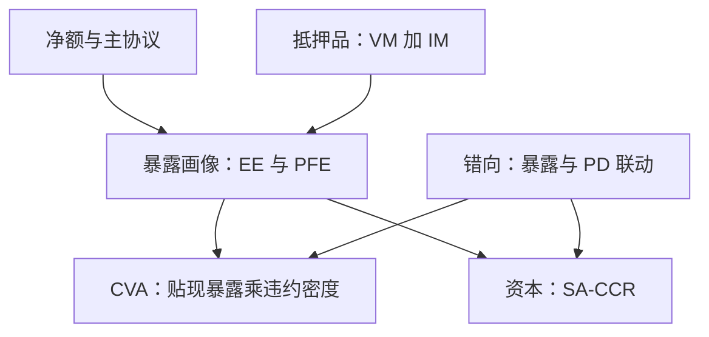

# 对手方风险体系

对手方风险计量的对象不是违约概率，而是对手违约那一刻你替他垫了多少钱——暴露是随市场走的随机变量，不是一个数。

<footer>—— 据 Pykhtin and Zhu, 2007；Gregory, *The xVA Challenge*, Wiley 整理</footer>

[上一课](/quant/rk-liquidity-measurement)把退出成本与现金日程记入计量，但损失上界仍以「自己活着」为前提。当交易双边清算、对手可能违约时，缺口换成了另一个：违约那天的重置成本——把同样的交易重新找谁做、按什么价做。本课是计量单元的第三类：对手方信用风险的暴露画像、净额与抵押、CVA 与资本。后课默认已经读完本课。

## 问题

对手方风险有两个不同的问题混在一起谈。结算风险：两腿交割不同步，付了款收不到货，1974 年 Herstatt 银行倒闭留下经典案例，现在由 PvP（付款对付款）机制与净额结算消除。揭约前风险：合约还有寿命，对手先违约，你手里只剩一张亏损后的替换单。错法有两类。用名义本金当暴露：利率掉期的名义动辄数亿，但平价时替换成本近零，夸大到没法用。用当前市值当暴露：期权卖出方此刻的 MTM 是正的小量，一年后深度实值时暴露放大数倍，低估到致命。两个极端都源于把随市场、随时间的随机过程压成一个常数。

## 方法

暴露画像按时间与情景展开：蒙特卡洛生成因子路径，逐时点重估净额组合，得到暴露分布 $E(t)$；取高分位得潜在未来暴露 PFE，取均值 $\mathrm{EPE}(t)=\mathbb{E}[E(t)]$ 作为定价与资本的代表量。净额先行：ISDA 主协议与 CSA 把同一对手的正负市值轧成净额，暴露从「逐笔之和」降为「净额之分布」，幅度差可达一个量级。抵押品第二层：变动保证金把暴露压回最小转让金额附近，初始抵押覆盖更远的尾部；代价是缺口风险——对手违约到抵押到账之间的保证金风险期里，市场还在动。第三层才是计量：$\mathrm{CVA}$ 把期望损失写为贴现暴露对违约密度的积分，$\mathrm{CVA}\approx \mathrm{LGD}\int \mathrm{EE}^{\ast}(t)\,\mathrm{dPD}(t)$；监管资本用 SA-CCR，以 $\alpha=1.4$ 的乘数覆盖错向与加总不足。

保证金风险期（MPOR）是缺口风险的刻度：双边非集中清算的 OTC 衍生品至少取 $10$ 个营业日，净额组合超五千笔或含难估值抵押时上调到 $20$。抵押越勤，缺口期越短、日常运营越重——这是运营成本换尾部风险的交换。

## 机制

为什么画像必须是分布：暴露的上界由「市场先动、对手后倒」的联合事件决定，与市场风险共享同一组因子，因此对手方账簿的重估引擎往往直接复用上一课的流水线，只是把「自己的损失」换成「对手违约时自己的替换成本」。错向风险在这里入账：暴露与违约概率正相关——卖保护给高杠杆对手，它越接近倒下，你暴露越大；独立假设会系统性低估尾部，SA-CCR 的 $\alpha$ 就是给这个 ignorance 留的粗罚。CVA 把对手方风险翻译回市场风险：它随利差与汇率波动，可以对冲，对冲本身又引入新的暴露——这条链在 [XVA 的联动](/quant/rc-xva-linkage)展开；违约概率与回收的估计交给[信用组合模型](/quant/rc-credit-portfolio)。

## 边界

本课不推导 CVA 的对冲组合，也不展开 CCP 的违约瀑布：中央清算把双边对手换成清算所，暴露降低了，换来的是会员的追缴义务与违约基金份额，资金侧归上一课的现金流梯级管。发行方信用与结构化产品的持有者风险是另一套文档与法律动作，不在本课。本课的画像按风险中性违约密度定价口径走，资本口径（监管映射）与会计口径（CVA 的 DVA 争议）各有规则，混用会把保守性与真实性搅在一起。

## 小结

- 对手方风险的计量单位是暴露分布，不是名义本金，也不是当前市值。
- 净额与抵押先于模型：协议结构决定暴露的数量级，模型只画剩下的形状。
- 缺口风险用保证金风险期刻度；错向风险用乘数或联合建模覆盖，独立假设低估尾部。
- CVA 把对手方风险翻译回市场风险，对冲链与资本映射各有一套口径。
- 出处：Pykhtin and Zhu, 2007；Gregory, *The xVA Challenge*；BCBS, *The standardised approach for measuring counterparty credit risk exposures*, 2014；Herstatt 案例见国际清算银行清算风险报告。
