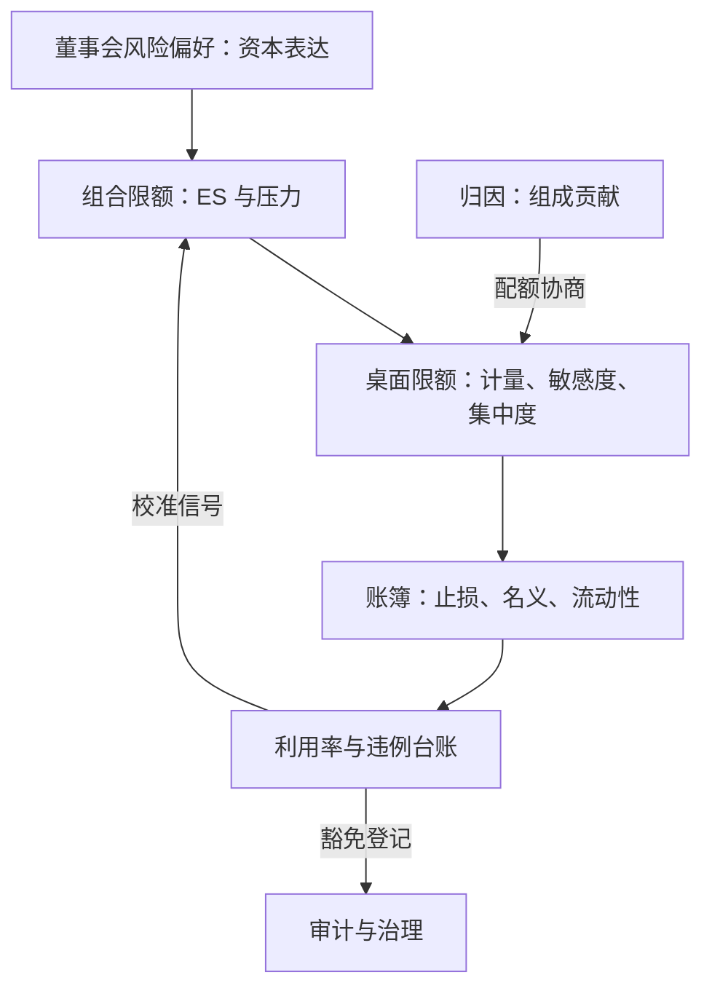

# 限额体系

限额是风险偏好的兑换汇率：董事会说「能承受多少」，限额把它翻译成每张桌面上的一串数字；翻译不走样，靠层级与口径。

<footer>—— 据 Jorion, *Value at Risk*；Matten, *Managing Bank Capital*, 2000 整理</footer>

[上一课](/quant/rk-attribution)把总风险拆成各分部的组成贡献、把损益对到未解释残差。拆出来要有人负责，负责的边界就是限额。[做市风控与限额](/quant/mm-risk-limits)已给出交易台一层的先例；本课升一层，搭机构的限额体系：从董事会风险偏好到账簿约束的翻译，以及违例程序。后课默认已经读完本课。

## 问题

限额体系的病在上中下三段。上段脱节：风险偏好是年报里的一句话，桌面限额是另一套拍出来的数字，中间没有换算路径，偏好成了修辞。中段混口径：名义、希腊字母、VaR、止损堆在同一张清单里互相打架——利率掉期簿的名义动辄百亿而 DV01 有限，按名义管理毫无信息量；反过来，只用灵敏度管理，对冲后的凸性尾巴与流动性极差的持仓又被放走。下段无程序：突破限额靠口头豁免，台账缺失，限额退化成建议。错在哪：每种口径只覆盖一种失败模式，单一口径的限额体系必然在它不管的维度上漏，漏出的头寸没有记录，下次灾难从那里进出。

## 方法

翻译链四层。董事会风险偏好：以资本表达——目标评级与资本充足缓冲。组合层：总 [Expected Shortfall](/quant/expected-shortfall) 限额与关键压力情景限额，分母是经济资本减缓冲（算法见下一课）。桌面层：VaR/ES 子限额、Delta/Gamma/Vega 敏感度限额、集中度限额，配额按上一课的组成贡献与边际贡献协商。账簿层：止损与回撤限额、名义与流动性约束。口径分工：止损管已实现的累积损失，不依赖模型；VaR/ES 管前瞻分布，随市场状态自动松紧；名义与流动性约束管「按市值出不去」的头寸；敏感度限额圈定局部近似的可信范围。违例程序是体系的执行件：先分类（技术性故障还是实质超险），带时限、上报路径与恢复计划，豁免一律书面登记带期限；违例率是校准信号：长期不触是过松，频繁触是过紧或模型漂移。

Jorion 的经典提醒：限额要绑定损失容忍度而不是报告习惯。$99\%$ 十日 VaR 限额设在年风险预算的 $16\%$ 左右（一年约 $25$ 个不重叠十日窗，单窗超限概率约 $8\%$），数字从偏好推出——直接按「去年用量的百分之一百一」定限额，是把现状当偏好。

## 机制

为什么多口径并存是特性而非混乱：代理偏差不可消除，只能并排覆盖。名义限额便宜、难被模型骗，适合约束低流动性的绝对规模；希腊字母精确但只在局部成立，大波动外没有约束力；ES 限额直达尾部却依赖整个流水线的质量；止损不预测只截断，把「继续错」的成本封顶。四类并排，各自失败的维度被彼此接住。限额与计量的耦合要显式：上一课的损益归因给出每张桌的真实风险行为，条件波动收紧计量时，同等限额下的可用风险预算自动收缩，平静期的虚高利用不构成隐性加杠杆。豁免文化决定体系生死：一次无痕豁免教会的不是这次例外，而是限额可以谈。

## 边界

限额数量有上限：指标多过可监控范围，每个都失效，宁少而必查。限额不替代定价：内部过账价与资本收费是让限额「不用到顶」的配套，只靠限额硬拦的交易台会把交易推到限额边缘——这正是下一课资本配置要解的激励问题。做市台的库存与报价限额有更细的时效结构，本课只提供层级接口。跨市场的保证金规则与追缴频率改变同一限额的实际松紧，全球账户按最紧口径统一。

## 小结

- 限额体系是风险偏好的逐层翻译：偏好以资本表达，组合、桌面、账簿各有口径。
- 每种口径覆盖一种失败模式：止损截断累积、ES 管前瞻、名义管流动性、希腊管局部。
- 配额以归因的组成贡献为据；条件波动让实际预算随市场状态自动收缩。
- 违例程序与豁免台账是执行件；违例率是限额校准的信号。
- 出处：Jorion, *Value at Risk*；Matten, *Managing Bank Capital*, 2000；BCBS 内部资本充足评估原则（ICAAP）；交易台一层先例见本站做市风控与限额课。
