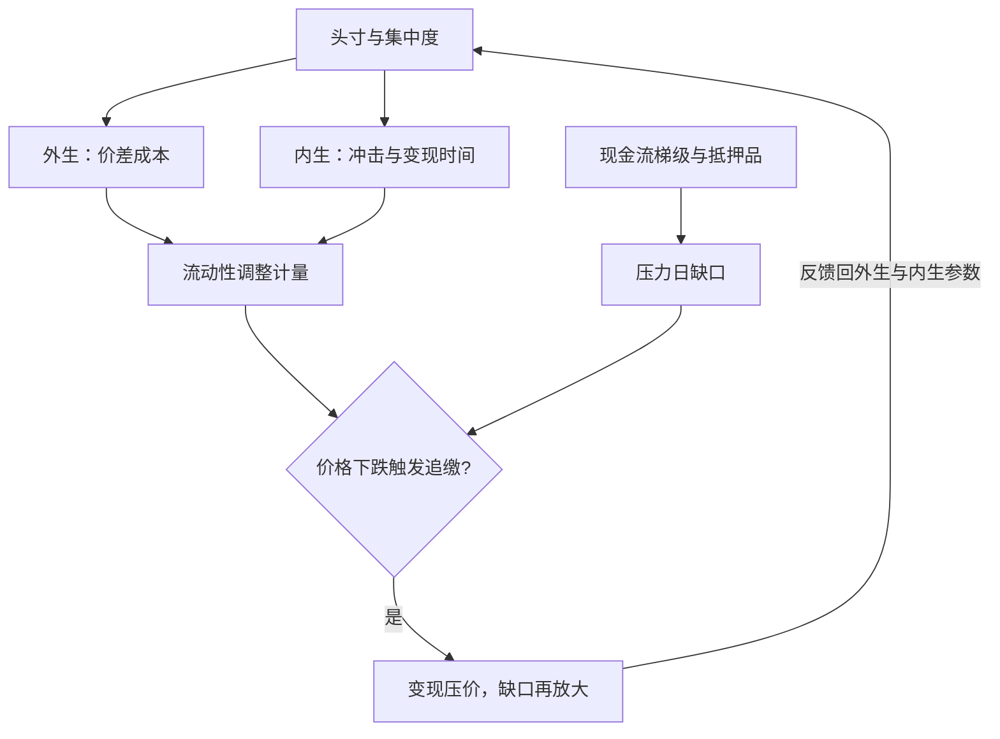

# 流动性风险计量

流动性风险有两张面孔：想把仓位换成现金时的市场，和想按时拿到现金时的资金；把两张脸当成一张的机构，在两次危机里各错一次。

<footer>—— 据 Brunnermeier and Pedersen, *Review of Economic Studies*, 2009；BCBS, *Basel III: The Liquidity Coverage Ratio and liquidity risk monitoring tools*, 2013 整理</footer>

[上一课](/quant/rk-market-system)把市场风险装进六环流水线：快照、映射、情景、重估、分位数、回测，并规定例外要按环归因。留下一处缺口：整条流水线按中间价计损益，变现成本没有入场。本课把流动性拆成两条线分别计量——市场侧的「退出要花多少」，资金侧的「现金接得上吗」——再讨论两条线如何互相放大。后课默认已经读完本课。

## 问题

中间价 VaR 隐含一个假设：头寸可按标记价退出。市场侧的缺口分两层：外生价差——任何人都付的成本；内生冲击——仓越大，退出把价格压得越低，成本随自己变。资金侧的缺口是现金流错配：保证金追缴、抵押品补足、负债展期都有自己的日程，账面盈利的机构照样死于付不出现金。错法各有典型：用半价差给大仓位计成本，漏掉的主导项是冲击与变现时间；用市场侧指标管资金链，1998 年那种「资产没问题、融资断了」的死法完全不在视野里；反过来只盯现金流，2008 年「能变现的资产突然折价三成」又数不出来。

## 方法

市场侧分三档。小仓位按 [流动性调整 VaR](/quant/liquidity-adjusted-var) 的口径，把外生价差成本加到中间价 VaR 上；更一致的做法是在每条情景里用可成交价定义损失，三种 VaR 算法都适用。大仓位的主导项换成变现计划：按 [Almgren–Chriss 最优执行](/quant/almgren-chriss)的框架，用冲击系数与风险厌恶解出变现时间表，成本是「冲击成本与持有风险的折中」，把这条成本曲线的分位数记作流动性的仓位数额。截面代理用 [Amihud 非流动性](/quant/amihud-illiquidity)或价差时间序列做日常监测，债券侧有[债券流动性与 TRACE](/quant/bond-liquidity-trace) 的成交口径。资金侧同样分层：现金流梯级表把未来每日的 contractual 流入流出排队，压力参数给出日缺口；监管口径 LCR 要求优质流动性资产覆盖三十天压力净流出，NSFR 要求一年期稳定资金对上所需稳定资金。

巴塞尔 III 的 LCR 分子是优质流动性资产（一级不打折、二级占比受限），分母是三十天压力情景下的净流出，要求比率 $\ge 100\%$；压力参数按负债类别给流失率、按衍生品状态给抵押品追加。对非银行机构它是类比不是义务，但「三十天现金梯级」的思路通用。

## 机制

两条线通过抵押品耦合：价格下跌触发追加保证金，机构被迫变现资产，变现冲击压低价格，再触发更多追缴——[抵押品与资金链](/quant/rc-collateral-funding)讲的螺旋在计量上表现为外生与内生项同时恶化。这解释了内生 LVaR 的一个数学后果：变现成本随仓位增长，破坏正齐次性，把加仓的资本收费写成线性会低估集中度。它也决定了退出假设必须统一：监管的流动性期限与内部的 LVaR 用同一套变现时间与冲击参数，否则限额说「三天能走」，资本说「十天才走得完」，两套口径各自合法、合起来失效。

## 边界

外生加项忽略价差与市场的正依赖，把加法当近似可以、当上界不行——那是 [流动性调整 VaR](/quant/liquidity-adjusted-var) 课的结论，本课沿用。Amihud 类指标是截面代理，回答「市场贵不贵」，回答不了「我这仓退得出吗」。LCR 与 NSFR 是银行监管口径，基金与自营没有对应义务，但现金流梯级与抵押品驱动的思路必须自己搭。压力参数（流失率、追缴幅度）取自监管校准时是下限，本机构客户结构更挤提时应上调——参数错误是下一类计量课题的入口。

## 小结

- 流动性计量分市场侧（退出的成本）与资金侧（现金的日程），指标不可互换。
- 小仓位用价差加项，大仓位的主导项是冲击与变现时间，用执行框架定退出计划。
- 内生成本随仓位增长，破坏正齐次性；集中度收费不能线性外推。
- 退出假设要在监管口径与内部口径间统一，否则限额与资本各说各话。
- 出处：Bangia, Diebold, Schuermann and Stroughair, 1999；Almgren and Chriss, 2000；Brunnermeier and Pedersen, *Review of Economic Studies*, 2009；BCBS LCR/NSFR 标准，2013。
