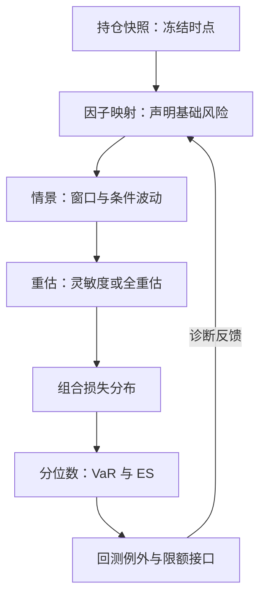
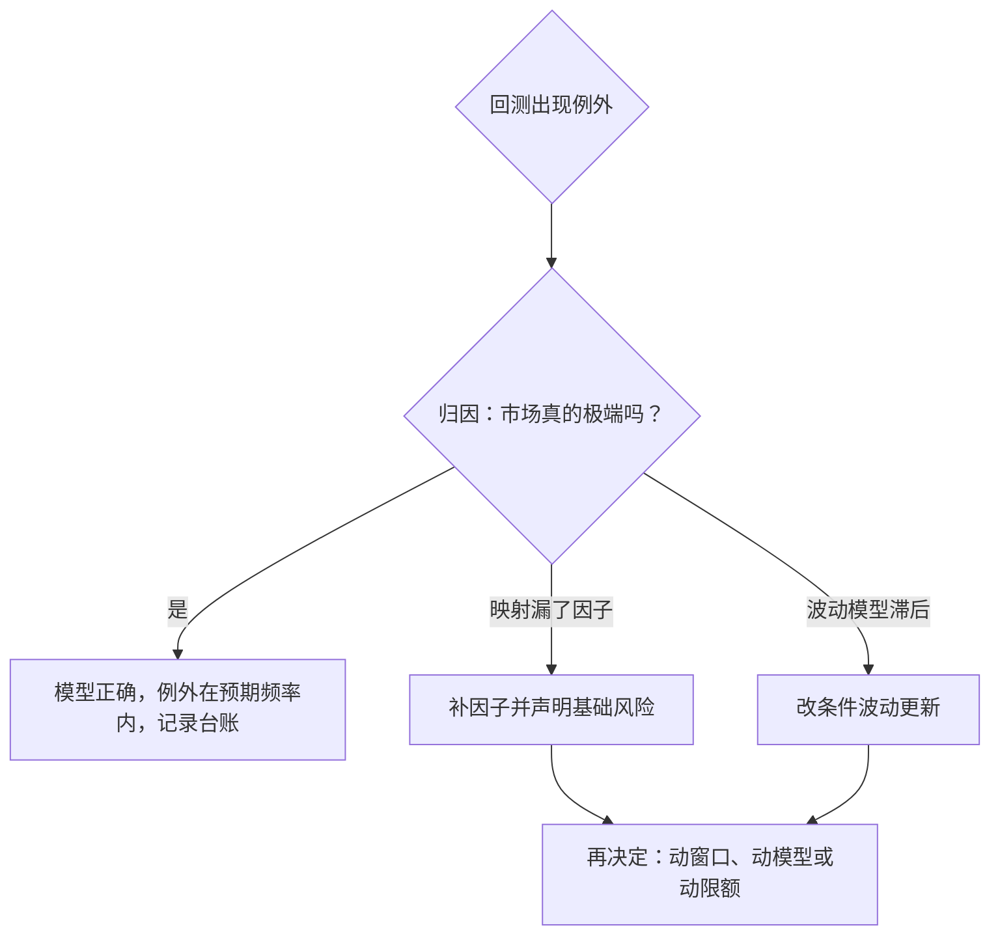

# 市场风险体系

市场风险体系不是一个大模型，而是一条流水线：持仓进来、因子出去、分位数落地，每一环都能单独指认错误。

<footer>—— 据 Jorion, *Value at Risk*；McNeil, Frey and Embrechts, *Quantitative Risk Management*, 2005 整理</footer>

[上一课](/quant/cn-compliance-map)把合规红线收束在上一课程末尾：红线按行为模式与监控数据落判，报备与速率监控必须勾稽。合规回答「能不能做」，本课起回答「仓能做多大、亏到哪要停」——本课是「风险体系深化」的第一课。主干已交付计量件：[VaR：历史、参数、MC](/quant/var-methods) 的三种算法、[Expected Shortfall](/quant/expected-shortfall) 的连贯性、[流动性调整 VaR](/quant/liquidity-adjusted-var) 的变现成本、[体制切换失效](/quant/regime-break-risk)的失效路径。本课程不重写这些定义，而是把它们组装成机构口径：先计量四类风险——市场、流动性、对手方、操作；再治理六件事——模型、压力、归因、限额、资本、报告。第一课钉住市场风险的流水线框架。后课默认已经读完本课。

## 问题

给单本账簿算一个 $99\%$ 分位数不难；缺口在于让全机构对同一口径负责。常见断点有三处。其一，头寸映射：交易簿里的奇异结构折不进风险引擎的因子向量，剩下多少基础风险没人记账。其二，双套数字：前台灵敏度与风控全重估各算各的，差值被当成噪声，隐性头寸藏在正负相抵里。其三，例外无闭环：回测穿透后没人改窗口、改模型或降限额，计量退化成日报插画。断在哪一环，错的性质就不同：映射断的是覆盖，重估断的是口径，回测断的是治理——不按环定位，修模型的力气会花在错的地方。

术语翻译：基础风险就是「模型没看见的那部分风险」——风险引擎只认它认识的因子，奇异结构折不进去的剩余暴露就落在这里。像只按身高分区间的衣柜：塞不进去的那件外套不会消失，只会堆在椅子上没人记账。

### 流水线的六环

体系固定成一张作业图，每环有独立的责任人与失败模式；先立全图，再逐环细写。

## 方法

因子映射把每个头寸写成风险因子向量的函数：债券折成关键期限点的现金流，期权簿折成 Delta、Gamma、Vega 加曲面因子；映射放弃的部分就是基础风险，必须有名字、有量级。情景生成二选一：历史法直接搬 $N$ 天的因子联合变动，$N$ 常取 $250$ 到 $500$；参数法用协方差椭圆，条件波动由 EWMA 或 GARCH 更新，使分位数随今日 $\sigma_t$ 收紧。重估分级：线性账簿用灵敏度内积就够，期权簿要全重估——十日窗口的平方根法则只是近似，曲率与跳大时失真。分位数产出 VaR 与 ES；汇总用 [Expected Shortfall](/quant/expected-shortfall)，理由是次可加性让总账不超过分部之和，VaR 做不到。回测逐日记穿透，Kupiec 的似然比检验与巴塞尔红黄绿区给出一阶判据。

数字实例：十日 VaR 常用一日 VaR 乘 √10≈3.16 近似。这一步假定日损益独立同分布：若日内有趋势或波动聚集，真实十日尾部可以明显超过 3.16 倍。平方根法则是便利近似，不是守恒定律。

巴塞尔回测交通灯以 $250$ 个交易日、$99\%$ VaR 为口径：例外 $0$–$4$ 次 绿区、$5$–$9$ 次黄区、$10$ 次及以上红区；黄区须解释，红区可触发乘数上调。例外本身不是坏消息，没有归因的例外才是。

## 机制

为什么分环：只有切开，错误才能定位与归因。三种 VaR 算法在同一线性近正态账簿上应当接近，在期权、跳与体制切换上分叉——分叉是诊断信号，指出哪一环的假设被打破。条件波动进入情景，等价于让计量的松紧跟着市场状态走：同一分位数在波动放大时自动收紧。ES 的次可加性把「分部合规、总体超标」的悖论从制度里删掉。回测闭环是体系的免疫系统：例外先归因——是市场真极端、映射漏了因子、还是波动模型滞后——再决定动窗口、动模型还是动限额；跳过归因直接加乘数，等于把免疫系统改成疤痕组织。

## 边界

本课不重写分位数的定义与三种算法的取舍，那是 [VaR：历史、参数、MC](/quant/var-methods) 的职责。中间价口径的计量不含变现成本，价差与冲击交给下一课的流动性计量；对手方与操作风险的损失生成机制独立，不能塞进市场因子。平方根法则不是定理，「从未违反」也不是模型正确的证明——$250$ 天样本对 $99\%$ 分位几乎没有拒绝力。窗口外的联合尾部要靠压力测试与极值理论补，那是本课程后半段的事。

常见误区：把「回测从未违反」当模型正确的证明。99% 分位下 250 天平均只该出两三次例外，这么小的样本对「模型是否恰好对」几乎没有拒绝力——没报警不等于没病，这正是压力测试必须并存的原因。

## 小结

- 市场风险体系是一条可分环归因的流水线，不是单个模型；故障按环定位。
- 因子映射要显式声明基础风险；双套数字的差值是隐性头寸的藏身处。
- 条件波动让分位数随 $\sigma_t$ 收紧；ES 的次可加性保证分部可加总。
- 回测例外的价值在归因闭环，不在次数本身。
- 出处：Jorion, *Value at Risk*；McNeil, Frey and Embrechts, *Quantitative Risk Management*, 2005；Kupiec, *Journal of Derivatives*, 1995 与巴塞尔市场风险回测框架；计量定义见本站 VaR 与 Expected Shortfall 两课。
