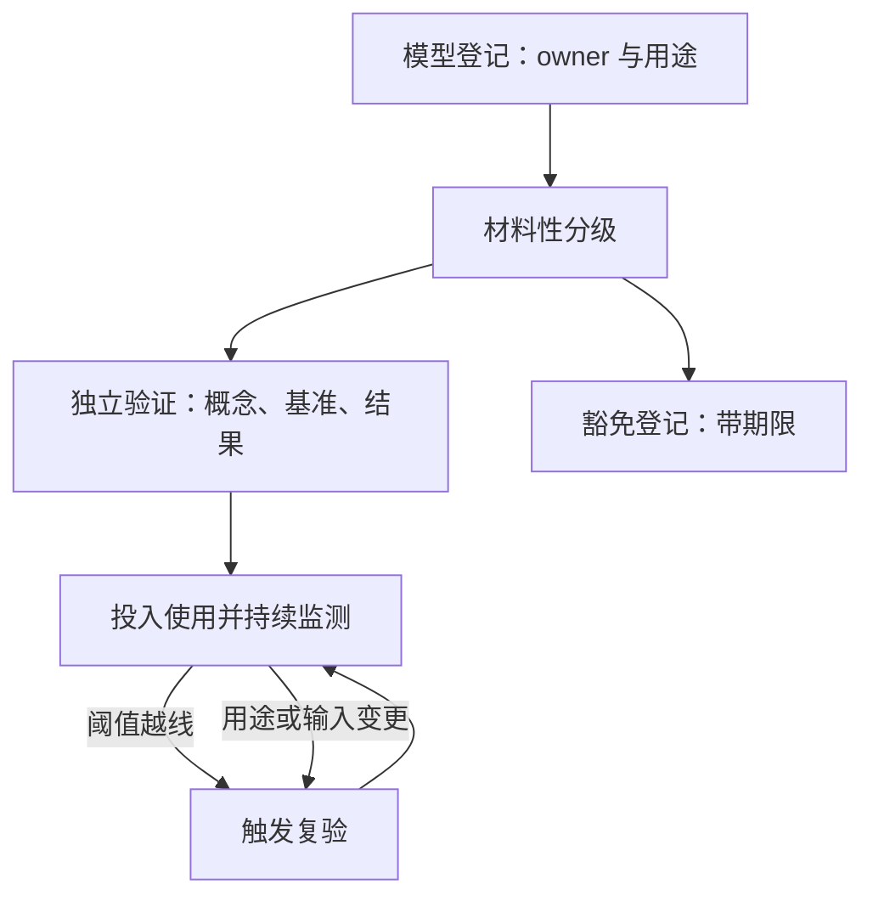

# 模型风险治理的深化

模型风险有两个来源：错的模型，与对模型的错用；验证负责让第一种现形，治理负责让第二种无路可走。

<footer>—— 据 Federal Reserve SR 11-7（2011）；Cont, *Model uncertainty and its impact on the pricing of derivative instruments*, Mathematical Finance, 2006 整理</footer>

[上一课](/quant/rk-operational)收掉计量单元：市场、流动性、对手方、操作四类损失各有生成机制与数据。四类计量的每一环都依赖模型，模型本身的错误谁来管，是治理单元的第一课。[SR 11-7 模型风险管理](/quant/sr-11-7-model-risk)已交代定义、三根柱子与有效挑战；本课深化落地层：模型库与分级、验证做什么、清单之外的实践——尤其共享假设与机器学习管道。后课默认已经读完本课。

## 问题

原则到落地之间的缺口有四处。模型库不完整：研究代码、临时脚本直接喂进决策，库里查无此模型，验证无从谈起。分级不分材质：把关键定价模型与辅助报表模型塞进同一流程，要么重流程拖死业务，要么轻流程放走要害。验证退化成复算：拿开发者的代码再跑一遍、对了就算过——没有独立基准、没有结果分析，等于让被验证者自证。变更管理断裂：模型的输入、用途或市场变了，验证状态却挂在旧版本上，证书过期还挂着上岗。四类缺口共享一个后果：决策层以为有模型在管，实际没人知道假设走到哪了。

## 方法

落地从一张库开始：每个模型登记所有者、用途、输入数据、材料性分级、验证状态与复验周期；分级按使用后果定——进资本、进限额、进客户报价的验证深度递增，出报告的做轻量核查。独立验证做三件事：概念健全性——假设、推导与适用域逐条过；基准对照——独立实现、闭式解或另一族模型的结果差，差值要归因；结果分析——回测、后验与损益解释，对接日常监测。持续监测设阈值：输入漂移、校准残差、损益偏差越线即触发复验，不等周期。例外与豁免一律登记并带期限。机器学习与生成式系统只要输出进决策，就按同一套原则登记分级；管道的特殊部位是数据合同与特征监控，验证要点延伸到[ML 审计](/quant/fml-audit)的处理：特征血缘、训练数据版本、可复现的评估。

共享假设是一个故障域：估值、限额、资本三套模型若共用同一条供应商曲线，曲线日终异常当天三者同时失真——治理视角下这不是三个模型各犯小错，而是同一个假设在库里没有复用登记。

## 机制

为什么治理是体系而非文档：模型库把「哪些决策靠哪些假设」变成可审计的映射，审查者顺着库能从一纸报告走到数据源，也能反向找出所有用同一数据的模型——这是发现共享假设与加总风险的唯一入口。分散在各系统的影子模型没有这个性质，出事时连受影响范围都点不清。为什么验证强调独立：有效挑战的价值在视角差，不在二次计算；独立实现的对价是慢与贵，材料性分级就是把这份贵花在要害上。Cont 的提醒是边界：模型不确定性的定价差距可以估计，但「正确模型」不存在，治理只能保证模型被知晓、被验证、被限制用途，不保证模型对。

## 边界

本课不重述 SR 11-7 的模型定义与三根柱子，也不做单一模型的数值校准验证——定价模型的校准诊断在定价深化课程处理。治理与操作风险的边界按错误性质分：概念错归模型风险，运行错归操作风险；这条分界决定改进流向，模糊不得。相称性原则调节验证强度，不豁免登记义务——小模型可以验证得轻，不能库里没有。ML 管道的验证深度尚无定论，可解释性与稳定性是当前最弱的格，与其宣称已覆盖，不如在分级里显式降级使用。

## 小结

- 模型治理的第一对象是库：登记不完整的机构谈不上模型风险管理。
- 材料性分级把验证的独立性与深度分配到要害；验证是概念、基准、结果三件事。
- 持续监测与变更触发复验，验证状态与模型版本绑定，没有永久证书。
- 共享假设要在库层面登记，它把多个模型的失败连成一个故障域。
- 出处：Federal Reserve SR 11-7 与 OCC Bulletin 2011-12；Cont, *Mathematical Finance*, 2006；机器学习管道的审计要点见本站 ML 审计与 SR 11-7 两课。
