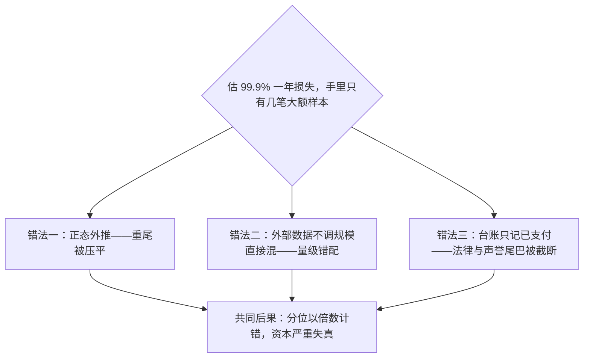
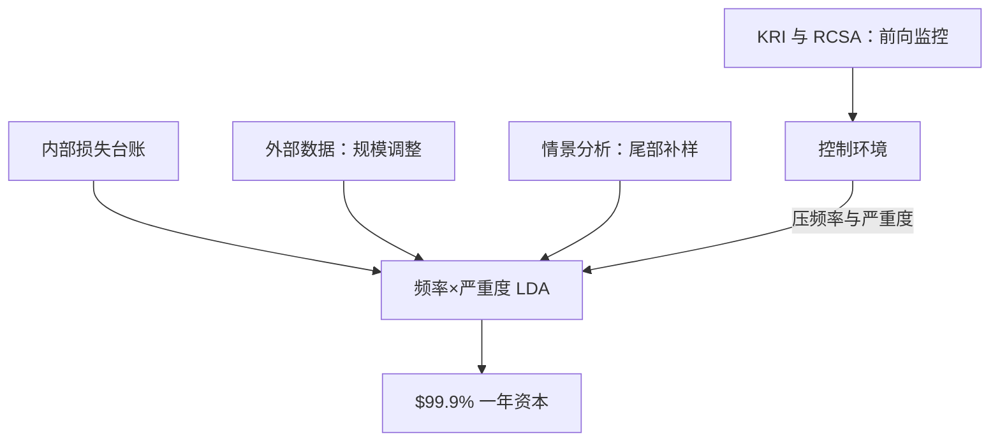

# 操作风险

操作风险是剩下的那一类：市场没动、对手没倒，钱还是没了——流程、人员、系统或外部事件，总有一处替市场完成了这笔交易。

<footer>—— 据 BCBS 巴塞尔 II 操作风险框架；Chernobai, Rachev and Fabozzi, *Operational Risk*, Wiley, 2007 整理</footer>

[上一课](/quant/rk-counterparty-system)计量的损失以对手违约触发，与市场共享因子。本课是计量单元的最后一类：操作风险的损失不来自价格，来自内部流程、人员、系统与外部事件的失败——数据科学课讲过它的频度低于市场数据、重尾却更狠。后课默认已经读完本课。

## 问题

操作风险的计量难点与前三类相反：不是数据太多建不动模，而是大额样本太少、尾巴太重。巴塞尔口径下要估一年持有期、$99.9\%$ 的分位——比市场风险的 $99\%$ 十日远得多，而一家机构的自有大额损失可能一年只有几笔。错法跟着样本少来。用正常损失的均值与方差外推分位：正态或轻尾假设把 rogue trading（交易员隐瞒亏损）、清算事故链这类低频高损事件压没了，资本严重不足。把外部数据直接混进内部样本：不同机构规模、业务与控制环境下，同一事件的损失量级差几个数量级，不按规模调整就错配。把模型外的损失漏掉：法律与声誉损失来得很晚、额很大，台账只记「已支付」口径，尾巴被截断。

术语翻译：99.9% 一年分位就是「千年一遇的坏年份」——把未来一年所有可能的损失排序，取最差 0.1% 那条线作为资本要求。对一家一年只有几笔大额损失的机构，这等于凭几十年的局部经验去猜千年一遇，所以必须借外部数据和情景分析补样本。

## 方法

主流做法是损失分布法：把损失拆成频率与严重度两个分布相乘卷积。频率用泊松，强度按业务条线与事件类型（巴塞尔的 $7\times 7$ 矩阵）分格估计；严重度用对数正态拟合主体、广义帕累托接尾部，分界点以上的超额用极值理论的外推。四路数据进同一个框架：内部损失台账、外部数据（行业联盟按规模与通胀调整后拼接）、情景分析（专家构造接管、灾难、欺诈的尾部样本，补内部数据到不了的尾部）、业务环境与控制因素。前向监控用关键风险指标与风险控制自评：未遂事件、系统宕机时长、人工干预笔数，这些在损失发生前就动。巴塞尔 III 终版另给标准化方法（业务指标加权），以可比性换敏感性——内部模型不再被认可计入监管资本，但内部计量仍是管理与经济资本的工具。

直觉类比：广义帕累托接尾部像「只研究超过警戒水位的洪水」——不去拟合每场小雨，只看越过警戒线的那几次洪峰有多大、间隔多密。极值理论的结论是：门槛足够高时，超额损失的形状趋于稳定，于是可以外推到没见过的水位。

尾部由极少数事件主导：行业研究中，最大 $20$ 笔损失常占全部操作损失额的大半；这是频率低、严重度极重的典型组合——把样本均值当中心、把尾部当噪声，分位误差不是百分点而是倍数。

## 机制

为什么必须频率与严重度分开：两者的管理杠杆不同。频率由控制环境决定——双人复核、职责分离、系统硬约束压住「事件变多」；严重度由限额与响应决定——止损速度、追偿、业务连续性压住「单次变大」。卷成一个总分布，管理动作就找不到落点。为什么外部数据不可省：内部样本对 $99.9\%$ 分位几乎没有信息量，行业联盟把别人的灾难变成你的样本，但拼接必须调规模与控制差异，且不能假设机构间独立——同一危机往往同时抬高多家机构的尾部，相关性使加总不是简单相加。情景分析的价值不在点估计，在把「我们没见过但同业见过」的机制写进分布的支撑。

## 边界

操作风险不进市场风险因子：损失与价格弱相关，用 VaR 框架硬装会把尾部错标成市场尾部。声誉风险的量化没有成熟口径，本课只承认可行的做法是情景加限额式的敞口声明。模型错误与模型运行的错误要分流：概念错了归模型治理（下一课），数据断流、跑错批次、审批越权归本课——分流不清，两类改进都落空。标准化方法不是「更准」，是「更可比」；用它的机构仍需要内部计量回答自己的资本与控制问题。

常见误区：以为操作风险资本是「算出来的客观值」。同一机构换分格、换门槛、换情景专家，99.9% 分位可以差出数倍——它更像管理声明而非物理测量。真正降损失的杠杆是控制环境与响应速度，不是把分布调得更漂亮。

## 小结

- 操作风险的计量瓶颈是重尾加样本稀少：低频高损事件主导资本数。
- 频率与严重度分开建模，因为管理杠杆不同：控制压频率，限额与响应压严重度。
- 四路数据各有职责：内部台账、规模调整后的外部数据、情景补尾、KRI 前向监控。
- 分位要求 $99.9\%$ 一年，轻尾外推会以倍数计错；极值理论是外推的最低装备。
- 出处：BCBS 巴塞尔 II 操作风险框架与 Basel III 终版标准化方法；De Fontnouvelle, Rosengren and Jordan, in *The Risks of Financial Institutions*, 2007；Embrechts, Klüppelberg and Mikosch, *Modelling Extremal Events*, 1997。
