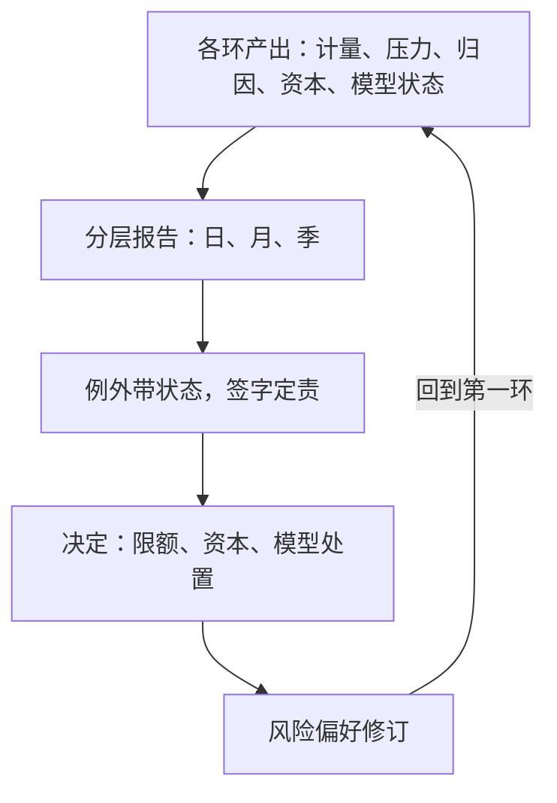

# 风险报告与收束

风险体系的价值在最后一环兑现：计量变成一份可信的报告，报告变成一次有人签字的决定——没有这一步，前面九环都只是练习。

<footer>—— 据 Federal Reserve SR 11-7（2011）；BCBS, *Corporate governance principles for banks*, 2015 整理</footer>

[上一课](/quant/rk-capital-allocation)把资本摊到分部并标上相对价格，激励闭环成形。还剩最后一环：计量与治理的产出要按时、按受众、按责任落到报告与决定——报告是体系的出口，也是回到偏好的入口。本课程到此收束。

## 问题

报告环节的病有三类。数据断链：报告数字与源系统对不上，口径没有血缘——每个数字应能回溯到快照时点、模型版本与数据版本，做不到时报告与限额、资本各说各话。受众错配：给董事会看分位数的技术细节，给交易台只发月报——频率与决策节奏不匹配，报告没人读。例外无主：违例、穿透、告警淹没在附录里，没有归因、状态与签字人；报告完成了「分发」，没完成「负责」。错在哪：报告滞后于决策（T+2 出的数字管不住 T+0 的仓）只是表象，根源是报告没有被当成决策流程的一部分，而是当成合规产出。

## 方法

分层固定模板与节奏。日度桌面报：限额利用率、回测穿透、最大风险贡献、未解释损益——决策者是桌头与风控，节奏按交易日。月度委员会报：趋势、限额调整、压力测试结果、资本占用与 RAROC 概览、模型例外台账——决策者是风险委员会。季度董事会与监管报：风险偏好达成度、重大例外与处置、模型变更与验证状态。三条纪律贯穿各层。血缘：报告管道与计量流水线同源，数字不可手改，修正走重跑。例外带状态：每个例外必有归因、处置动作、责任人与关闭期限，无状态的例外不许出报告。触发不等周期：限额违例、模型告警、情景越线走即时报，不排队等月度会。

报告的压缩本身是模型风险：董事会页面只有十格，选哪十个指标进入视野，等于替董事会决定了什么风险「存在」。治理的对策是定期审计这份「指标清单」与偏好陈述的映射，而不是加页。

## 机制

为什么报告是闭环的关键：偏好、限额、资本、归因各环的输出只有在报告层对齐，才成为组织的共同事实；签字把「知情」变成「负责」——[SR 11-7 模型风险管理](/quant/sr-11-7-model-risk)要求使用侧与开发侧共同担责，落到操作上就是报告签字线。报告也是体系的自检：若日度报出不了 T+1，说明流水线某环太慢或太脆；若例外总在委员会开会时才被发现，说明触发通道名存实亡——诊断体系，先看报告时效与例外流转时间。

## 收束

本课程沿两条线走完。计量线四类风险各有生成机制：市场风险把 VaR 与 ES 装进可分环归因的流水线；流动性把退出成本与现金日程分别入账；对手方把暴露画成随市场走的分布；操作风险用频率乘严重度对付重尾与稀样本。治理线六环咬合：模型治理管计量器本身，压力测试覆盖窗口外的联合极端，归因把总量拆成责任，限额把偏好翻译成数字，资本把风险变成价格，报告把一切变成有人签字的决定。体系没有最终完成态：计量会漂移，情景会过时，限额会被磨穿。本课程到此收束。

## 边界

报告不创造信息，只压缩与分配注意力；压缩的代价是清单外风险被边缘化，需要反向压力与未遂事件通道补盲。自动化报表不豁免人工审阅：管道不出错不等于口径没错。报告义务因辖区而异，本课给内部治理的最低集，监管模板另加。风险体系为策略服务；策略从生到退的台账与流程治理是下一课程的主题。

## 小结

- 报告按受众与节奏分三层，每层固定模板、固定签字人；频率匹配决策周期。
- 每个数字有血缘（快照、模型版本、数据版本）；每个例外有归因、状态与期限。
- 触发式报告不等治理周期；报告管道的时效是体系健康的诊断指标。
- 体系唯一稳定的性质是环环互检：失效能被看见并回流到偏好与决策。
- 出处：Federal Reserve SR 11-7（2011-04-04）与 OCC Bulletin 2011-12；BCBS, *Corporate governance principles for banks*, 2015；各环细节见本课程前九课与所引 VaR、ES、反向压力测试、SR 11-7 等课。
