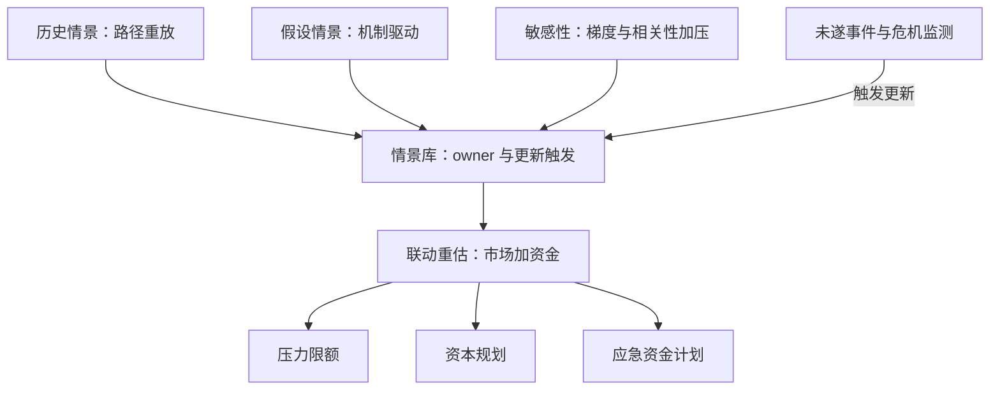

# 压力测试体系

压力测试不预测哪场危机，它回答另一个问题：如果波动、相关性与流动性同时坏掉，账上还剩多少——答案不进决策，问题就白问了。

<footer>—— 据 BCBS, *Principles for Sound Stress Testing Practices and Supervision*, 2009/2018；CEBS, *Guidelines on Stress Testing*, 2010 整理</footer>

[上一课](/quant/rk-model-governance-deep)把计量器本身纳入治理：模型入库、分级、验证、监测。留下一层缺口：分位数长在历史窗口的分布上，窗口外的联合极端——多因子同坏、相关性翻转、流动性蒸发——样本里没有。本课把正向压力测试搭成体系：情景库、严重度校准、结果对接；从失败反推的另一半见[反向压力测试](/quant/reverse-stress-test)专课。后课默认已经读完本课。

## 问题

压力测试的失败模式在 2008 年后监管复盘得很清楚：不是缺数字，是数字没人接。常见病有三类。情景不成库：临时拍脑袋，重复且漏机制，人走了情景就断档。校准无锚：冲击幅度随手设，$\pm 20\%$ 与 $\pm 40\%$ 的差别说不出机制依据，压力变成「更大的 VaR」——但历史窗口里根本没有这种联合状态，把分位数调高得不到它。结果不落决策：报告发出去了，不接限额、不接资本规划、不接应急资金计划，压力测试成为年报插画。三病同源：把压力当成日常计量的加压版，同一条流水线产出，自然同一种盲区。

## 方法

情景分三层入库。历史情景：1987 股灾、1998 LTCM、2008 次贷、2013 减债恐慌、2020 疫情，冻结因子路径原样重放，好处是联合变动真实、机制有案可查。假设情景：机制驱动构造——油价与汇率与利差同向的「滞胀组」、拍卖失败的「流动性组」，每个情景写明传导链：谁先动、谁传染、流动性假设是什么。敏感性层：单因子梯度与相关性加压矩阵，回答「哪个方向最脆」。校准给锚：幅度不小于对应历史段的实际联合变动，再加恶化假设——保证金螺旋让跌势自我放大时，幅度按螺旋参数上调。治理给对接：每个情景有 owner 与更新触发；结果必须落三处——限额（压力限额）、资本规划（ICAAP 或 CCAR 式自评）、应急资金计划（触发条件与动作表）。流动性压力单独跑：存款流失率、抵押品追缴、市场关闭假设组成资金情景，与市场情景联动重估。

相关性翻转是压力情景的常规件：风险资产内部相关性在压力中趋近 $1$，股债相关性翻负——用常态协方差外推压力损失，方向与幅度都会错。2020 年 3 月连美国国债都出现变现折价，「无风险资产」的流动性假设也要写进情景。

## 机制

为什么必须与分位数互补：二十个因子的高维联合尾部，在几年的日度样本里是空集——历史法对「同时坏」没有数据，参数法的椭圆假设把联合极端平滑掉了。情景是专家判断的结构化：把「什么机制能把账打到多深」写成因子路径、定价与资金联动的可计算对象；它接受审阅与挑战，因此本身是被登记、被验证的模型，与上一课的治理对接。传导链比终点重要：同样「跌三成」，纯价格冲击与「跌两成后被迫变现再补一成」的螺旋，对应完全不同的预防动作——前者减仓，后者先改融资结构。[体制切换失效](/quant/regime-break-risk)课的结论在这里兑现：压力态的相关性与波动不是常态参数的外推，检测到切换就该触发情景更新。

## 边界

反向压力测试不重写：正向库覆盖不到的机制，从损失阈值反推因子情景去补。监管压力测试（CCAR/DFAST 类）的宏观路径由监管给定，机构补的是执行质量与内部联动。压力通过不等于安全：情景是有限集合，未覆盖机制的暴露仍在，由反向测试与日常监测补。情景间的相关性不加总——「所有情景都过」不是风险总量的上界。

## 小结

- 压力测试的价值在结果进决策：限额、资本规划、应急计划三处对接缺一不可。
- 情景三层入库——历史、假设、敏感性，每个情景有 owner、传导链与更新触发。
- 严重度以历史段联合变动为锚，恶化假设由传导机制（如保证金螺旋）给出。
- 压力态的相关性与波动不是常态参数外推；体制切换检测触发情景更新。
- 出处：BCBS, *Principles for Sound Stress Testing Practices and Supervision*, 2009 年发布、2018 年修订；CEBS, *Guidelines on Stress Testing*, 2010；Brunnermeier and Pedersen, *Review of Economic Studies*, 2009；反向口径见本站反向压力测试课。
